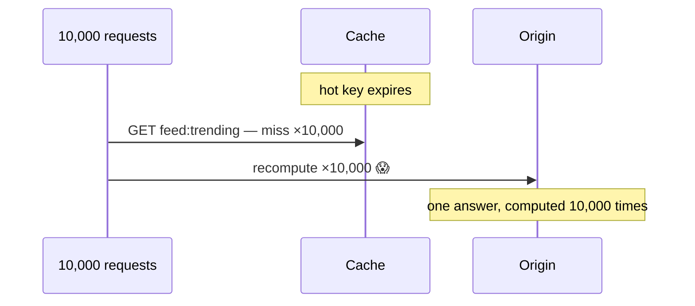

# Cache Failure Modes

Caches fail strangely: sometimes by *succeeding at the wrong thing* (serving a lie past its freshness date), but most spectacularly by disappearing and revealing a truth nobody wanted tested — that the origin stopped being able to live alone years ago. The good news: cache disasters are a closed catalog. Each has a name, a dashboard signature, and a named cure, and interviewers return to them constantly because operators who've lived them answer differently than readers who've memorized them.

## Stampede (thundering herd)

One hot key expires. The next 10,000 requests all miss, and *all 10,000 independently recompute* the same expensive query against the origin — which is now doing 10,000× the work to produce one identical answer, at peak traffic, because popularity is what made the key hot.

**Cures, in the order to reach for them:**

1. **Single-flight (request coalescing)** — per key, one request recomputes; the other 9,999 wait on that result (a per-key mutex/promise in-process; a short-TTL `SETNX` lock across the fleet). The [CDN request-collapsing](../networking/cdn.md) idea, brought home.
2. **Stale-while-revalidate** — serve the expired value instantly, refresh asynchronously, exactly once. Users never wait; origin sees one recompute. For most product data, *strictly better* than synchronous expiry.
3. **Probabilistic early refresh** — each hit near expiry has a small, rising chance of triggering refresh, so the recompute happens *before* the cliff, once-ish, under load exactly proportional to popularity.

## Avalanche (mass expiry)

The stampede's fleet-scale sibling: *many* keys expire simultaneously — because they were all set with the same TTL at the same moment (the midnight cron that warmed the cache, the deploy that filled it), or because the cache *restarted empty*. Hit rate cliffs from 95% to zero, origin takes the full unshielded load, and [the hockey stick](../foundations/latency-throughput.md) does the rest.

**Cures:** **TTL jitter** — always `TTL ± random(10–20%)`, converting synchronized cliffs into gentle slopes (this should be baked into your cache client, not remembered per call site); **warming** before traffic (replay top-N keys from logs, pre-fill on deploy); **persistent/replicated cache tiers** so restarts aren't empty ([Redis RDB/AOF](redis.md)); and rolling deploys of cache-holding app tiers so only a slice goes cold at once.

## Penetration (the misses that can't hit)

Requests for keys that **don't exist** — deleted users, fabricated IDs, an attacker iterating `/user/999999999` — sail through the cache (nothing cached for a nonexistent key) and hammer the database *every single time*. Your cache defends only the data you have; penetration attacks the data you don't.

**Cures:** **negative caching** — cache the "not found" itself with a short TTL (30–60 s), turning repeat misses into hits-on-nothing; **Bloom filters** in front — a compact "definitely not in the set" check ([the same structure LSM engines use](../data/storage-engines.md)) rejects fabricated keys before any lookup, with false-positive rates you tune in exchange for bytes; and boring **input validation** (malformed IDs shouldn't reach the data path at all).

## Hot key

One key's traffic exceeds what any single cache node can serve — the celebrity's profile, the viral post, the one config blob every request reads. Sharding doesn't help: [hashing balances *keys*, not *traffic*](../data/partitioning.md), so `post:viral123` lands on exactly one node, which now melts while its peers idle.

**Cures:** **L1 in-process caches** with tiny TTLs (1–10 s) in front of the distributed tier — the hottest keys get absorbed *inside each app instance*, converting a million cluster hits into N local reads per second (this two-tier pattern is the single most effective hot-key defense and [general design pattern](fundamentals.md)); **key replication** — write `key#1..key#8`, read a random replica, trading 8× invalidation fan-out for 8× read capacity; **request coalescing** at the app tier (many concurrent readers, one fetch). Detection first, though: per-key sampling/top-K metrics, because the cluster average will look serene while one node burns.

## Big key

The 500 MB sorted set, the hash with 4M fields, the "we cached the whole catalog as one JSON blob" key. Symptoms: network saturation per read, serialization pauses, replication lag spikes, and — on Redis — [the single thread](redis.md) blocking fleet-wide when the key is read, written, or (worst) deleted.

**Cures:** decompose (paginate collections into chunked keys, hash-per-segment), compress values, cap value sizes in the paved-road client (reject-with-metrics beats discover-in-incident), and delete asynchronously (`UNLINK`).

## Inconsistency windows (the racing lies)

The [fundamentals page](fundamentals.md) covered why every invalidation scheme races; here's the operational face: after a write, *some* readers see the old value for up to (race window + TTL). The failure story is always a product story — the un-liked post that stays liked, the revoked permission that still works (that one's a security incident, not a caching quirk). **Mitigations recap:** delete-not-set, delayed double-delete for the paranoid, [CDC-driven invalidation](../data/analytics.md) for rigor, versioned keys for immunity, and TTL as the always-on upper bound of any lie. Design reviews should state the window per data class out loud — "permissions may be stale up to 5 seconds; we accept this / we event-invalidate" — so staleness is a *decision*, not a discovery.

## The dependency cliff (the one that ends companies' quarters)

The quiet arithmetic: at 98% hit rate, your database serves 2% of traffic — so the database got sized, over the years, for 2%. The cache tier fails, and origin receives **50× its provisioned load** instantaneously. This isn't degradation; it's a step function to zero — and recovery self-sabotages: the database dies before refilling the cache, restarts cold, dies again ([the recovery herd](../foundations/reliability-availability.md)).

**The honest defenses:**

1. **Decide, in writing, whether origin must survive cold-cache** — if yes, capacity-plan for it (expensive, honest); if no, then *the cache is tier-0 stateful infrastructure*: replicate it, persist it, spread it across [failure domains](../foundations/reliability-availability.md), and capacity-plan *its* failover — the "it's just a cache" era is over the day this arithmetic first holds.
2. **Load-shed at the origin** — admission control so the database serves *some* fraction well instead of everything terribly ([resilience patterns](../distributed/resilience.md)); pair with request priorities so checkout outlives browse.
3. **Brownout mode** — a rehearsed degraded configuration: serve stale aggressively, disable expensive features, lengthen TTLs fleet-wide via config flag. Rehearsed being the operative word.
4. **Refill discipline** — on recovery, warm progressively (rate-limited fill, priority keys first), or the refill itself is a stampede.

!!! ops "DevOps lens"
    Each mode has a dashboard signature worth recognizing at a glance: **stampede** — origin QPS spike + hit-rate cliff *on one key class*, latency spike aligned to a TTL boundary; **avalanche** — global hit-rate cliff at a suspicious timestamp (deploy? cron? restart?); **penetration** — miss rate high while *distinct-key cardinality* explodes (and the keys look sequential — hello, scanner); **hot key** — one cache node's CPU/network pegged, cluster average green; **big key** — p99 spikes correlated with specific key reads, replication lag sawteeth. Two disciplines turn this page from theory into muscle: **per-key-class metrics** (blended numbers hide every one of these), and **chaos-testing the cache** — deliberately kill the cache tier in staging (then, bravely, in production during business hours with the brownout mode armed) because the dependency cliff is the one failure mode you cannot discover gently by accident.

!!! staff "Staff+ altitude"
    Markers: (1) **The paved-road cache client is the fix that scales** — jitter, single-flight, negative caching, value-size caps, and per-class metrics implemented *once* in the shared library; every team hand-rolling cache-aside will reimplement this page's disasters one incident at a time, and a Staff engineer ends that genre with one artifact. (2) **Cache-loss capacity policy as a written, tiered decision** — per system: "survives cold" (and the capacity bill that proves it) or "cache is tier-0" (and the replication/persistence/chaos-drill bill that proves *that*); unwritten, the answer is always the cheap one until the Tuesday it isn't. (3) **Staleness budgets reviewed like SLOs** — with permissions/authz called out as the class where staleness is a security property. (4) The meta-skill: this catalog is *transferable* — stampedes, hot keys, and dependency cliffs recur in [DNS](../networking/dns.md), [connection pools](../networking/fundamentals.md), [autoscalers](../foundations/scalability.md), and [service meshes](../devops/service-mesh.md); recognizing the shape in a new costume is exactly the pattern-matching Staff review exists to provide.

!!! interview "In the interview"
    Name the mode, then the cure — speed matters, it signals scar tissue: *"hot key expires under load"* → stampede → single-flight + stale-while-revalidate; *"cache restarted / everything expired at midnight"* → avalanche → jitter + warming + persistence; *"attackers requesting random IDs"* → penetration → negative cache + Bloom filter; *"celebrity post melting one node"* → hot key → L1 tier + key replication; *"cache cluster dies — what happens to your design?"* → the cliff → do the arithmetic out loud (hit rate → origin multiplier), then the four defenses, leading with "that's a written capacity decision, and here's which side I'd take for this system and why." The reflex trio to state proactively in *any* design's caching sentence — **jitter, single-flight, negative caching** — costs six words and pre-answers three follow-ups. That's the [fundamentals page's six-part sentence](fundamentals.md) earning its keep.

**Section complete.** Next: [Messaging & Streaming](../messaging/index.md) — the queues, logs, and delivery guarantees that hold asynchronous systems together.
