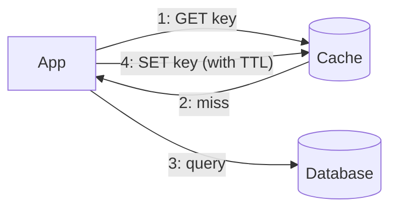

# Caching Fundamentals

A cache is a bet: *the answer I computed recently is still the answer.* When the bet pays — and for most data it pays overwhelmingly — you've converted a 100 ms database query into a 100 µs memory read, absorbed 95% of your origin load, cut the bill, and accidentally bought availability (the cache keeps answering while the database has a bad day). The [three ratios from estimation](../foundations/estimation.md) — memory ~1000× faster than SSD, SSD ~100× faster than a network hop to another region — are the entire physics; everything else in this page is managing the bet's one risk: **being wrong about freshness**.

## The hierarchy: caches all the way down

A request may traverse six caches before touching truth, each trading scope for speed:

| Layer | Latency | Scope | You control? |
|---|---|---|---|
| Browser / client | 0 (local) | one user | via headers |
| [CDN edge](../networking/cdn.md) | ~10–50 ms from user | region | yes |
| Gateway / reverse-proxy cache | ~1 ms | fleet-wide | yes |
| **In-process (app memory)** | **~100 ns** | one instance | fully |
| **Distributed (Redis/Memcached)** | ~0.5–1 ms | fleet-wide | fully |
| DB buffer pool | ~100 ns (inside DB) | database | indirectly |

The interesting rivalry is **in-process vs. distributed**. In-process is 1000× faster and free of network failure modes — but each instance holds its own copy (memory × N, cold on every deploy) and *invalidating it fleet-wide is a distributed systems problem* (you'll need a pub/sub broadcast or short TTLs). Distributed caches centralize the copy — one invalidation, shared hit rate, survives app deploys — at network-hop prices and with their own [failure repertoire](failure-modes.md). The production answer at scale is often **both**: a tiny-TTL L1 in process (seconds — absorbs the hottest keys and [hot-key storms](failure-modes.md)) over a Redis L2 (minutes — the shared workhorse). Two tiers, two TTLs, two invalidation stories: say all six parts or you haven't described a cache.

## The five patterns

**Cache-aside (lazy loading)** — the default 90% of the time. App reads cache; on miss, reads DB, fills cache, returns. On write: update DB, **delete** (not update) the cache key.

Simple, resilient (cache dies → app still works, just slower... [mostly](failure-modes.md)), caches only what's asked for. Its fine print: the *first* reader eats the miss (latency spike), and concurrent misses duplicate work ([stampede](failure-modes.md)).

**Read-through** — same shape, but the *cache* does the loading (app asks cache, cache fetches on miss). Cleaner app code, requires cache-side loader logic; conceptually cache-aside with the fill moved.

**Write-through** — writes go to cache *and* DB synchronously. Cache is never stale for written keys and reads-after-write hit; the price is write latency (two systems in the write path) and caching data that may never be read.

**Write-behind (write-back)** — writes hit the cache, which flushes to the DB asynchronously in batches. Spectacular write throughput (this is how CPU caches and some counter/metrics systems work) — and now the cache holds the *only* copy until flush: **a cache crash loses acknowledged writes**. Write-behind is a queue wearing a cache costume; treat its durability accordingly (replication, persistence) or reserve it for data you can afford to lose (view counters, not orders).

**Refresh-ahead** — the cache proactively refreshes hot keys before expiry. Great p99 for predictable hot sets; wasted work for everything else. (Its per-key cousin, probabilistic early refresh, reappears as a [stampede cure](failure-modes.md).)

## Eviction: deciding who dies

Caches are full by design; eviction policy is who gets sacrificed. **LRU** (evict least-recently-used) is the default intuition and usually right — with one famous weakness: a single large *scan* (analytics job, crawler, backfill touching everything once) flushes your entire hot set in favor of garbage it'll never touch again. Scan-resistant variants exist precisely for this — **segmented LRU, LRU-K, TinyLFU** (admission control: new keys must *earn* entry by frequency) — and knowing why ("protect the hot set from one-time scans") matters more than the acronyms. **LFU** favors long-term frequency over recency (better for stable popularity, slower to adapt to trends). Real systems approximate: Redis samples candidates rather than tracking a perfect LRU list — precision isn't worth the memory.

Distinguish **eviction** (space pressure chose a victim) from **expiry** (TTL declared it stale): the first is a capacity signal, the second a freshness policy — dashboards should show both separately, because "evictions climbing" means *buy memory or shrink values*, while "expirations climbing" is Tuesday.

## Invalidation: the famously hard problem, honestly

The cache and the database are two systems with no shared transaction — so **every invalidation strategy has a race**; you're choosing which one and how long it lasts.

- **TTL — the honest baseline.** Every key gets one, *always*, even alongside cleverer schemes: it's the upper bound on any lie the cache can tell, and the safety net when the clever scheme misses. Choosing it is a *product* question wearing an infra costume: "how stale can a price/profile/permission be?" has a business answer, not a technical one.
- **Invalidate-on-write** — after the DB commit, **delete** the key (deletion beats set-the-new-value: computing the value outside the DB transaction invites writing a *stale* value with a fresh TTL — the set-race). The canonical order is *write DB, then delete cache*; the residual race (a concurrent reader loaded the old value just before your delete and fills the cache just after) is narrow but real — mitigations: short TTL as backstop, or delayed double-delete (delete again after a beat). Say "narrow race, TTL bounds it" and you've said the mature thing.
- **Event-driven invalidation** — tail the database's change stream ([CDC](../data/analytics.md)) and invalidate/refresh from *the log itself*: no app code path can forget to invalidate, and lag is observable. The robust answer for fleets of caches and cross-service consumers — the [log-is-truth idea](../data/storage-engines.md) collecting another dividend.
- **Versioned keys — don't invalidate, rename.** Key includes a version/hash (`user:42:v7`, or config epoch); writers bump the version; old entries die by TTL, unreferenced. Zero invalidation races *by construction* — this is the [CDN hashed-asset pattern](../networking/cdn.md) generalized, and it's criminally underused server-side.

!!! ops "DevOps lens"
    The operational truths: **deploys create cold caches** — a full restart of the app tier (in-process caches) or the cache tier itself sends the origin a [herd](failure-modes.md); the fixes are rolling deploys, cache warming (replay top-N keys from a log), persistent cache tiers, and honesty about whether origin survives cold ([the cliff](failure-modes.md)). **Watch hit rate *by key class*, not globally** — a 95% blended rate can hide the 40% rate on the class that matters; tag keys (`profile:*`, `feed:*`) and graph separately, alongside *origin QPS absorbed* (the metric that justifies the cache's existence) and *eviction vs. expiry rates* (capacity vs. policy). And the strategic trap to name in reviews: **the cache that started as an optimization and became load-bearing** — if origin can no longer survive without it, the cache is tier-0 stateful infrastructure and must be operated like one (replicated, persisted, capacity-planned, chaos-tested) — not like the disposable optimization it was born as.

!!! staff "Staff+ altitude"
    Markers: (1) **Staleness budgets as a product contract** — a table per data class ("prices: ≤30 s; permissions: ≤5 s or event-invalidated; avatars: hours") signed with product, turning every future "why is this stale?" from an incident into a lookup. Permissions deserve their own row and paranoia: cached authorization is the one staleness class that becomes a *security* bug. (2) **The paved-road cache client** — stampede protection, TTL jitter, negative caching, metrics, and key-naming conventions belong in *one shared library*, because every team hand-rolling cache-aside reimplements the same four bugs; this is the highest-ROI platform library after the RPC client. (3) **Cache placement is an architecture review topic** — every added layer buys latency and pays in consistency surface and invalidation fan-out; a Staff review sometimes *removes* a cache (the read-through that's 4% hit rate but 100% of the confusion) — caching is a tool, not a virtue.

!!! interview "In the interview"
    Never say "we'll cache it" — say the six-part sentence: *"Cache-aside in Redis, 5-minute TTL with jitter, delete-on-write invalidation, single-flight on misses, negative caching for not-founds, and an in-process L1 at 10 seconds for the hottest keys."* That's pattern, place, TTL, invalidation, [stampede posture](failure-modes.md), and tiering — one breath, complete. The probes it pre-empts, and their cores if asked anyway: *"how do you keep cache and DB consistent?"* (you don't, perfectly — two systems, no transaction; delete-after-write + TTL bound + CDC for rigor; name the set-race to show you know *why* delete beats set); *"update or delete the cache on write?"* (delete — computing values outside the transaction races); *"what TTL?"* (turn it around: "how stale can this data be, per class?" — then jitter it). And when the interviewer says the load doubled: hit rate arithmetic, out loud — at 95% hit rate, origin sees 5%; the cache tier absorbs the doubling, origin feels a rounding error. That's [estimation](../foundations/estimation.md) cashing in.

**Next:** [Redis deep dive](redis.md) — the single-threaded Swiss army knife that ended up holding half the internet's ephemeral state.
