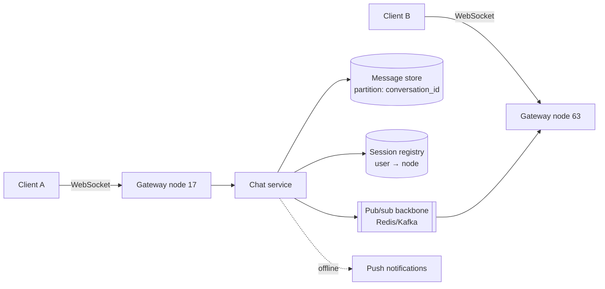

# Chat System

The hardest of the common prompts, because it stacks three problems most designs never face at once: a **stateful connection fleet** (millions of open sockets — [the state warning](../foundations/thinking-in-systems.md) made physical), **per-conversation ordering with delivery guarantees** (a messaging system where humans *notice* every anomaly), and **presence** (a write-storm feature disguised as a green dot). WhatsApp-scale numbers make it vivid, but the architecture below is the answer at any scale — and it's where half the site's pages converge.

## Requirements & estimation

**Scope**: 1:1 and group chat (cap groups at ~1k for now — say it), delivery states (sent/delivered/read), presence, typing indicators as a parked stretch; media via [presigned URLs in one sentence](../data/object-storage.md). Per-data-class honesty ([the move](../interviews/requirements-estimation.md)): **messages** — never lost, per-conversation ordered; **presence** — [approximate, seconds-stale fine, lossy fine](../foundations/cap-pacelc.md); **read receipts** — between the two. Three classes, three designs, most of the architecture explained already.

**Numbers**: 200M DAU, 40 messages/user/day ≈ 8×10⁹/day ≈ **~100k msg/s, 300k peak**. Concurrent connections: ~50M online at peak. Per-node socket capacity: [FD-and-memory bound, not CPU](../networking/fundamentals.md) — ~500k idle-ish connections/node is credible → **~100 connection nodes** plus headroom. Message storage: 8×10⁹ × ~200 B ≈ 1.6 TB/day raw — [wide-column, time-clustered, TTL'd per retention policy](../data/nosql.md). **Verdict**: "the connection tier and the fan-out path are the design; message storage is a solved write-heavy pattern."

## Architecture

**The connection tier** — [WebSockets](../networking/apis.md) (duplex: clients send *and* receive), terminated on a fleet of gateway nodes whose only jobs are holding sockets, authenticating, and forwarding — *thin by design*, because [stateful tiers should carry as little logic as possible](../foundations/thinking-in-systems.md) (logic redeploys often; sockets hate redeploys). The **session registry** ([Redis](../caching/redis.md): `user_id → node_id`, TTL'd, heartbeat-refreshed) answers "where is B connected?"; the **pub/sub backbone** delivers cross-node ([Redis pub/sub for speed, or Kafka when you want replay/audit](../messaging/kafka.md)): A's message → chat service → persist → publish to B's node → push down B's socket. B offline? The registry says so → [hand off to the push-notification path](notifications.md).

**Message flow with guarantees** — the sequence that earns the delivery states: client sends with a **client-generated ID** ([idempotency from the first hop](../messaging/delivery-semantics.md) — retries on flaky mobile networks must not double-send); server assigns the **per-conversation sequence number** ([single-writer-per-conversation ordering](../distributed/time-ordering.md): partition by `conversation_id`, and order exists *by construction* — [the "route, don't lock" pattern](../distributed/coordination.md)); persist *then* ack "sent"; deliver → "delivered"; B's client acks read → "read" fans back. Every state transition is an idempotent, sequence-carrying event — gaps detected client-side trigger a fetch-since-sequence catch-up, which is also *exactly the reconnect story*: socket drops, client reconnects anywhere, sends "last seq I have per conversation," server replays the gap. **Sync-by-sequence makes the connection disposable** — that sentence is the design's keystone.

**Group fan-out**: sender writes once to the conversation partition; delivery fans out to N members' active nodes via pub/sub ([amplification counted](../foundations/thinking-in-systems.md): 1k-member group = 1 write, ≤1k deliveries — fine; this is why group size caps exist, and why [the news feed](news-feed.md) — where N is 100M — needs a different architecture entirely; drawing that line is a strong comparative move).

## The deep dives that win it

**Deploying the socket fleet** — [the operational deep dive nobody else can do](../devops/kubernetes-workloads.md): rolling restarts disconnect users by construction, so: [app-level drain](../networking/load-balancing.md) (GOAWAY-style "reconnect please" to a node's clients, spread over minutes), client reconnect with [jittered backoff](../distributed/resilience.md) (or the fleet's own deploy becomes a [reconnect stampede](../caching/failure-modes.md) against auth and the registry — the thundering herd with your name on the commit), and connection-count-aware rollout waves. "Every chat deploy is a controlled partial outage; here's how it's controlled" is an operator's sentence.

**Presence without melting** — the trap: naive presence is a write per heartbeat per user (50M × every 10 s = 5M writes/s — [derived load](../foundations/estimation.md) eating the system) and a fan-out per transition ("A is online" → notify everyone with A in their list). The fixes: heartbeats [TTL'd in Redis](../caching/redis.md) (presence = key exists; offline = expiry — no explicit offline writes), transitions **debounced** (flapping mobile connections don't broadcast every blip), fan-out **on-demand-first** (fetch presence when the chat list renders; subscribe only to the ~dozen visible contacts — [pull over push](../foundations/thinking-in-systems.md) where staleness is cheap). Presence is a [lossy, eventual](../foundations/cap-pacelc.md) product — engineer it as one.

**End-to-end encryption, one honest paragraph**: E2EE (Signal-protocol lineage) moves message *content* out of the server's reach — the server routes ciphertext blobs. Design consequences worth naming: server-side features that read content (search, moderation, smart replies) become client-side or impossible; key management and multi-device become real subsystems; delivery machinery (sequences, receipts, fan-out) is *unchanged*. Knowing where E2EE does and doesn't touch the architecture is the differentiating sentence; deriving Signal's ratchet is not the interview.

!!! ops "DevOps lens"
    The chat operator's dashboard: **connections per node + fleet skew** ([consistent-hash or least-conn balancing](../networking/load-balancing.md) keeps nodes even; skew = a node approaching [FD limits](../networking/fundamentals.md) while peers idle), **reconnect rate** (the leading indicator of *everything* — deploys, network events, and auth outages all announce themselves as reconnect spikes), **delivery latency p99 enqueue→socket-write** (the product SLO), **registry health** (its [staleness is misrouted messages](../caching/failure-modes.md); its outage degrades to push-notification fallback — [a rehearsed brownout](../distributed/resilience.md)), and **per-conversation sequence-gap rate** (client catch-up fetches spiking = something's dropping deliveries upstream). Incident genres: the reconnect stampede (above), the *hot conversation* (a 1k-member group with a viral moment — per-conversation [rate caps](rate-limiter.md)), and the *zombie session* (registry says node 17, socket died un-heartbeated — TTLs bound the lie window; deliveries fall back to push on socket-write failure).

!!! staff "Staff+ altitude"
    (1) **The connection tier is a platform** — once it exists, every real-time feature in the company (notifications, live dashboards, collaborative cursors) wants to ride it; designing it as a *product* (multiplexed channels, per-feature authz, [tenant rate budgets](rate-limiter.md)) versus a chat-only implementation is a fork worth naming early — [the BFF/gateway lesson](../networking/proxies-gateways.md) for sockets. (2) **Regional homing for chat** is unusually natural ([conversations have locality](../devops/multi-region.md)) — home each conversation's partition to its members' region; cross-region conversations proxy to the home ([single-writer preserved](../data/replication.md), latency honest); the alternative — multi-leader message logs — is [the conflict story](../data/replication.md) nobody needs for chat. (3) **Retention and compliance are the quiet governors**: message TTLs, legal hold, E2EE-vs-moderation tension, per-jurisdiction residency — chat is where [data governance](../data/analytics.md) meets product hardest, and raising it unprompted is the altitude signal. (4) **Group-size ceilings are architecture decisions** — 1k (fan-out on write) vs. 100k "channels" (fan-out on read — [the feed architecture](news-feed.md)); knowing the number where one becomes the other *is* the design.

!!! interview "In the interview"
    The spine: data-class split (messages/presence/receipts) → connection tier + registry + backbone → the message sequence with sync-by-sequence → then steer to the two deep dives that are *yours* (socket-fleet deploys; presence economics). Probes, pre-armed: *ordering across users?* (per-conversation sequences — global order [neither exists nor matters](../distributed/time-ordering.md); say so); *exactly-once delivery?* ([at-least-once + client-ID dedup + sequence gaps for loss detection](../messaging/delivery-semantics.md)); *user has 3 devices?* (registry holds a *set* of sessions; each device tracks its own sequence cursor — multi-device is why sync-by-sequence beats push-and-pray); *node dies with 500k connections?* (clients reconnect with jitter to healthy nodes, catch up by sequence; registry TTLs expire the corpse — the failure is designed to be boring); *WhatsApp does this with how few engineers?* (the famous frugality: [one process per node holding a million sockets](../networking/fundamentals.md) — the event-loop story, cited as kinship).
