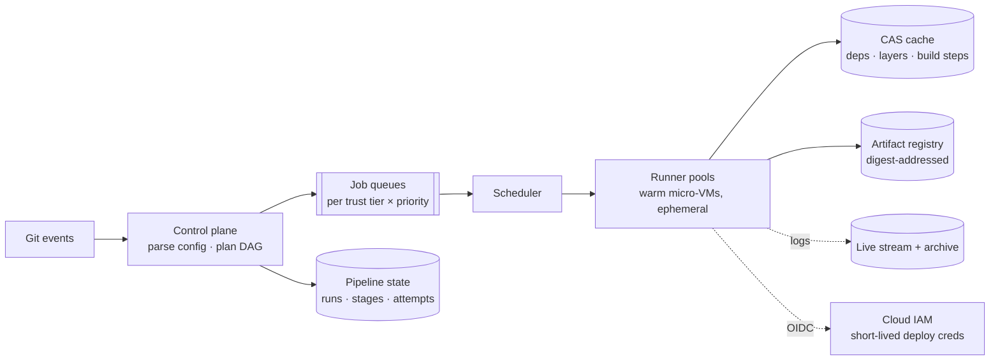

# DevOps Special: CI/CD Platform

Design GitHub Actions / an internal build-and-deploy platform — the Staff-flavored special where the [CI/CD-as-a-system page](../devops/cicd.md) becomes a whiteboard performance. The prompt's secret: it's four canonical designs stapled together — [a queue-and-workers system](../messaging/async-fundamentals.md), [a DAG scheduler](job-scheduler.md), [a content-addressed cache](../data/object-storage.md), and **the most security-critical trust boundary in any company** — and the candidate who names that composition in the first minute owns the hour.

## Requirements & estimation

**Scope**: webhook-triggered pipelines (build → test → deploy stages as a DAG), ephemeral isolated runners, artifact/cache storage, logs and status back to the developer, deploy credentials handled somehow (*the somehow is the deep dive*). Non-functional: **queue-time is the product** ([PR feedback <10 min or culture rots](../devops/cicd.md)); [untrusted code executes here by design](../devops/cicd.md); and the platform must be *more* available than what it deploys — [the break-glass corollary](../devops/cicd.md) noted aloud.

**Numbers**: 2k engineers, ~50k jobs/day, mean 5 min ≈ **~250 concurrent runners steady, 3–5× at peak hours** ([the diurnal shape](../devops/cost-capacity.md) — spot-friendly, warm-pool-dependent); artifacts ~50 GB/day hot, [content-addressed dedup shrinking it](../data/object-storage.md); logs [a mini log-pipeline](log-pipeline.md) (streamed live, archived cheap). **Verdict**: "throughput is small; the design is scheduling latency, cache correctness, and the trust boundary."

## Architecture

**Control plane**: parses pipeline config (versioned in the repo — [config-as-code with review](../devops/iac-gitops.md)), plans the DAG, persists run state ([a state machine per run](../data/distributed-transactions.md) — stages with attempts, [the stuck-saga dashboard shape](../data/distributed-transactions.md) applies verbatim), enqueues ready stages as their dependencies complete.

**Queues & scheduling**: [separate queues per trust tier × priority](../messaging/async-fundamentals.md) (main-branch deploys never queue behind fork PRs — *both* for latency and because they run in different security worlds), [age-based SLOs, autoscaled pools](../devops/kubernetes-autoscaling.md) with **warm minimums** ([runner cold-start is queue-time](../devops/containers.md) — the warm pool *is* the product's p99), [spot-heavy with drain discipline](../devops/cost-capacity.md) (interrupted job = retry; [idempotent by design](../messaging/delivery-semantics.md), and jobs must be, because retries happen anyway).

**Runners — the trust boundary, drawn in ink**: every job in a **fresh ephemeral sandbox, destroyed after** ([micro-VMs for fork/untrusted code](../devops/containers.md) — Firecracker-class; namespaces suffice for trusted internal tiers; [the tenancy spectrum](../devops/containers.md), applied); **no ambient secrets** — PR builds get *nothing*; deploy stages get [OIDC-federated, minutes-lived, stage-scoped cloud credentials](../devops/secrets-identity.md) ("the pipeline proves *I am repo X, branch main, stage deploy* and receives exactly that power" — [the workload-identity endgame](../devops/secrets-identity.md), and the sentence that wins the security portion); egress from runners [allowlisted](../networking/proxies-gateways.md) (a compromised build must not exfiltrate the cache or mine coins in peace).

**Cache & artifacts — correctness economics**: [content-addressed everything](../devops/cicd.md) — dependency caches keyed by lockfile hash, [image layers by input digest](../devops/containers.md), build steps by [Merkle-tree of declared inputs](../devops/cicd.md); **hermeticity makes hits provably safe** ([undeclared inputs are why caches "flake"](../devops/cicd.md) — the linting/enforcement story belongs in the design). Artifacts: **build once at commit, promote the digest through environments** ([the invariant](../devops/cicd.md)) with [signed provenance attestations admitted at the cluster](../devops/cicd.md) — closing the supply chain loop from commit to runtime.

## The deep dives that win it

**Queue-time anatomy** ([the DORA-metabolism argument](../devops/cicd.md) as engineering): decompose PR-feedback time — queue wait (warm pools, priority lanes) + setup (image pull → [registry proximity + pre-baked runner images](../devops/containers.md)) + execution (cache hit rate + [DAG fan-out with the serial fraction dieted](../devops/cicd.md)) + [flake retries](../devops/cicd.md) (quarantine-on-detection: at 50 shards, a 2% flaky suite fails most runs — *the math, aloud*). Each term has an owner-metric; "we hold p95 PR feedback under 8 minutes and here's the budget per term" is the platform-SLO sentence.

**Deploy stages as a different animal**: deploys are jobs with side effects on production — they get [the progressive-delivery machinery](../devops/deployments.md) (canary analysis gates between waves, auto-rollback hooks), **environment locks/serialization** ([one deploy per service per env at a time](../distributed/coordination.md) — an ownership claim, not a mutex free-for-all), and audit-grade records ([who shipped what digest where when — the promotion metadata *is* the compliance story](../devops/cicd.md)).

!!! ops "DevOps lens"
    Operating the platform that operates everything: **the golden metrics** ([queue age per tier, stage p95s, cache hit rates, flake rates](../devops/cicd.md) — reviewed like product SLOs because they are), **cache infrastructure as tier-0-adjacent** ([cache outage = fleet-wide 10× build slowdown that *feels* like an outage](../devops/cicd.md) — capacity and availability planned accordingly), **the registry doubly-critical** ([pipeline output *and* deploy input](../devops/containers.md)), **runner-pool hygiene** (zombie VMs leaking quota, [spot-reclaim drain verified](../devops/cost-capacity.md), sandbox-escape patching as [a security SLO](../security/defense-in-depth.md)), and **the break-glass path rehearsed** ([when CI is down mid-incident, how does the fix ship?](../devops/cicd.md) — documented, tested, audited manual deploy; the platform's own [game day](../observability/chaos.md)). Incident genres: the *poison job* wedging a runner pool ([max-attempts + quarantine](../messaging/async-fundamentals.md)), the *cache poisoning scare* (hermeticity + CAS makes "rebuild from source" the clean answer), and the *credential-scope drift* (quarterly audit of what each stage's OIDC role can actually touch — [least-privilege rots](../devops/secrets-identity.md)).

!!! staff "Staff+ altitude"
    (1) **The platform is the org's metabolism** — [DORA metrics are its product KPIs](../devops/cicd.md); a Staff owner argues capacity and headcount from "lead time × engineer-hours saved," [the incident-tax arithmetic](../observability/incidents.md) inverted into a growth story. (2) **Paved-road pipelines**: templates with [security (identity, attestation, isolation) and speed (caching, sharding) built in](../devops/cicd.md) — 400 repos inherit correctness; the alternative is 400 bespoke YAMLs each finding the fork-PR-secrets bug independently. (3) **The trust boundary is the design review** — who can edit pipeline definitions ([they're deploy-credential-adjacent code](../devops/cicd.md)), what fork builds reach, where attestation is enforced: drawn explicitly, [audited annually](../security/defense-in-depth.md), because *this* is the perimeter now. (4) **Build-vs-buy with the real math**: managed CI prices queue position and egress; self-hosted prices a platform team — [the crossover](../devops/cost-capacity.md) computed on *your* job-minutes, with the hybrid (managed control plane + self-hosted runners for trust/cost) named as the frequent winner.

!!! interview "In the interview"
    Open with the composition ("a queue-and-workers system + a DAG scheduler + a content-addressed cache + the company's most sensitive trust boundary") — it frames every follow-up as a chapter you've already outlined. The spine: control plane/state machine → tiered queues + warm ephemeral runners → OIDC-federated credentials → CAS caching with hermeticity → build-once-promote-digest → the queue-time anatomy as your centerpiece. Probes: *how do you keep PR builds from stealing secrets?* (hostile-by-default: ephemeral micro-VMs, zero ambient credentials, egress allowlists — [the fork-PR genre](../devops/cicd.md), pre-answered); *how do you know prod runs what you tested?* ([digest promotion + attestation chain](../devops/cicd.md) — chain of custody, recited); *builds are slow — go*: (cache honesty → serial fraction → shard fan-out → flake math, [in diagnostic order](../devops/cicd.md)); *what if the platform is down during an incident?* (availability tier above its tenants + the rehearsed break-glass — the answer that marks you as having *been there*). [Take this prompt every time it's offered](../interviews/question-bank.md).
