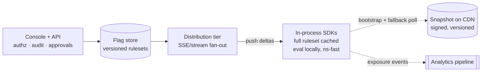

# DevOps Special: Feature Flags

Design a feature-flag system — the smallest-sounding special with the highest architectural density: it's a **config control plane** ([the Kubernetes lesson](../devops/kubernetes-architecture.md) in miniature), a [read path measured in nanoseconds](../foundations/latency-throughput.md), a [fleet-wide blast radius](../networking/proxies-gateways.md) begging for discipline, and — at maturity — [the release-governance layer](../devops/deployments.md) the whole company ships through. The prompt rewards the candidate who designs it as *infrastructure that must fail boring*, because a flag system's outage is every product's outage simultaneously.

## Requirements & estimation

**Scope**: boolean and variant flags; targeting rules (user/tenant/percentage/attributes); instant-ish kill switch (seconds fleet-wide); SDKs in-process across languages; audit trail of every change ([who flipped what when — this is change management](../devops/deployments.md)). Non-functional, and the design's spine: **flag evaluation is on every request's hottest path** — the check must cost *nanoseconds and zero network hops*; and **the flag service being down must not take products down** ([fail static](../devops/kubernetes-architecture.md) — the requirement to state before drawing anything).

**Numbers**: 2k flags × ~50 KB total ruleset ≈ **the entire config fits in every process's memory** — the estimate that *is* the architecture ("this is a distribution problem, not a storage problem"); evaluations: 500k RPS × ~20 flag checks ≈ **10M evals/s fleet-wide** — only survivable in-process; change rate: dozens/day — reads outnumber writes by [ten orders of magnitude](../foundations/thinking-in-systems.md), the most extreme ratio in the canon. Say that; it's the verdict.

## Architecture

**Evaluation is local — the non-negotiable**: SDKs hold the *full ruleset* in memory and evaluate on-process (a hash-and-compare, nanoseconds); **no network call per check, ever** ([the two-tier cache](../caching/fundamentals.md) taken to its logical end: L1 is the only tier on the hot path). Percentage rollouts are **deterministic bucketing** — `hash(flag_key + user_id) % 100` — the same user always lands the same side ([consistent, sticky, no coordination](../data/partitioning.md)), which is also what makes [canary-by-flag](../devops/deployments.md) statistically honest.

**Distribution — push with pull's honesty**: changes stream to SDKs ([SSE — one-way, proxy-friendly, auto-reconnecting: its textbook use case](../networking/apis.md)) for seconds-level propagation, over a **bootstrap-and-fallback snapshot path** ([versioned, signed ruleset on CDN/object storage](../data/object-storage.md)) — SDKs start from the snapshot, then subscribe; stream down → poll the snapshot; *both paths verify ruleset version monotonicity* ([never apply an older config than you have](../distributed/coordination.md) — a fencing token for config). Propagation SLO stated like an operator: "p99 flag-change-to-fleet-applied < 10 s, *measured* — the kill switch's worth is exactly this number."

**Fail static, everywhere**: service unreachable → SDKs serve the last-known ruleset indefinitely (and *say so* in their telemetry); process restarts → bootstrap from CDN snapshot (no thundering herd on the control plane — [the herd goes to the edge, which shrugs](../networking/cdn.md)); brand-new process with *nothing* → **compiled-in defaults** (every flag declares its safe value in code — the last line of defense, and the reason a total flag-system outage degrades to "yesterday's behavior," not chaos). [The three-layer fallback is the design's soul; recite it.](../devops/kubernetes-architecture.md)

**The write path is change management**: every mutation versioned, attributed, diffed, and — for [blast-radius-tiered flags](../devops/deployments.md) — gated (approvals for kill switches on tier-0 services; none for a dev's experiment flag): [the config-push discipline](../networking/proxies-gateways.md) productized. Flag changes get [canary machinery themselves](../devops/deployments.md) — a targeting-rule typo *is* a deploy, and the biggest flag-era outages were exactly this ([cite the genre, not the vendor](../devops/deployments.md)).

## The deep dives that win it

**Exposure events and experimentation**: every evaluation *can* emit "user U saw variant V" — at 10M evals/s, [sampled and batched](../observability/logging.md) through [the ingest pipeline](log-pipeline.md) — powering A/B analysis ([the flag system grows into the experimentation platform](../devops/deployments.md); acknowledging the gravity without designing the stats engine is the right scope). The subtle correctness point: exposure logging must be *evaluation-consistent* (log what was actually served, from the SDK, not reconstructed later from rules that have since changed — [the event-sourcing instinct](../messaging/event-driven.md): record the fact, not the derivation).

**Flag lifecycle as a first-class feature** ([the 2ⁿ test-matrix decay](../devops/deployments.md)): expiry dates on creation, staleness dashboards (flags at 100%/0% for 90 days are dead code with a pager), ownership required, and cleanup ergonomics (the console generates the "remove this flag" PR link) — the system *fighting its own entropy* is what separates a flag platform from a flag pile.

!!! ops "DevOps lens"
    The dashboards: **propagation lag fleet-wide** (ruleset version histogram across SDK heartbeats — the one graph that answers "did my kill switch land?"; [the dead-man's variant](../observability/alerting.md): alert when *any* segment's version age exceeds the SLO), **SDK staleness telemetry** (processes serving hours-old rulesets = broken streams or [egress rules](../devops/cloud-networking.md) eating SSE — found by the version histogram, not by user reports), **evaluation-error rates** (rule-parse failures fall back to defaults *loudly*), and **change-frequency anomalies** ([a flag flapping at 2 a.m. is an incident being fought or caused](../observability/incidents.md) — either way, surface it). Incident genres: the *bad targeting push* ([canary the config, stage by environment](../devops/deployments.md) — the system must dogfood deployment discipline), the *stream-reconnect stampede* after a distribution-tier deploy ([jittered reconnects, CDN bootstrap absorbing](../caching/failure-modes.md)), and the *default-drift* bug (compiled-in default says off, ruleset says on for a year, restart during an outage silently reverts behavior — audit defaults against live state as hygiene).

!!! staff "Staff+ altitude"
    (1) **The flag system is the release platform** — [deploy-vs-release decoupling](../devops/deployments.md) makes it the control point for progressive delivery, experimentation, entitlements, and incident mitigation; designing its API as *the org's release primitive* (with [error-budget-linked automation](../observability/slos.md): burn rate trips → flags auto-conservative) is the platform-thinking flex. (2) **Blast-radius tiering as governance**: a dev experiment and a payments kill switch are different objects — approval flows, audit depth, and propagation priority tiered by declared impact, [the paging-bar discipline](../observability/alerting.md) applied to config. (3) **Entitlements vs. experiments** — "customer X gets feature Y" (a *contract*, permanent, billing-adjacent) will colonize your experiment system unless separated early; naming that fork before it happens saves a painful migration ([the API-gravity lesson](kv-store.md), config edition). (4) **Build-vs-buy**: vendors (LaunchDarkly-class) are excellent and priced per-seat/per-MAU; the self-build justifies on [data-residency, evaluation-volume economics, or platform integration depth](../devops/cost-capacity.md) — the confession-first answer, as always.

!!! interview "In the interview"
    Open with the ratio and the requirement ("ten orders of magnitude read-heavy; evaluation must be in-process nanoseconds; the service failing must mean *stale flags, not no flags*") — the whole design falls out of those two sentences. The spine: local evaluation + deterministic bucketing → SSE push over CDN-snapshot pull with version monotonicity → the three-layer fail-static stack → write-path-as-change-management → lifecycle hygiene. Probes: *flag service dies?* (the three layers, recited — last-known → snapshot → compiled defaults; "yesterday's behavior, never chaos"); *how fast is the kill switch?* (propagation SLO, *measured* by version histograms — give the number and how you know it); *percentage rollout mechanics?* (deterministic hash bucketing — sticky, coordination-free, experiment-honest); *what took down [famous flag outage]?* (bad config push at fleet blast radius — hence canaried flag changes and tiered approvals; [config is code](../devops/iac-gitops.md), third time, always true); *SDK in six languages?* ([the paved-road problem](../caching/failure-modes.md) — a spec + conformance suite, or six subtly different evaluators produce six subtly different products). Close by connecting it home: "this is the same design as [the K8s control plane](../devops/kubernetes-architecture.md) — declarative truth, watching edges, fail-static data plane — config control planes are one pattern, and this is its purest form."
