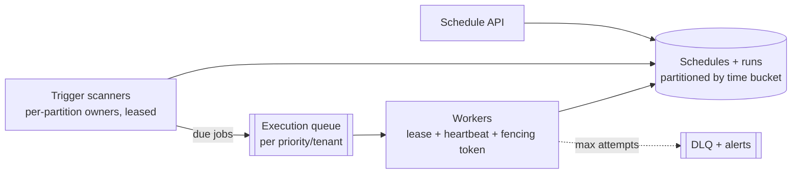

# DevOps Special: Job Scheduler

Design distributed cron — jobs that run *at* a time (one-off and recurring), at scale, exactly-once-ish, with retries. The prompt sounds like a `sleep` loop and is secretly the [coordination page's](../distributed/coordination.md) final exam: every hard question (who fires the trigger? what if the worker dies mid-run? what does "exactly once" even mean here?) is a lease, a fence, or an idempotency key wearing a scheduling costume. It's also quietly universal — [retry-with-backoff](../messaging/async-fundamentals.md), [saga timeouts](../data/distributed-transactions.md), [re-crawl scheduling](web-crawler.md), and "send in 24 h" features are all this system in miniature.

## Requirements & estimation

**Scope**: schedule one-offs ("run at T") and recurring (cron expressions), execute via [pluggable workers](../messaging/async-fundamentals.md), retries with backoff, visibility (status, history), and the semantics question asked *first* because it forks everything: **at-least-once execution with idempotent jobs** is the honest contract ([exactly-once execution doesn't exist for the same reason exactly-once delivery doesn't](../messaging/delivery-semantics.md) — a worker can die after doing the work, before reporting it; say this in minute two and the interview tilts your way). Non-functional: trigger precision ~seconds (ask! *sub-second changes the design*; cron-class tolerates jitter), [no lost jobs, durable schedules](../data/replication.md).

**Numbers**: 10M scheduled jobs, ~100k firings/minute peak ≈ **~2k triggers/s** — small; storage trivial. **Verdict**: "throughput is nothing; the entire design is *correctness under partial failure* — duplicate triggers, dead workers, and the thundering herd at the top of every minute."

## Architecture

**Storage — time is the index**: schedules and pending runs in a store ordered by fire-time — [the sorted-set-by-timestamp pattern](../caching/redis.md) or an indexed SQL table (`WHERE fire_at <= now AND state='pending'`), **partitioned by time-bucket × shard** ([the sequential-key hotspot](../data/partitioning.md) tamed by bucketing: everything due *now* must not live on one partition — the range-partitioning trap, pre-empted). Recurring jobs materialize their next N firings ("compute next occurrence on completion" — cron expressions stay in the schedule; *runs* are rows, [idempotently derivable](../messaging/delivery-semantics.md)).

**Triggering — the ownership move**: scanners poll their *owned* partitions ("due jobs in my buckets") — [one owner per partition via leases](../distributed/coordination.md), so duplicate triggering is structurally rare rather than lock-prevented ([route, don't lock — fifth appearance, still the answer](../distributed/coordination.md)). The residual race (lease handover overlap) is closed by **claim-on-transition**: firing = [a conditional write](../data/transactions.md) (`UPDATE runs SET state='queued' WHERE id=? AND state='pending'`) — losers of the race update zero rows and shrug. [At-least-once + idempotent transition = the whole trigger story.](../messaging/delivery-semantics.md)

**Execution — leases with teeth**: workers claim runs ([`SKIP LOCKED` or conditional-write claims](../data/transactions.md)), heartbeat while running ([long tasks extend the lease](../messaging/async-fundamentals.md)), and carry a **[fencing token](../distributed/coordination.md)** — the run's attempt number, checked by any side effect that can check it — because the [GC-pause zombie worker](../distributed/time-ordering.md) *will* eventually wake and try to report success on a run that was re-leased minutes ago ([the story](../distributed/coordination.md), now with a scheduler's name on it). Dead worker → lease expires → run reclaims to `pending` with `attempt+1` → [backoff-with-jitter](../distributed/resilience.md) → [max attempts → DLQ + alert](../messaging/async-fundamentals.md).

## The deep dives that win it

**The top-of-minute thundering herd**: humans schedule everything at `:00` ([synchronized demand is self-inflicted](../caching/failure-modes.md)) — 40% of daily firings in 2% of the seconds. The stack: **scheduling-time jitter** (offer/default `0 * * * * ~` splay — the fix that costs nothing), execution-queue smoothing ([the queue absorbs, workers drain level](../messaging/async-fundamentals.md)), and per-tenant [rate budgets](rate-limiter.md) so one tenant's 50k-job cron can't starve the fleet. Bonus depth: *downstream* herds — 10k jobs all hitting the same API at :00 is [your retry-storm](../distributed/resilience.md) exported; jitter is neighborly, not just self-protective.

**Misfires and catch-up policy** — the semantics question that separates operators: the scheduler was down 09:00–09:20; the 09:05 hourly job — run it late? skip it? run *all* missed occurrences? There's no universal answer, so it's a **per-job policy** (`catchup: run-once | run-all | skip`, [Airflow's hard-won lesson](../data/analytics.md)) — and *offering the policy enum instead of picking silently* is exactly the [contract-honesty](../messaging/delivery-semantics.md) the prompt is fishing for. Same family: overlap policy (previous run still going when next fires → `skip | queue | kill-and-replace` — [the singleton-execution question](../distributed/coordination.md), parameterized).

**DAG extension, scoped**: "now support job dependencies" → you're building [the CI/CD control plane's](cicd-platform.md) state machine (stages, fan-in triggers on completion events) — sketch the delta in three sentences (runs emit completion events; dependent runs materialize on parents' success; [the saga-shaped stuck-run dashboard](../data/distributed-transactions.md) comes along), and *bound it* — full workflow engines ([Temporal-class durable execution](../data/distributed-transactions.md)) are the buy-line, and naming it is the Staff move.

!!! ops "DevOps lens"
    The scheduler's own runbook: **lateness is the SLO** (fire-time vs. actual-start p99 — [age, not depth](../messaging/async-fundamentals.md), as ever; a scanner partition falling behind shows here first), **the stuck-run dashboard** ([state × age](../data/distributed-transactions.md): `queued` too long = workers starved; `running` past lease = zombies; `pending` past fire = scanner sick — three shapes, three diagnoses), **DLQ triage as a product surface** (failed jobs are *someone's* broken cron — [route the alert to the job's owner](../observability/alerting.md), not the platform team), **clock discipline** ([NTP-monitored fleet](../distributed/time-ordering.md) — a skewed scanner fires early/late and *nobody* files a clean bug for "my job ran 40 s early"; plus DST/timezone handling as the eternal cron tax — store UTC, render local, test the transitions), and **the scheduler's own scheduling** ([leader-elected scanners](../distributed/coordination.md) with [the mass-lease-expiry stampede](../distributed/coordination.md) jittered — the coordination page's ops callout, cashed here).

!!! staff "Staff+ altitude"
    (1) **Semantics as published contract** — at-least-once + idempotency-required + catchup/overlap policies as *documented platform law* with a conformance checklist for job authors ([the paved-road](../caching/failure-modes.md) version of "your job WILL run twice eventually; here's the test that proves yours survives it"). (2) **Multi-tenancy is the real product**: per-team quotas, priority tiers, [noisy-cron isolation](../data/partitioning.md), and *cost showback per firing* — a company-wide scheduler is a shared resource with all of [the rate-limiter's governance](rate-limiter.md) attached. (3) **Build-vs-buy honestly**: cloud-native options (EventBridge Scheduler-class) and durable-execution engines (Temporal) cover most needs; the internal build justifies itself on *scale × control × cost* arithmetic or not at all — [the confession-first pattern](kv-store.md). (4) **The scheduler is tier-0 by accretion** — teams quietly build [reconciliation](../data/distributed-transactions.md), [cert rotation](../devops/secrets-identity.md), and billing on it; a Staff owner tracks *what depends on firing on time* and [tiers the SLO accordingly](../observability/slos.md) before the dependency graph does it for them.

!!! interview "In the interview"
    Open with the contract ("at-least-once execution, idempotent jobs — exactly-once is a lie here for the same reason it is in messaging") — it reframes every failure question as already-answered. The spine: time-indexed storage with bucket-sharding → leased-owner scanners + conditional-write claims → worker leases with heartbeats and fencing tokens → herd management → misfire policy enum. Probes, pre-armed: *two schedulers fire the same job?* (partition ownership makes it rare; conditional transition makes it harmless — [both layers named](../distributed/coordination.md)); *worker dies mid-job?* (lease expiry → reclaim → retry with backoff → the fencing token stops the zombie's late report); *job takes 3 hours?* (heartbeat lease extension — [the SQS visibility lesson](../messaging/async-fundamentals.md)); *everything fires at midnight?* (jitter at schedule time + queue smoothing + tenant budgets — and the downstream-herd empathy line); *scheduler down 20 minutes?* (the catchup policy enum — "that's a per-job business decision I expose, not one I hardcode"). The fencing-token moment is this prompt's [set piece](../distributed/coordination.md) — land it and the rest is formality.
