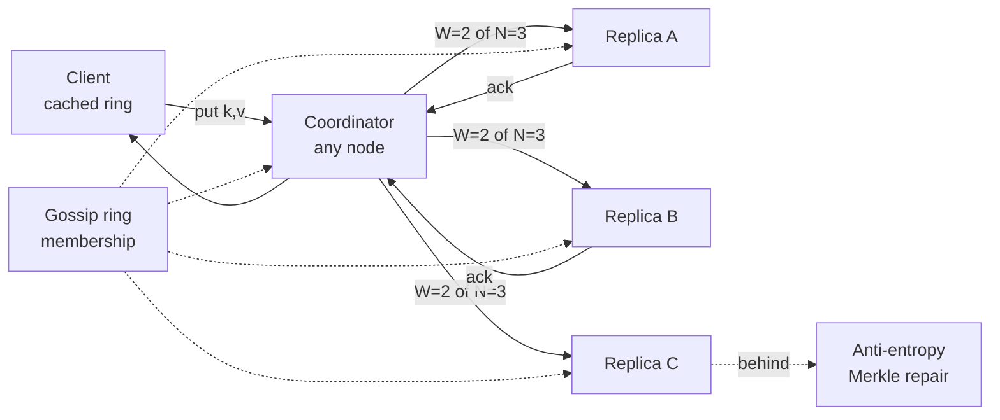

# Key-Value Store

"Design a distributed key-value store" is the capstone prompt: no product to hide behind, just distributed systems fundamentals assembled into a coherent machine. It's [the Dynamo paper](../data/nosql.md) as an exam — and if you've read this site's data and distributed sections, you already own every part. This walkthrough is the assembly manual: each component named, each with its decision and its [page of origin](../data/index.md), because the interview *is* a tour of those decisions.

## Requirements & estimation

**Scope**: `get(k)`, `put(k,v)`, `delete(k)`; values ≤ ~1 MB; horizontal scale to hundreds of nodes; and the question that *forks the whole design* — **CP or AP?** Ask it as a product question ([the partition-behavior framing](../foundations/cap-pacelc.md)): "during a partition, refuse writes or accept-and-merge?" Build the AP/Dynamo answer (richer interview terrain), noting the CP fork ([quorum-strict, or Raft-per-shard — the CockroachDB shape](../distributed/consensus.md)) at each divergence.

**Numbers**: 100 TB, 1M ops/s, 10:1 reads. Per node (NVMe, 64 GB RAM): ~2 TB data, ~50k ops/s comfortable → **~64 nodes + replication ×3 ≈ 200 nodes** — real fleet, [real failure math](../foundations/reliability-availability.md): at 200 nodes, *something is always dead*; the design must treat node loss as weather, not incident. That sentence is the verdict.

## Assembly, component by component

**Partitioning — [consistent hashing with virtual nodes](../data/partitioning.md)**: the ring, vnodes for variance-smoothing and heterogeneous hardware, K/N movement on membership change. Placement: each key's N=3 replicas are the next N *distinct physical nodes* clockwise, spread across [failure domains](../foundations/reliability-availability.md) (rack/AZ-aware placement — replicas sharing a rack share fate, and saying so is the ops instinct).

**Replication & consistency — [leaderless quorums](../data/replication.md)**: `W + R > N` as the dial (N=3: W=2/R=2 balanced; per-request override for [per-data-class posture](../foundations/consistency-models.md)). No failover machinery *by construction* — a dead replica is a quorum member absent, not an event ([the leaderless serenity](../data/replication.md)). The AP price, paid honestly: **sloppy quorums + hinted handoff** for availability during failures, and therefore **conflicts exist** → versioning (vector clocks or last-write-wins per-cell — [name the LWW clock-skew corruption caveat](../distributed/time-ordering.md); choosing LWW is choosing silent loss under skew, acceptable only by declaration), **read repair** on the read path, **anti-entropy via Merkle trees** in the background ([convergence as a process](../data/replication.md)).

**Node storage engine — [LSM](../data/storage-engines.md)**: memtable → WAL → SSTables → compaction; [Bloom filters](../data/storage-engines.md) for miss-cheapness; the [amplification triangle](../data/storage-engines.md) as the tuning surface. Deletes are **tombstones** (a distributed delete must out-replicate the data it kills — [the Cassandra tombstone saga](../data/nosql.md) is this decision's bill arriving).

**Membership & failure detection — [gossip](../data/nosql.md)**: nodes exchange heartbeat-stamped membership views; [suspicion-before-eviction](../distributed/failure-modes.md) (phi-accrual flavored) because [slow and dead are indistinguishable](../distributed/failure-modes.md) and eager eviction causes [flapping rebalances](../networking/load-balancing.md). No master, no [consensus core on the data path](../distributed/consensus.md) — though a small CP store for *cluster config* (ring version, schema) is the pragmatic modern concession; name the distinction.

**Client routing**: smart clients (or any-node-coordinates) holding a cached, versioned ring map — [the shard-map discipline](../data/partitioning.md): stale maps mis-route briefly, corrected by redirect-with-new-map ([MOVED semantics](../caching/redis.md)).

## The operations that prove the design

**Node death**: gossip suspects → confirms → ring updates → its vnode arcs' replication topology shifts to successors → anti-entropy backfills the new replicas, *rate-limited* ([re-replication is a backfill](../data/sql-at-scale.md); unthrottled it saturates the network exactly when the cluster is already degraded — the [recovery-herd lesson](../foundations/reliability-availability.md)). During the gap: sloppy quorums keep writes flowing; hints drain back when replacement stabilizes.

**Scale-out**: new node joins gossip → claims vnodes → **streams only its arcs' data** (K/N movement cashing out) → serves. The operational dial: join-streaming rate vs. cluster headroom — [same throttle discipline](../data/partitioning.md).

**Hot keys & big values**: [per-key metrics, L1 caching at clients, key-splitting](../caching/failure-modes.md); value-size caps enforced at the API ([big keys block event loops and replications alike](../caching/redis.md)) with [object-storage spillover](../data/object-storage.md) (store the pointer) as the escape hatch.

!!! ops "DevOps lens"
    Running your own Dynamo is a commitment; the dashboards that keep it honest: **quorum health per key-range** (how many ranges are at exactly-W live replicas — one more failure from unavailability), **hinted-handoff depth and age** ([hints piling = a node's been degraded longer than anyone noticed](../data/replication.md)), **repair coverage** (time-since-last-anti-entropy per range — unrepaired ranges are [divergence with a deadline](../data/nosql.md): outlive `gc_grace` and deletes resurrect), **compaction debt per node** ([the LSM operational headline](../data/storage-engines.md): pending compactions, write stalls, disk headroom ≥30–50%), **gossip convergence time** (membership disagreement = [split-brain-lite routing](../distributed/failure-modes.md)), and **ring balance** (vnode variance; the node with the triple arc is tomorrow's hotspot). Upgrade choreography: [rolling, one failure-domain at a time](../devops/deployments.md), quorum-aware ([never take W nodes of any range down together](../devops/kubernetes-workloads.md) — the PDB logic, hand-rolled).

!!! staff "Staff+ altitude"
    (1) **The build-vs-buy confession comes first** — "in production I'd reach for DynamoDB/Cassandra/managed-first unless we have exceptional scale, cost, or control needs; this design is what I'd *evaluate them against*" — [the boring-technology thesis](../data/sql-at-scale.md) applied to yourself, and interviewers at altitude *want* to hear it before the deep dive. (2) **CP fork fluency**: sketch the alternative in three sentences (Raft group per shard, [leader-per-range, linearizable by construction, election gaps as the availability price](../distributed/consensus.md) — the CockroachDB/Spanner lineage) and *when* it wins (uniqueness, counters, anything [fencing-shaped](../distributed/coordination.md)). (3) **Multi-region posture**: leaderless spans regions seductively and pays [cross-region quorum RTTs](../foundations/cap-pacelc.md) — the grown-up shapes are [per-region clusters + async replication, or regional homing](../devops/multi-region.md); "one global ring" is almost always the wrong answer, said with the latency math. (4) **API evolution gravity**: KV stores grow secondary indexes, scans, TTLs, and transactions by customer demand — each addition [re-fights a war this design dodged](../data/nosql.md); a Staff answer names the slippery slope and picks a stopping point on purpose.

!!! interview "In the interview"
    This prompt is a component tour with you as the guide — structure *is* the score: partition (ring + vnodes) → replicate (quorums + the dial) → converge (hints, read repair, Merkle) → store (LSM + tombstones) → membership (gossip) → route (cached maps), each with its one-sentence *why* and its failure story. The probes are the classics in sequence: *W=2 write, node dies before repair?* (R=2 overlaps → read repair fixes; anti-entropy is the backstop); *two concurrent writes, both acked?* (versioning: vector clocks detect, someone merges — or LWW with the skew caveat *stated*); *why no leader?* (no failover drama, symmetric availability — traded for conflict machinery; [the scorecard row by row](../data/replication.md)); *delete a key?* (tombstone + gc_grace + repair discipline — the resurrection story told *before* they ask); *make it CP?* (the three-sentence Raft-per-shard fork). Finish where Dynamo started: the design is one business commitment — never refuse a write — [with every exotic mechanism as that commitment's installment plan](../data/nosql.md). Telling it as that story is what separates assembly from understanding.
