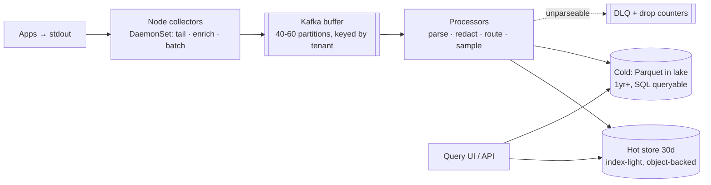

# DevOps Special: Log Pipeline

Design a log aggregation system — the [26 TB/day estimation example](../foundations/estimation.md) grown into a full walkthrough. It's the purest **ingest-shaped** design in the canon ([1000:1 write-heavy](../foundations/thinking-in-systems.md)), with one philosophical fork (index-heavy vs. index-light) that decides the economics, and a burst profile that inverts normality: *peak load arrives exactly when the system matters most* — during everyone else's outage. The [logging page](../observability/logging.md) laid the principles; this is the assembly.

## Requirements & estimation

**Scope**: collect from every host/pod, parse and enrich, make searchable within seconds, retain per policy (30 d hot / 1 yr cold), serve incident-time queries fast; the audit-log stream [explicitly split off](../observability/logging.md) (immutable, legal-retention, separate pipeline — one sentence, big maturity signal). Non-functional: **never block producers** ([logging must not take down the product](../observability/logging.md)), lossless-ish for errors (sampled INFO is fine, [say the classes](../observability/logging.md)), and **burst tolerance of 10–100×** because [error storms are log storms](../observability/logging.md).

**Numbers** ([the worked example](../foundations/estimation.md), owned): 10k hosts × 100 lines/s × 300 B = **300 MB/s ≈ 26 TB/day raw**; ×10–100 during incidents. [Kafka math](../messaging/kafka.md): 300 MB/s ÷ ~15 MB/s per partition ≈ 20 minimum → **provision 40–60**; ×3 replication ≈ 1 GB/s cluster write bandwidth. Hot store at 10:1 compression: 26 TB → ~2.6 TB/day × 30 d ≈ **80 TB hot** (+30–100% if you index everything — *the fork, previewed by arithmetic*). Cold: ~1 PB/yr compressed in [object storage tiers](../data/object-storage.md). **Verdict**: "ingest is a solved streaming problem; the design decisions are the buffer, the index philosophy, and retention economics."

## Architecture

**Collect**: apps write stdout, [never ship logs themselves](../observability/logging.md); node-level collectors ([DaemonSet](../devops/kubernetes-workloads.md)) tail, enrich with metadata (pod, node, version — the labels queries filter by), batch, and forward with [bounded local buffers + drop counters](../observability/logging.md) (the [at-most-once choice](../messaging/delivery-semantics.md) at the edge, made visible).

**Buffer — the load-bearing decision**: [Kafka](../messaging/kafka.md) absorbs the incident burst; [retention-as-RTO](../messaging/async-fundamentals.md) sized aloud ("6 h of peak = the search tier can die for 6 h with zero loss"). Partitioned by tenant/service hash — [per-key ordering](../messaging/async-fundamentals.md) preserved where it matters (per-pod log order), parallelism everywhere else.

**Process**: parse to [structured events](../observability/logging.md), [redact at the platform layer](../observability/logging.md) (PII/secrets never reach storage — enforced here, not in 400 apps' goodwill), apply [class-based sampling](../observability/logging.md) (errors 100%, INFO sampled, [trace-coherent](../observability/tracing.md)), route (audit stream out; per-tenant quotas enforced — [the noisy-team rate limiter](rate-limiter.md)); unparseable events [DLQ with alerting, never silent drops](../messaging/async-fundamentals.md).

**Store — the fork, argued**: index-everything (Elastic-class: instant full-text, 30–100% index overhead, real cluster ops) vs. **index-light (the recommendation)**: index only labels + time (Loki-class), store compressed chunks in [object storage](../data/object-storage.md), brute-scan at query time. Defense: [the query-pattern honesty](../observability/logging.md) — 95% of real queries are *service + time window + trace-ID*, which labels answer; the rare full-text needle-hunt tolerates a slower scan; and the economics at 26 TB/day are decisive (object storage + small index vs. a fleet of index-heavy nodes). Cold tier: [Parquet in the lake](../data/analytics.md), SQL-queryable, [lifecycle-tiered to archive](../data/object-storage.md) — logs *become* analytics data as they age, and the architecture should admit it.

## The deep dives that win it

**The incident-burst inversion**: error storms 100× volume exactly when responders need queries fast. The stack: Kafka absorbs (that's *why* it's there), [shed-by-class at the processor](../distributed/resilience.md) (errors and canonical lines survive; DEBUG/INFO shed first — [priority shedding](../distributed/resilience.md) with the priorities pre-decided), per-tenant quotas stop one team's storm from drowning others ([bulkheads](../distributed/resilience.md)), and the query tier [bulkheaded from ingest](../distributed/resilience.md) so writes can't starve incident reads. Say the inversion explicitly — it's the sentence that proves you've *used* a log system during a fire, not just built one.

**Query-time craft**: time-partitioned, label-partitioned chunks make "last 15 min, service=checkout" a [pruned scan](../data/analytics.md), not a cluster grep; [trace-ID lookup is the three-keystroke path](../observability/logging.md) (the incident workflow's spine: [metric → trace → logs](../observability/fundamentals.md)); heavy historical queries route to the cold SQL tier — different lanes, [different SLOs, priced accordingly](../devops/cost-capacity.md).

!!! ops "DevOps lens"
    The pipeline's own runbook ([you've carried this pager](../observability/logging.md)): **collector health fleet-wide** (a silent collector = a blind spot — [dead-man's-style](../observability/alerting.md) per-node liveness), **consumer lag age** ([the SLO: seconds-to-searchable](../messaging/async-fundamentals.md) — lag during an incident means responders query a past that's minutes old; alert on it *as* product breakage), **drop counters everywhere** (edge buffers, sampler, quota enforcement — visible loss is a policy, invisible loss is an incident), **DLQ depth** ([parse-failure spikes follow deploys](../observability/logging.md) — a schema change upstream just broke the processor; the alert names the offending service), **per-tenant volume anomalies** ([the accidental-TRACE and recursive-logging genres](../observability/logging.md) — velocity alerts convert month-end bills into same-day fixes), and **storage-tier lifecycle verification** ([the petabyte that never transitioned](../data/object-storage.md)). The meta-rule stated in-interview: the log pipeline logs *about itself* go somewhere simpler — a pipeline that needs itself to debug itself is [a circular dependency wearing a uniform](../foundations/reliability-availability.md).

!!! staff "Staff+ altitude"
    (1) **The canonical-log-line campaign** — [one wide event per request](../observability/logging.md), platform-middleware-enforced: halves volume *and* raises query value; the highest-ROI change and it's organizational, not architectural — which is the point. (2) **Cost governance as product**: per-team ingest showback, [sampling policy as a written treaty](../observability/logging.md), retention tiers with owners — at 26 TB/day the pipeline is a [seven-figure line item](../devops/cost-capacity.md), and "whose logs cost what" is a dashboard the CFO gets. (3) **The audit split is non-negotiable** ([immutable, object-locked, legal-retention, access-logged](../observability/logging.md)) — conflating debug logs with compliance artifacts under-protects one and over-prices the other. (4) **Schema governance across 400 services** ([field dictionary, CI linting, data contracts](../observability/logging.md)) — logs are consumed by security, finance, and ML long after debugging; the pipeline is a data platform whether you admit it or not, and Staff-level design admits it.

!!! interview "In the interview"
    The spine: the 26 TB/day math → collector/buffer/processor/store left-to-right with one decision each → the index-light fork argued from query patterns → the incident-burst inversion as your centerpiece deep dive. Probes: *why Kafka in the middle?* ([burst absorption + retention-as-RTO + consumer independence](../messaging/kafka.md) — three reasons, numbers attached); *why not Elasticsearch for everything?* (query-pattern honesty + the 30–100% index tax at this volume — economics, not fashion); *how do you not lose logs?* (per-class honesty: errors lossless through acked Kafka; INFO sampled *by policy*; edge drops counted and visible — ["losing 0.1% of INFO beats blocking checkout"](../observability/logging.md)); *what happens during a huge outage?* (the inversion stack, rehearsed); *PII in logs?* ([platform-layer redaction + the never-log list + the audit split](../observability/logging.md)). Home-field prompt, [take it when offered](../interviews/question-bank.md) — and close with the self-observation meta-rule, which lands like the operator's signature it is.
