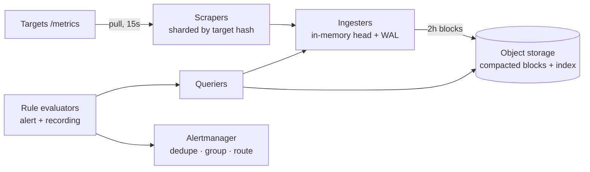

# DevOps Special: Metrics System

"Design a metrics/monitoring system" — the prompt where you've *operated the real thing*, and the interview becomes a guided tour of your home. It's also a genuinely hard design: [the most write-heavy workload shape in the canon](../foundations/thinking-in-systems.md), a query language over it, and an alerting engine whose own reliability outranks the product it watches. The [metrics page](../observability/metrics.md) taught the concepts; this is their assembly under the clock.

## Requirements & estimation

**Scope**: ingest metrics from a fleet, store as time series, query for dashboards (ranges, aggregations), evaluate alert rules continuously; [logs and traces explicitly out](../observability/fundamentals.md) (different pillars, different systems — drawing the boundary is the first point scored). Non-functional: ingest must be *relentless and lossless-ish*; queries are dashboard-latency (sub-second for recent data); **alerting evaluation is the tier-0 path** — the system watching production must out-survive production ([who monitors the monitor](../observability/fundamentals.md) is a requirements question here, not a koan).

**Numbers** ([the derived-load math](../foundations/estimation.md), center stage): 10k hosts × 100 pods-ish worth of targets × ~1k series each ≈ **10M active series**; scraped every 15 s ≈ **~700k samples/s**. At ~2 bytes/sample compressed (the Gorilla-encoding number worth citing): ~120 GB/day — *storage is modest*; the pressure lives in **series cardinality (the index) and ingest fan-in**, not bytes. **Verdict**: "this is an index-and-ingest problem wearing a storage costume — [cardinality is the boss fight](../observability/fundamentals.md)."

## Architecture

**Ingest — [pull](../observability/metrics.md)**, defended in one breath (backpressure: the monitor controls its load; `up` for free; declared targets) with the honest push exceptions (edge, batch jobs) via a remote-write door. Scrapers shard by target hash ([ownership routing](../distributed/coordination.md) — each target scraped by exactly one scraper, [rebalanced on membership change](../data/partitioning.md) via the ring you already know).

**The write path is a TSDB's heart**: samples land in an **in-memory head block** (recent hours — the hot query window served from RAM) journaled by a [WAL](../data/storage-engines.md) (crash = replay, not loss); every ~2 h the head seals into an **immutable block** — columnar-ish chunks per series, [Gorilla/delta-of-delta compression](../observability/metrics.md) (timestamps and values delta-encode brutally well — 16 bytes → ~2), plus an inverted **label index** (label→series postings — *this* is what cardinality inflates). Blocks upload to [object storage](../data/object-storage.md); **compactors** merge and downsample in the background ([LSM philosophy at metrics scale](../data/storage-engines.md): sequential writes, immutable files, background merge — say the kinship). Retention = [tiering](../data/object-storage.md): raw 15 d, 5-min rollups 90 d, 1-h rollups years — downsampling *is* the retention economics.

**Query path**: queriers fan out over head + relevant blocks, [merge-and-aggregate](../data/analytics.md); **recording rules** precompute expensive expressions ([read-path/write-path trade](../foundations/thinking-in-systems.md), verbatim); per-query **limits** (series touched, samples scanned) because [one whale query is the analytics-took-down-checkout story](../data/analytics.md) pointed at your own dashboards.

**Alert evaluation — the tier-0 lane**: rule evaluators run [the burn-rate queries](../observability/slos.md) on schedule against *recent* data (head-block reads — deliberately independent of the long-term store: **object storage down must not stop paging**; [bulkhead the lanes](../distributed/resilience.md)). Fired alerts flow to an alertmanager tier for [dedupe, grouping, inhibition, routing](../observability/alerting.md) — itself clustered, because [the dead-man's switch](../observability/alerting.md) needs somewhere reliable to live.

## The deep dives that win it

**Cardinality defense in depth**: per-tenant/series limits *enforced at ingest* (reject-with-metrics beats OOM — [the bounded-queue philosophy](../messaging/async-fundamentals.md) applied to series), label linting upstream, top-K cardinality-offender dashboards, and the honest failure story: [one deploy adding `pod_name`-with-churn](../observability/metrics.md) walks in as a 10× series spike — the system's own [rate limiter](rate-limiter.md) against its noisiest tenant.

**HA without double-paging**: run scrapers/evaluators in **replicated pairs** (both scrape, both evaluate — [active-active because failover is a gap](../data/replication.md) and gaps in *alerting* are the unforgivable failure); dedupe at the alertmanager (replica label dropped, [idempotency by alert fingerprint](../messaging/delivery-semantics.md)). Queries dedupe replicated samples at read time. The design accepts 2× ingest cost to make the paging path [redundant with no failover moment](../foundations/reliability-availability.md) — a trade worth saying out loud.

**Multi-cluster/global view**: per-cluster stacks ([cells](../foundations/reliability-availability.md) — a cluster's monitoring lives and dies with it, deliberately) + a global query layer federating across them, + [remote-write to a central long-term store](../observability/metrics.md) for the fleet view. The monitoring topology *mirrors the failure-domain topology* — [the multi-region lesson](../devops/multi-region.md): your observability must survive the region it observes.

!!! ops "DevOps lens"
    You've lived this system's incidents; name them as design inputs: **the cardinality bomb** (ingest limits + offender dashboards, above), **the scrape gap** ([targets churning faster than discovery converges](../devops/kubernetes-workloads.md) — staleness handling and `up` semantics), **query-of-death** (limits + [per-tenant query quotas](rate-limiter.md) + a killer for runaway queries), **the compactor falling behind** ([the LSM debt-collector story](../data/storage-engines.md): block pileup, query fan-out widening, disk pressure — compaction lag is a first-class alert), and **WAL replay time** (a fat head block = slow ingester restarts = scrape gaps during deploys — [replay duration is your real MTTR input](../foundations/reliability-availability.md); cap head size accordingly). And the meta-discipline, stated in-interview: this system gets [the dead-man's switch](../observability/alerting.md), an *external* prober, and its own minimal meta-monitoring — "who watches the watcher" answered with architecture, not philosophy.

!!! staff "Staff+ altitude"
    (1) **Build-vs-buy, confessed early**: managed (Datadog-class) trades [cardinality-priced bills](../observability/fundamentals.md) for zero ops; self-run (Prometheus/Thanos/Mimir lineage) trades a platform team for control and 10× cost efficiency at scale — the crossover is [an estimation-page exercise](../devops/cost-capacity.md) with real numbers (series count × $/series vs. team cost), and "here's the volume where the math flips" is the Staff sentence. (2) **Multi-tenancy is the product**: per-team isolation ([quotas on series, samples, queries](rate-limiter.md)), showback by cardinality, and [paved-road instrumentation defaults](../observability/fundamentals.md) — the platform's job is making 400 teams' telemetry *not* be 400 incidents. (3) **The alerting lane's independence is the design's soul** — reviews should attack it ("object store down: do pages still fire? region down: does the surviving region's stack cover?"); [static-stability](../devops/multi-region.md) applied to observability. (4) **Downsampling policy is a governance artifact** — what resolution survives how long is a cost-vs-forensics treaty with incident responders, [not a default nobody chose](../observability/logging.md).

!!! interview "In the interview"
    The spine: derived-load math → "cardinality is the boss fight" verdict → pull-based ingest with sharded scrapers → head+WAL+immutable-blocks storage with the LSM kinship named → bulkheaded alert lane → HA-by-active-active-dedupe. Probes you'll get: *why pull?* ([the three reasons](../observability/metrics.md), rehearsed); *how is storage so small?* (Gorilla compression — 16 bytes to ~2; cite it); *what breaks this system?* (cardinality, with the ingest-limit defense — answering *before* the probe is the home-field move); *how do you monitor the monitor?* (dead-man's switch + external prober + per-cluster cells); *how do alerts stay up when storage is down?* (the bulkheaded evaluation lane reading only the head — the design's best sentence). This prompt is your [take-it-every-time offer](../interviews/question-bank.md) — the walkthrough above is 45 minutes of home turf.
