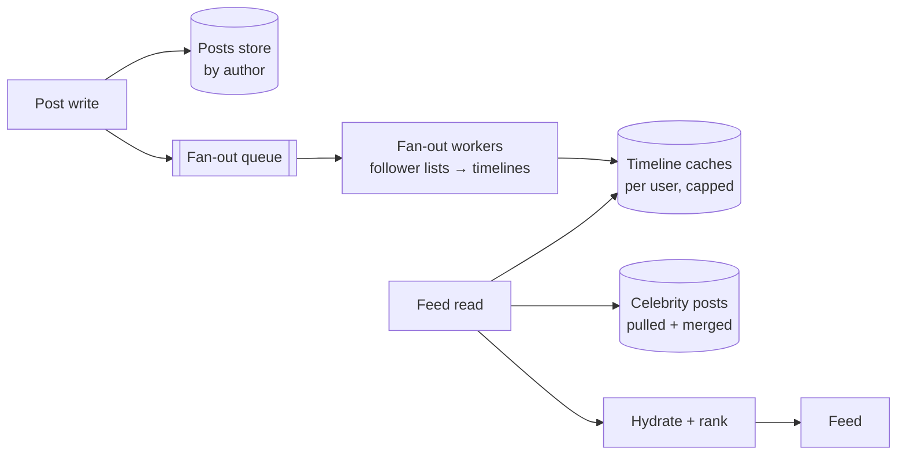

# News Feed

The canon's favorite trade-off question, because its heart is a single decision — **do the work at write time or read time?** — with a twist (celebrities) that breaks whichever answer you pick first. It's [the read-path/write-path model](../foundations/thinking-in-systems.md) as an entire product, and the interview is essentially: can you hold both strategies, know their breaking points, and assemble the hybrid the industry actually converged on.

## Requirements & estimation

**Scope**: follow users, post, read a reverse-chron feed of followees (ranking acknowledged as a layer on top — park ML, keep the *candidate generation* problem); likes/counts as a stretch. Non-functional: feed load is the app's front door — target p99 < 200 ms; [read:write ≈ 100:1](../foundations/thinking-in-systems.md); posts must appear to *followers* within seconds, and to the *author instantly* ([read-your-writes](../foundations/consistency-models.md) — the anomaly users screenshot).

**Numbers**: 200M DAU; 10 feed loads/day ≈ **~20k feed reads/s, 60k peak**; 1 post/user/day ≈ **~2.3k posts/s**. The number that *decides the architecture*: follower distribution — median ~200, celebrities 100M+. Fan-out math aloud: median post → 200 timeline writes (fine); celebrity post → **10⁸ writes for one tap** ([amplification](../foundations/thinking-in-systems.md) at its most vivid — at 2.3k posts/s average this is why pure push dies). **Verdict**: "reads demand precompute; celebrities forbid it; the design is the hybrid and its seam."

## The two pure strategies (know both cold)

**Fan-out on write (push)**: on post, write the post ID into every follower's precomputed timeline ([Redis list/ZSET or wide-column row per user](../data/nosql.md) — capped at ~800 entries, it's a cache not an archive). Feed read = fetch your list, [hydrate posts from cache](../caching/fundamentals.md), return — **one-partition read, blazing** ([the queries-first modeling](../data/nosql.md) payoff). Costs: write amplification × followers, storage × duplication, and wasted work for dormant users (fanning out to 90-day-inactive accounts is pure heat — skip them; lazy-rebuild on return).

**Fan-out on read (pull)**: store posts once, per author; feed read = fetch your follow list, query each followee's recent posts, merge, rank. Zero write amplification — and the read is a [scatter-gather across hundreds of partitions](../data/partitioning.md) whose latency is the slowest shard ([tail amplification](../foundations/latency-throughput.md): at 500 followees, per-shard p99 *is* your median), repeated on every load. Pull is what you'd build if reads were rare. They aren't.

**The hybrid (the answer)**: push for the many, pull for the few. Authors below a follower threshold (~10k–1M; it's a [tunable cost dial](../devops/cost-capacity.md), not a constant) fan out on write; celebrity posts stay in their author partition; feed read = **fetch your precomputed timeline + pull the handful of celebrities you follow + merge at the edge**. Each strategy covers the other's catastrophe: bounded write amplification *and* bounded read fan-out (you follow ~10 celebrities, not ~500). This asymmetric-workload-split pattern — segment the population by cost profile, run different machinery per segment — [generalizes far beyond feeds](../data/partitioning.md) (whale tenants, hot keys) and *naming the generalization* is a Staff-flavored flourish.

## Architecture

The pieces, one decision each: **posts store** — write-once by author ([wide-column, author-partitioned, time-clustered](../data/nosql.md)); **fan-out via queue** ([the async boundary](../messaging/async-fundamentals.md): the author's ack never waits on 200 timeline writes; workers absorb bursts, [idempotent by post ID](../messaging/delivery-semantics.md) because retries duplicate); **timeline caches** — IDs only (hydrate content at read — storing full posts ×200 followers is the denormalization that ate the cluster; IDs keep timelines tiny and edits/deletes cheap-ish); **read path** — timeline fetch + celebrity merge + [hydration from a post cache with the full six-part sentence](../caching/fundamentals.md) + ranking as a stateless layer on the merged candidates ([CQRS-shaped](../messaging/event-driven.md): the timeline is a projection; rebuildable, disposable).

**Author-sees-own-post-instantly**: [client-side patching + leader-read of own recent posts](../foundations/consistency-models.md) — the UI is part of the consistency architecture; say it and collect the point.

**Deletes and edits** (the probe that catches push designs): the post ID is everywhere. Answer: timelines hold IDs → hydration checks the post store → deleted post hydrates to nothing (filter, backfill one extra candidate). Delete is one write + cache invalidation, *not* a 200-partition scrub. This is why IDs-not-content was the right call — connect it back explicitly.

**Counts at scale** (likes/views): [sharded counters batch-flushed, HLL for uniques, eventual by declaration](../caching/redis.md) — one sentence, park it, [the counters row of the consistency table](../foundations/cap-pacelc.md).

!!! ops "DevOps lens"
    The feed's operational truths: **fan-out lag is the product SLO** ([queue age, not depth](../messaging/async-fundamentals.md) — "posts visible to followers p99 < 5 s" is the alert; a celebrity-adjacent burst backing the queue is the incident genre), **timeline-cache loss is a rebuild story** (it's a projection — [replay from the posts store](../messaging/event-driven.md), rate-limited, hot users first; losing it is degraded-mode pull-reads, not data loss — *rehearse that brownout*), **the hot-post problem** (one viral post hydrated on every feed load = [the hot key](../caching/failure-modes.md) — L1 caches on feed servers absorb it), and **dormant-user hygiene** (fan-out skip-lists and lazy rebuild are a double-digit-percent [cost lever](../devops/cost-capacity.md) — the kind of number that makes the FinOps review interesting). Deploy note: fan-out workers are the [amplification engine](../foundations/thinking-in-systems.md) — a bad deploy there corrupts timelines at scale; [canary with extra soak](../devops/deployments.md), and keep the projection-rebuild tooling warm.

!!! staff "Staff+ altitude"
    (1) **The threshold is a costed dial** — push-vs-pull crossover moves with storage prices, read latency targets, and celebrity count; owning it as a [tunable with a model](../devops/cost-capacity.md) ("at 100k threshold: X TB of timelines, Y ms merge p99") beats defending a magic number. (2) **Ranking changes the contract** — once ML ranks, the timeline cache becomes *candidate generation*, freshness pressure relaxes (a ranked feed tolerates minutes-old candidates), and the real-time infra budget should follow the product's *actual* freshness need — a requirements-question, re-asked at altitude. (3) **The feed is a privacy surface** — blocks, mutes, private accounts must apply at *every* path (fan-out filter, celebrity merge, hydration) — three enforcement points, one policy, [the cached-authorization staleness trap](../caching/fundamentals.md) with legal stakes; raising it unprompted is real signal. (4) **The pattern portfolio**: feeds are the canonical *materialized-view-maintenance* problem — [the same shape as CQRS projections, search indexes, and CDC-fed caches](../messaging/event-driven.md); a Staff answer names the family, because the org will build this shape five more times.

!!! interview "In the interview"
    This prompt has a script the interviewer expects — deliver it *with the math*: pure push (200-write median, 10⁸ celebrity — dead), pure pull (scatter-gather tail — dead), hybrid with the threshold and the merge (alive, and here's why each catastrophe is covered). Then differentiate in the follow-ups: *deletes?* (IDs + hydration filter — and connect it to why IDs were stored); *author sees own post?* (client patch + leader read — [the consistency mechanisms](../foundations/consistency-models.md) by name); *feed is slow for one user?* (they follow 40 celebrities — the merge is their tail; cap or precompute for heavy-followers: the design's own [whale problem](../data/partitioning.md), recursed); *now add ranking?* (candidate generation + stateless ranker + the freshness-relaxation point). Close operational: fan-out lag SLO, rebuildable projections, the brownout to pull-mode — [the operability phase](../interviews/framework.md) lands hardest on the prompt everyone else ends at the whiteboard.
