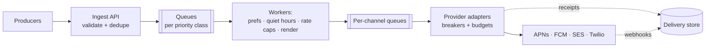

# Notification System

The deceptively rich prompt: it sounds like "send emails," and it's actually a [fan-out engine](../foundations/thinking-in-systems.md), a [priority-queue system](../messaging/async-fundamentals.md), a third-party integration layer with [hostile failure modes](../distributed/resilience.md), and — at the top of the maturity curve — a governance platform. It's also [the worked example of the levels page](../interviews/communication.md), so this walkthrough is the Senior floor built properly, with the Staff and Principal layers marked where they attach.

## Requirements & estimation

**Scope**: multi-channel (push, email, SMS, in-app), triggered by system events and by campaigns; user preferences and quiet hours; delivery tracking. The scoping move that reframes everything ([the Staff opener](../interviews/communication.md), usable at any level): **OTP/transactional and marketing-blast are different workloads wearing one name** — seconds-latency, [high-availability](../foundations/reliability-availability.md), never-drop vs. throughput-shaped, brown-outable. Same pipeline, **separate priority classes, separate queues, separate SLOs** ([in-queue priorities starve](../messaging/async-fundamentals.md); separate queues don't).

**Numbers**: 100M DAU; ~10 notifications/user/day average ≈ 10⁹/day ≈ **12k/s average — but the shape is spiky**: a campaign to 50M users "now" is a burst limited only by your own send rate, and a breaking-news event triggers millions in minutes. **Verdict**: "average throughput is easy; the design problems are burst absorption, provider failure, not-annoying-users, and duplicates — I'll spend depth there." (Storage: delivery records ~1 KB × 10⁹/day is [a real retention conversation](../data/analytics.md) — 30 days hot, then aggregate.)

## API & flow

```
POST /notifications {template_id, recipient_id | segment_id, channel_hints, priority, idempotency_key, dedupe_key?}
```

Producers (services, campaign tools) call one API; everything after is async — the caller gets an ID, never a wait ([the sync/async boundary](../foundations/thinking-in-systems.md): nobody's checkout blocks on SMTP). Two keys, distinct jobs, worth distinguishing aloud: **idempotency_key** ([retried API calls don't double-enqueue](../messaging/delivery-semantics.md)) and **dedupe_key** (business-level: "order-42-shipped" — however many services emit it, the user gets one).

## Architecture



The pipeline stages, each with its one design sentence: **ingest** validates, applies the dedupe key ([unique-constraint-backed](../data/transactions.md)), and drops to the right priority queue; **decision workers** load user preferences and quiet hours ([a read-heavy KV lookup — cache it](../caching/fundamentals.md)), apply **per-user frequency caps** ([a rate limiter pointed at annoyance](rate-limiter.md) — the feature that protects the product itself), pick channels (push if reachable, else email — channel fallback is a *policy*, encode it as one), render templates; **channel queues** isolate downstream fates ([bulkheads](../distributed/resilience.md): Twilio's bad day must not delay push); **provider adapters** hold the hostile-world machinery — per-provider [circuit breakers, rate budgets](../distributed/resilience.md) (providers *will* throttle you; blowing through APNs limits gets you banned, not just delayed), retries with [full jitter](../distributed/resilience.md), and provider failover where channels allow (SMS via two vendors; email likewise — [the multi-provider hedge](../foundations/reliability-availability.md) is real here because vendors are genuinely independent).

**Delivery semantics, end to end**: every hop [at-least-once + idempotent](../messaging/delivery-semantics.md); the provider send itself is the [side-effect-that-leaves-the-system](../messaging/delivery-semantics.md) — pass your dedupe key through where vendors support it, accept the honest residual ("a crash between send and ack can double-send; vendor keys shrink it; for OTP we bias to at-least-once, for marketing to at-most-once" — *choosing the failure per class* is the senior move). Receipts and provider webhooks flow back async into the delivery store — which powers status APIs, retry-on-no-receipt, and [the reconciliation sweep](../data/distributed-transactions.md) (nightly: sends without receipts, receipts without sends — trust, but verify with a cron).

## Deep dives worth steering toward

**Burst absorption**: the 50M-recipient campaign enters as *one* API call and explodes at the fan-out worker — [amplification](../foundations/thinking-in-systems.md) made literal. The queue absorbs; workers drain at provider-budget pace; the *campaign* class can take hours by design ([load leveling](../messaging/async-fundamentals.md) is the feature, not a compromise), while OTP rides the express lane unbothered. Autoscale workers on [queue age per class, not depth](../messaging/async-fundamentals.md).

**The device-token lifecycle** (the push-channel deep dive nobody prepares): tokens rot — apps uninstalled, tokens rotated by the OS. Providers return feedback ("token invalid"); you *must* consume it and prune, or your send volume inflates with ghosts, your metrics lie, and eventually the provider throttles you for spamming corpses. It's [the DLQ discipline](../messaging/async-fundamentals.md) pointed at an external catalog — unsexy, and the operational tell of someone who's run push at scale.

**In-app/real-time channel**: [SSE or WebSocket](../networking/apis.md) delivery for online users rides the [chat architecture](chat.md) in miniature — connection registry, publish to the node holding the socket, fall back to push if offline. One sentence in this design; a full walkthrough next door.

!!! ops "DevOps lens"
    The dashboards that run this system: **end-to-end latency per priority class, enqueue→provider-ack** ([the queue hides slowness — measure through it](../foundations/devops-lens.md); OTP p99 is the SLO that pages), **provider health matrices** (per-provider error/throttle/latency — the breaker states *are* the vendor status page you can trust), **queue age per class** (campaign backlog of hours = fine; OTP backlog of seconds = incident), **token-prune and bounce rates** (deliverability rot is gradual then sudden — email domain reputation especially: warm up IPs, honor suppression lists, or land in spam fleet-wide), and **the duplicate/miss reconciliation report** as the weekly truth. Incident genres: the *provider brownout* (breakers open, failover fires, budget-limited catch-up drains the backlog — rehearsed), the *campaign-tramples-OTP* (someone routed a blast to the wrong class — class-based authz on the ingest API), and the *feedback-loop lapse* (nobody consumed bounce webhooks for a month; deliverability quietly cratered).

!!! staff "Staff+ altitude"
    [The levels page](../interviews/communication.md) already staged this prompt; the attachment points in this design: (1) **split the SLO, not the infrastructure** (priority classes over parallel systems — one pipeline, two contracts); (2) **buy the engine, own the contract** (v1 on managed push/email behind *your* API — [the custom fan-out earns itself at 10×](../interviews/requirements-estimation.md), and the swap is invisible because the contract was yours); (3) **the preference store is the real product surface** — five teams integrate against it; its API gets the design attention the queues don't need; (4) **governance is the Principal layer** — per-team send budgets, org-wide frequency caps, fatigue metrics ([notification pressure as an error budget](../observability/slos.md)): the scarce resource is *user attention*, and the mature system rations it by policy, because the alternative — every team blasting independently — is how apps get muted, which no queue architecture can fix.

!!! interview "In the interview"
    The spine to perform: split transactional/marketing in the first two minutes (it restructures everything after and reads as product sense), then the pipeline left-to-right with one decision per stage, then steer depth to burst-absorption and provider-failure (where your [resilience vocabulary](../distributed/resilience.md) compounds). Probes to expect: *duplicate notifications?* (idempotency at every hop + dedupe key + the honest provider-boundary residual, per class); *provider goes down?* (breaker → failover where the channel allows → budget-paced catch-up — and *name the ban risk* of ignoring provider limits); *user gets 40 notifications?* (frequency caps + digest batching + quiet hours — the annoyance limiter is a feature, not politeness); *how do you know it was delivered?* (receipt tracking + reconciliation — ["push for latency, poll for truth"](../networking/apis.md) applied to your own vendors). Close with the governance sentence — it's the one they won't have heard twice that day.
