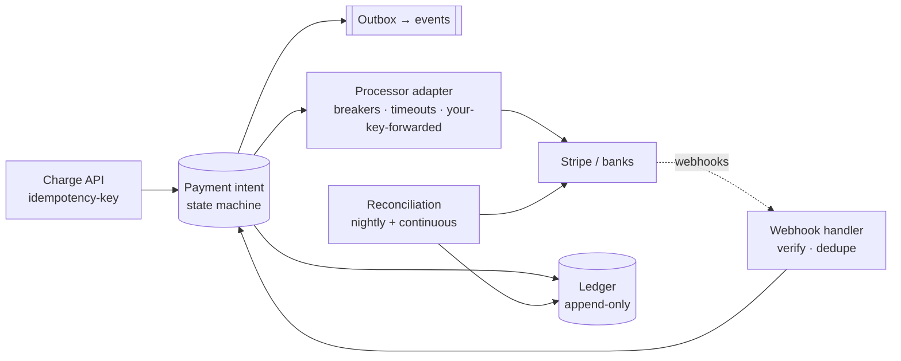

# Payment System

The prompt where the rubric flips: everywhere else, scale is the boss fight and correctness is table stakes — here **correctness is the product** and the scale is almost embarrassingly small (even giant platforms process "only" thousands of payments per second — [the estimation](../foundations/estimation.md) takes one breath). Every hard-won idea from the [transactions](../data/transactions.md), [distributed transactions](../data/distributed-transactions.md), and [delivery semantics](../messaging/delivery-semantics.md) pages reports for duty, because the failure modes aren't outages — they're *money being wrong*, which is the one incident class with lawyers attached.

## Requirements & estimation

**Scope**: charge a customer via external processors (Stripe/Adyen/banks), record it unimpeachably, handle refunds, survive every network failure without double-charging or losing money; payouts/ledgers for a marketplace noted as the extension. Non-functional, stated as the reframe: **auditability and exactness over latency** (a payment taking 3 s is fine; a payment recorded twice is not), [linearizable-by-declaration for money state](../foundations/cap-pacelc.md), and *the external processor is a partner you don't control* — slow, occasionally down, occasionally answering "unknown."

**Numbers**: 10M payments/day ≈ **~120/s, 500 peak** — a single well-run [Postgres](../data/sql-at-scale.md) yawns at this; say it, because "I don't need exotic storage; I need exact storage" is the verdict that sets the tone. Records are small, retention is *forever-ish* ([regulatory](../data/analytics.md)), and the write path's contention unit is the account, not the system.

## The ledger: append-only or apology-prone

The foundational design decision: money state is a **double-entry, append-only ledger** — immutable entries, every movement a balanced pair (debit customer-receivable, credit merchant-payable), balances *derived* from entries, corrections as new compensating entries, never edits. This is [event sourcing where history is genuinely the product](../messaging/event-driven.md) — the audit trail isn't a feature bolted on, it *is* the data model. The disciplines it brings: balances as [cached projections](../messaging/event-driven.md) (rebuildable, verifiable by re-summation), invariant checks as [constraints](../data/transactions.md) (entries balance to zero, by CHECK and by nightly proof), and [serializable isolation or explicit locking on the hot account rows](../data/transactions.md) — the [write-skew doctors](../data/transactions.md) become write-skew *balances* here, and this is the one domain where you say "serializable, and I'll pay the retries" without blinking.

## The payment flow: a saga with an untrusted partner

**Idempotency, triple-layered** ([the page](../messaging/delivery-semantics.md), maximally applied): client → you (idempotency key on the charge API, [result stored, replays return it](../networking/apis.md) — the Stripe pattern, aimed at Stripe); you → processor (*forward your key* — every serious processor accepts one; their dedup is your outer safety net); internal hops ([outbox + idempotent consumers](../data/distributed-transactions.md), everywhere).

**The state machine is the real API**: `created → authorized → captured → settled`, with `failed`, `refunded`, `disputed` branches — every transition [conditionally written](../data/transactions.md) (no state skipping under concurrency), timestamped, event-emitted via [the outbox](../data/distributed-transactions.md). [Auth-then-capture ordered by revocability](../data/distributed-transactions.md): authorize early (reversible), capture late (the money moment), notify after commit — the saga's risk-ordering discipline with dollars attached.

**The "unknown" problem** — the deep dive that separates payment engineers from everyone: you call the processor, the request **times out**. Charged or not? *You don't know, and guessing either way is wrong* — retrying without the key double-charges; not retrying maybe loses the sale. The answer stack: idempotent retry with the same key (safe *because* the key), the intent parked in a `pending_confirmation` state (an honest state — "we don't know yet" is a legitimate business state, [design it as one](../data/distributed-transactions.md)), resolved by **webhook or poll, whichever answers first** ([push for latency, poll for truth](../networking/apis.md) — the processor's events are signed, [deduped by event ID](../messaging/delivery-semantics.md), and *reordered-tolerant*: webhooks arrive out of order, so transitions validate against the state machine, never blindly apply).

**Reconciliation is the actual product** ([the payments-companies-are-reconciliation-engines line](../data/distributed-transactions.md), now literal): continuous and nightly diffs — your ledger vs. processor reports vs. bank settlement files — with drift alerting, aging dashboards for unmatched items, and a human workflow for the residue. The Staff sentence: "I *assume* every component occasionally lies or loses; reconciliation is how the system notices before the auditor does." Detection is the guarantee; everything upstream just makes the diff small.

!!! ops "DevOps lens"
    Operating money systems inverts several instincts: **fail closed and park, don't fail open and guess** (a processor brownout means requests queue in `pending`, [rate-limited retries with budgets](../distributed/resilience.md), and *honest customer messaging* — never optimistic acks); **the dashboards are state-machine dashboards** ([count by state × age](../data/distributed-transactions.md): `pending_confirmation` older than 15 min pages someone; stuck states are money in limbo); **webhook infrastructure is tier-0 ingest** ([signature verification, dedup store, replay tooling](../networking/apis.md) — a dropped webhook is a payment frozen until reconciliation catches it); **deploys get the full ceremony** ([expand-contract on the ledger schema is non-negotiable](../data/sql-at-scale.md) — there is no "quick migration" on the money table), and **access is radioactive** ([audit-logged, least-privilege, break-glass-only production access](../security/defense-in-depth.md) — the insider threat model is real here, and SOC/PCI auditors will read your access logs even if you don't). The reconciliation report is the SLO: unmatched-items age is the metric the CFO can read.

!!! staff "Staff+ altitude"
    (1) **Multi-processor is the availability *and* leverage play** — route by cost/success-rate/geography across two PSPs with [per-processor breakers](../distributed/resilience.md); it's [the multi-provider hedge](notifications.md) plus negotiating power at contract time ([the commit-curve conversation](../devops/cost-capacity.md), with basis points at stake). (2) **The ledger is the platform** — once it exists, wallets, credits, marketplace splits, and revenue recognition all want to be ledger entries; designing entry schemas and posting rules as *the* org-wide money API (with [contract discipline](../networking/apis.md)) is the difference between a payments feature and a financial platform. (3) **Compliance shapes topology** — PCI scope minimization (card data touches the *smallest possible* system — tokenize at the edge, keep the vault [isolated](../devops/cloud-networking.md), everything else handles tokens), data residency for financial records, and retention-by-regulation: [the compliance-is-architecture theme](../devops/multi-region.md) at maximum intensity. (4) **Exactness has tiers** — the ledger is exact; *analytics* on payments can be [eventual and approximate](../data/analytics.md); refusing to let reporting requirements contaminate the transactional core is a boundary a Staff engineer patrols.

!!! interview "In the interview"
    The spine: the correctness-over-scale reframe (with the 120/s number) → append-only double-entry ledger → the state machine + triple idempotency → the timeout-"unknown" deep dive → reconciliation as the guarantee. Probes, pre-armed: *network fails mid-charge?* (the unknown-state stack: same-key retry, pending state, webhook-or-poll resolution — never guess); *double-click buys twice?* ([idempotency key from the client](../networking/apis.md), stored result, replay returns it); *how do you know the money is right?* (invariants + constraints upstream, reconciliation as detection — "trust, but diff nightly"); *webhooks arrive out of order?* (state-machine validation, event-ID dedup, [ordering never assumed](../messaging/delivery-semantics.md)); *why not microservices-per-step?* (the [aggregate boundary](../data/distributed-transactions.md) argument: money state wants one transactional home; distribution here buys failure modes, not scale — declining to distribute is the senior move). Close with the parked-and-honest states line — "unknown is a state, not a bug" — it's this prompt's version of [the fencing-token story](../distributed/coordination.md): small, true, unforgettable.
