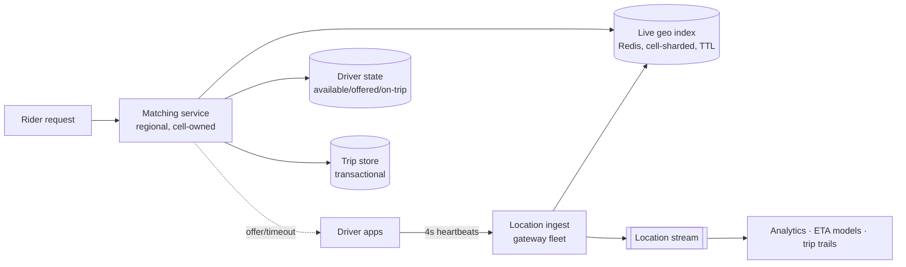

# Proximity & Ride-Hailing

"Design Uber" (or Yelp's nearby-search, or delivery dispatch) is really two systems with opposite temperaments sharing one map: **nearby search over mostly-static data** (restaurants don't move) and **live matching over furiously-moving data** (drivers emit locations every few seconds). Candidates who conflate them build one wrong system; the prompt is won by splitting them, then spending depth on the moving half — the [write-heavy, latency-tight, state-churning](../foundations/thinking-in-systems.md) part.

## Requirements & estimation

**Scope**: riders request; nearby available drivers found; one matched; live trip tracking. Nearby-*places* search noted as the static sibling. Non-functional: match latency seconds-tolerable, but **location ingest is relentless** and *staleness kills correctness* (a 30-second-old driver location is a wrong dispatch); [per-data-class honesty](../interviews/requirements-estimation.md): locations — high-write, lossy-tolerable, seconds-fresh; trips/payments — [never lost, transactional](payments.md); driver availability state — the contended truth in the middle.

**Numbers**: 1M concurrent drivers × location every 4 s ≈ **250k location writes/s** — [the ingest-shaped verdict](../interviews/requirements-estimation.md) instantly ("this is a metrics pipeline wearing a map"); matching: ~50k ride requests/min peak ≈ 1k/s — *small*; the asymmetry (250:1 ingest:match) is the architecture. Location payload tiny (~50 B) → bandwidth trivial; the cost is *index churn*, not bytes.

## Geo-indexing: making "nearby" a key

Lat/long can't be range-scanned in two dimensions at once; every practical design converts geography into **cell IDs** — [geohash, S2, H3](../caching/redis.md): hierarchical grids where one cell ID names an area and prefix/parent relationships give you zoom. "Nearby" becomes "my cell + neighbors" — a handful of key lookups ([the KV refusal](../data/nosql.md), geographic edition). Two honest footnotes that mark real understanding: **boundary effects** (a driver 50 m away across a cell edge — always query the neighbor ring, never one cell) and **cell-size choice** (dense downtown wants fine cells, rural wants coarse — hierarchical schemes let you *mix*, and [hot-cell skew](../data/partitioning.md) is the whale problem wearing a map: airport pickup zones are your celebrity keys).

**The live index**: driver locations live in memory — [Redis GEO or per-cell sets](../caching/redis.md), sharded by cell/region, TTL'd so a crashed driver app *expires out* rather than haunting dispatch ([presence mechanics](chat.md), exactly). Updates are last-write-wins per driver ([the one place LWW is simply correct](../data/replication.md): a newer location supersedes, period). Durability posture stated plainly: **the live index is rebuildable ephemera** — lose the region's index, and 4 s of heartbeats repopulate it ([fail-static-ish recovery by data shape](../devops/kubernetes-architecture.md)); the trip record is what's precious, and it lives elsewhere.

## Architecture

**Ingest path**: driver connections ride [the stateful-gateway pattern](chat.md) (WebSocket/long-lived HTTP); gateways batch heartbeats into the geo index and tee the stream to [Kafka](../messaging/kafka.md) for everything non-live (trip trails, ETA training, surge analytics — [derived consumers never touch the hot path](../foundations/thinking-in-systems.md)).

**The matching loop** — the deep dive that wins the prompt, because it's a *correctness* problem disguised as a search problem: candidate query (cell + neighbors, filter by state/vehicle) → rank (ETA — road-network time from a routing service, not crow-flies distance; say the difference) → **offer with a lease**: mark driver `offered` with a [TTL'd lease](../distributed/coordination.md), push the offer, await accept/decline/timeout. Accept → transactional flip to `on-trip` + trip creation; timeout/decline → lease expires, next candidate. The concurrency truth to say out loud: **two matchers must not offer the same driver** — solved not by distributed locks but by [ownership](../distributed/coordination.md): shard matching by region/cell so *one matcher owns each driver's state transitions* ("route, don't lock" — [fourth appearance, still the answer](../distributed/coordination.md)), with the state machine's transitions guarded by [conditional writes](../data/transactions.md) as the belt-and-suspenders.

**Surge/demand pricing**, one systems sentence: per-cell supply/demand ratios computed on the [stream](../messaging/kafka.md), published as [cached, versioned config](feature-flags.md) to pricing — a *derived, eventually-consistent* signal by design (surge being 30 s stale is fine; say so).

!!! ops "DevOps lens"
    The operational surfaces: **ingest fleet health is presence health** ([reconnect storms after deploys](chat.md) — same drain-and-jitter discipline; a gateway deploy that drops 100k driver connections *is* a supply outage for 30 seconds), **index staleness as an SLO** (age-of-freshest-location per cell percentile — the dashboard that catches a wedged ingest partition before riders see phantom drivers), **hot-cell dashboards** (airport surges = [hot-key mechanics](../caching/failure-modes.md): per-cell metrics, cell-splitting for chronic hotspots, L1 caching of candidate queries), **matching-loop latency budget** (candidate query + rank + offer round-trip — the offer *includes a human decision*, so instrument machine-time separately from driver-think-time or your p99 is measuring psychology), and **the state-machine audit** ([stuck-`offered` drivers = leaked leases](../data/distributed-transactions.md) — the stuck-saga dashboard, verbatim: count by state × age, alert on outliers, sweep with reconciliation).

!!! staff "Staff+ altitude"
    (1) **Regional cells are the whole game** — geography gives you [natural cell architecture](../foundations/reliability-availability.md): city-scoped matching, city-scoped state, city-scoped failure domains ([regional homing](../devops/multi-region.md) with physics on your side); cross-city consistency needs are near-zero, and a Staff design *exploits* that ruthlessly — one city's outage strands one city. (2) **The marketplace layer is the real product** — matching quality (ETA accuracy, acceptance rates, fairness across drivers) is an ML/economics system consuming this infrastructure; designing the *interfaces* (candidate API, pricing signals, experiment hooks — [flag-gated matching-algorithm rollouts](feature-flags.md)) is where platform thinking shows. (3) **Location data is regulated radioactive material** — trails identify homes, patterns, religions; retention minimization, aggregation-before-storage, and access audit are [compliance-shaping-architecture](../data/analytics.md) at its sharpest; raising it unprompted is a differentiator with teeth. (4) **Degraded modes are product decisions**: index rebuild window → widen search radius and lengthen ETAs honestly; matching brownout → queue requests with communicated waits — [brownouts as designed features](../distributed/resilience.md), pre-agreed with product.

!!! interview "In the interview"
    The spine: split static/live in minute one → ingest math and the "metrics pipeline wearing a map" verdict → cell-based geo-index with TTL'd ephemera → the matching loop with lease-and-ownership concurrency. Probes to expect: *two riders match one driver?* (single-owner-per-driver sharding + conditional state transitions — locks declined, [ownership chosen](../distributed/coordination.md), reasons given); *driver app dies mid-offer?* (lease TTL expires → next candidate; the state machine's timeouts *are* the failure handling); *how is "nearby" fast?* (cell + neighbor-ring lookups in memory — and the boundary-effect footnote); *index node dies?* (rebuildable in one heartbeat interval — durability lives in the trip store, [the data-class split](../interviews/requirements-estimation.md) cashing out); *scale to 10 cities → 1000?* (cells compose: shard by region, [operationally federate](../devops/multi-region.md) — the architecture is *already* cellular, which is the answer). Close with the location-privacy sentence — it's the one they'll repeat to the hiring committee.
