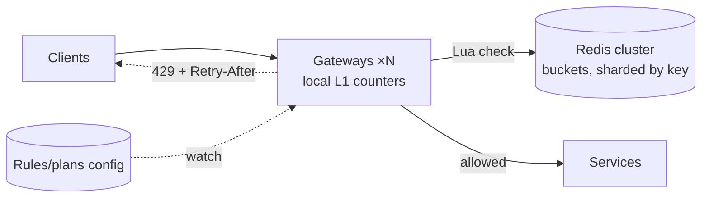

# Rate Limiter

The most-assigned design question in existence, and the fastest to score well on *if* you've internalized [the rate-limiting page](../distributed/rate-limiting.md) — this walkthrough is that page performed under the clock, decisions in interview order, with the traps marked. It's also the prompt where [estimation](../foundations/estimation.md) most visibly redirects the design: one memory calculation reveals that the "distributed systems problem" mostly isn't one.

## Requirements & estimation

**Scope**: limit requests per API key (per-user and per-IP variants noted), multiple rules per key (per-endpoint, tiered plans), sustained-rate *plus* burst semantics, <1 ms added latency, and — ask this one aloud, it reframes everything — *what happens when the limiter itself fails?* Non-functional: the limiter sits on **every request's critical path**; its latency is your latency, its outage is your outage.

**Numbers**: 10M active keys, 300k RPS peak across the fleet. Memory: 10M keys × ~40 B (two floats + metadata for a token bucket) ≈ **400 MB** — *one Redis node holds every bucket in RAM with room to spare.* **Verdict**: "state is tiny; the problems are per-check latency, atomicity under concurrency, and the failure posture — not storage." That sentence, ninety seconds in, is the interview's spine.

## Algorithm choice: token bucket, defended

[The full menu](../distributed/rate-limiting.md) exists to be name-checked, not recited — one line each: fixed window (simple, **boundary burst** — 2× at the seam, the classic probe), sliding log (exact, memory O(requests)), sliding counter (the edge-limiter workhorse). Then commit: **token bucket** — because it natively encodes the product contract ("100 req/s sustained, bursts to 500"), runs in O(1) with two floats, and needs no timers via **lazy refill**:

```lua
-- Redis Lua: atomic check-refill-spend (the whole limiter, effectively)
local tokens, ts = unpack(redis.call('HMGET', KEYS[1], 'tokens', 'ts'))
local now = tonumber(ARGV[1]); local rate = tonumber(ARGV[2]); local cap = tonumber(ARGV[3])
tokens = math.min(cap, (tokens or cap) + (now - (ts or now)) * rate)
local allowed = tokens >= 1
if allowed then tokens = tokens - 1 end
redis.call('HMSET', KEYS[1], 'tokens', tokens, 'ts', now)
redis.call('EXPIRE', KEYS[1], 3600)
return allowed and 1 or 0
```

The Lua script is the atomicity answer *and* a flex: [Redis's single-threaded execution](../caching/redis.md) makes check-refill-spend one indivisible operation — no race between read and decrement, no locks, no round trips between decision and effect. Mention `EXPIRE` unprompted: idle keys self-clean, which is why 10M *active* keys is the honest memory number.

## Architecture: the distributed question



The problem: N gateways × local limits = N× the intended global limit. [The solutions ladder](../distributed/rate-limiting.md), walked with recommendations: **centralized Redis check** (accurate; +0.5–1 ms; the default — buckets [shard by key across the cluster](../data/partitioning.md), and rate-limit keys shard *perfectly* since every operation names its key); **local counters with async sync** (~100 ms reconciliation; bounded overshoot ≈ N × interval × excess rate; the answer when the millisecond is unaffordable); **ownership routing** ([each key's bucket lives on one gateway](../distributed/coordination.md) via consistent-hash LB — exact *and* local, priced in routing complexity). Offer the hybrid the industry actually runs: centralized as truth + a tiny local L1 ("if this key was rejected 50 ms ago, reject locally without asking again") — the L1 absorbs [hot-key attack traffic](../caching/failure-modes.md) so one hammered key can't make Redis the victim.

**Rules/config distribution**: plans and per-endpoint rules are config — [pushed via watch, cached locally, versioned, canaried](../devops/iac-gitops.md); a bad limits-push is a self-inflicted outage ([config blast radius](../networking/proxies-gateways.md), as always).

## The failure posture (they will ask; answer per class)

Redis unreachable — fail open or closed? [The per-class answer](../distributed/rate-limiting.md), verbatim-ready: **capacity/fairness limits fail open** (the protection mechanism must never cause the outage it prevents), **auth/abuse limits fail closed-ish** (a login brute-force limiter failing open is a security incident — degrade to conservative *local* per-node caps), and either way the gateways fall back to **local approximate limiting** rather than binary open/closed. Add the [resilience trimmings](../distributed/resilience.md): the Redis check itself gets a 5 ms timeout and a circuit breaker — a slow limiter is worse than no limiter, [slow being worse than dead](../distributed/failure-modes.md) as ever.

**Response semantics** close the API story: 429 + `Retry-After` + remaining/reset headers ([scheduling the retry wave instead of receiving it](../distributed/rate-limiting.md)), **shadow mode before enforcement** (deploy observing, log would-be-429s, *then* enforce — the count of "legitimate" clients quietly over the intended limit is always a surprise), and soft-warn tiers before hard walls for paying customers.

!!! ops "DevOps lens"
    The limiter is an observability goldmine and an incident instrument: **rejection dashboards by key class** (one key spiking = broken client in a retry loop — [their missing backoff is now your traffic](../distributed/resilience.md); thousands of keys = attack or *your own* internal retry storm arriving at the front door disguised as customers — the diagnostic is *which keys*), **top-limited-keys as pre-written support tickets**, **limiter latency in your p99 budget** (it's on every request — its slowlog is your slowlog), and **the emergency clamp rehearsed** (a config-push global limit reduction is among the fastest mitigations in existence: "shed the crawlers, save checkout" as [priority shedding's](../distributed/resilience.md) front-door lever). Tune from data, not meetings: shadow-mode percentiles of real per-key traffic × headroom = the limits; round numbers from a planning doc = the support queue.

!!! staff "Staff+ altitude"
    The extensions that turn the toy prompt into a platform conversation: (1) **limits are product surface** — tiers, quotas, and overage billing are bucket parameters; the limiter's metering feeds revenue, making limit changes *pricing changes* with stakeholders ([the gateway-as-tollbooth thesis](../networking/proxies-gateways.md), cashed); (2) **cost-based limiting** — charge tokens per estimated operation cost ([GraphQL depth, scan bytes](../networking/apis.md)) rather than per request, ending the cheap-call/expensive-call arbitrage without changing the algorithm; (3) **fairness under contention** — per-key fair queuing beats FIFO when the fleet saturates (one whale's burst shouldn't starve minnows), and *defining* fairness (per-user? per-tenant? tier-weighted?) is a business decision to surface, not assume; (4) **adaptive limits** — the frontier: concurrency-based ([AIMD on observed latency](../distributed/rate-limiting.md)) so the limit *discovers* capacity instead of being guessed quarterly.

!!! interview "In the interview"
    This prompt is won on *decision density* — every sentence a choice with a reason: algorithm (token bucket, because burst semantics + O(1) + lazy refill), atomicity (Lua, because single-threaded Redis makes check-and-spend indivisible), memory (400 MB, because 40 bytes × 10M — [do it aloud](../foundations/estimation.md)), distribution (central + L1 hybrid, because accuracy plus hot-key absorption), failure (per-class open/closed, because auth and capacity have opposite risk shapes), rollout (shadow mode, because real traffic always surprises). Expected probes: *why not fixed window?* (boundary burst — 200 requests in 2 s across the seam); *two requests race the last token?* (they can't — Lua serializes; that's *why* Lua); *global exactness across regions?* (either ownership-routing by key or honest bounded overshoot — precision costs a hop, [say the trade](../foundations/thinking-in-systems.md)); *how do you pick the numbers?* (shadow mode + p99.9 of legitimate traffic). Fifteen minutes in, you should have said "fail open for capacity, fail closed for auth" — it's the sentence this prompt exists to elicit.
