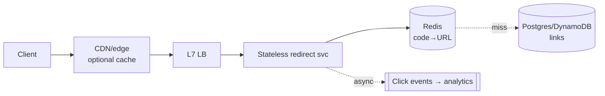

# URL Shortener

The canon's opener, and routinely underestimated: it *looks* like a hash map with a domain name, which is exactly why interviewers love it — the question isn't whether you can design it, but how much judgment you show in the details everyone else hand-waves. Treat it as a chance to demonstrate [the whole framework](../interviews/framework.md) at speed with zero wasted motion.

## Requirements & estimation

**Scope**: create short link (custom alias optional), redirect fast, expiry optional; analytics (click counts) as a parked stretch. Non-functional: redirects are the product — target <50 ms at the edge of possibility; [read:write is extreme](../foundations/thinking-in-systems.md) — assume 100:1 or worse; links must basically never break (a dead short link is silent reputation damage forever).

**Numbers** ([the recipes](../foundations/estimation.md)): assume 100M new links/month ≈ **40 writes/s** (trivial) and 10B redirects/month ≈ **4k reads/s, 12k peak** (modest). Storage: 100M × ~500 B/month ≈ 50 GB/year × 3 replication — *nothing*. **Verdict, stated aloud**: "every number here is small — the design challenge is read latency, key generation without collisions, and operational carefulness, not scale. I'll spend the time there." That verdict *is* the demonstration of estimation's purpose.

## API & data model

```
POST /links   {url, custom_alias?, expires_at?}  → {short_code}   (idempotency-key header)
GET  /{code}  → 301/302 redirect
```

One table: `links(code PK, target_url, owner_id, created_at, expires_at)`. Two deliberate decisions to narrate: **[idempotency key](../networking/apis.md) on create** (retried creates shouldn't mint duplicate codes), and **301 vs. 302** — the classic probe: 301 (permanent) lets browsers cache the redirect (faster, less load, *but* you lose every subsequent click for analytics and can never remap the link); 302/307 keeps control. Default 302; offer 301 as a per-link choice. Knowing *why* is the point.

## Key generation: the actual deep dive

The code is a base62 string (`[a-zA-Z0-9]`); 7 chars = 62⁷ ≈ **3.5 trillion** — space isn't the problem; *collision-free allocation under concurrency* is. The options ladder:

1. **Hash the URL** (MD5, take 7 chars): deterministic (same URL → same code — nice dedup) but collisions need probing, and two users shortening one URL share analytics. Meh.
2. **Random + check**: collision probability starts negligible and grows with fill; each insert needs an existence check ([the unique constraint is the real guard](../data/transactions.md)); retries on conflict. Fine at this scale, honestly.
3. **Counter + base62-encode** — the clean answer: a monotonic counter, encoded. Collision-impossible by construction. The distributed version: **allocate ranges** — each app node leases a block of 100k IDs from a [coordination store or a `SELECT ... FOR UPDATE` ticket table](../distributed/coordination.md), then mints locally, lock-free, until the block runs dry. Node dies mid-block → the unused tail is abandoned (gaps are free — 3.5T space). This is [Snowflake's](../distributed/time-ordering.md) cousin, simplified because ordering doesn't matter.
4. Mention-and-park: pre-generated key pools (a Key Generation Service filling a queue of unused codes) — valid, more machinery, only earns itself with strict vanity/entropy requirements.

Pick 3, say why (no collisions, no per-write coordination, trivially scaled by block size), note the trap (sequential codes are enumerable — scrapers can walk your namespace; fix by encoding `counter XOR secret` or shuffling the block) — that last sentence is a security instinct almost nobody volunteers.

## The read path: where the latency budget lives



The full [caching sentence](../caching/fundamentals.md), deployed: cache-aside in Redis, **TTL with jitter**, [negative caching for missing codes](../caching/failure-modes.md) (scrapers walking the namespace are a [penetration attack](../caching/failure-modes.md) — cache the 404s, and a [Bloom filter](../data/storage-engines.md) in front if you want the flex), single-flight on misses. Hit rate will be brutal-good (link popularity is [Zipfian](../caching/fundamentals.md) — the hot 1% is nearly all traffic). At 4k RPS with 95%+ hits, the database sees double-digit QPS: *one Postgres with a replica, done* — saying "I don't need to shard this, and here's the arithmetic" is [the boring-tech courage](../data/sql-at-scale.md) interviewers quietly score up. (If pushed to planetary scale: the table is a pure KV workload — [DynamoDB-class](../data/nosql.md) with the code as partition key shards perfectly; the design barely changes, which is itself worth saying.)

**Analytics without touching the redirect path**: emit a click event to [a queue](../messaging/async-fundamentals.md), aggregate downstream ([counters batched](../foundations/scalability.md), [approximate uniques via HLL](../caching/redis.md)); the redirect never waits on analytics, ever — [the sync/async boundary](../foundations/thinking-in-systems.md) in its clearest form.

**Expiry**: filter at read time (`expires_at < now` → 404/410) + [lazy deletion sweep](../caching/redis.md); never a synchronous delete storm.

!!! ops "DevOps lens"
    Small system, real operational story — which is exactly the impression to leave: **the redirect path is tier-0 and everything else isn't** ([bulkhead accordingly](../distributed/resilience.md) — analytics ingestion down must mean *nothing* to redirects); **watch the cache like the product it is** (hit rate by code-age class, [stampede protection verified](../caching/failure-modes.md) — one viral link expiring is the hot-key story in miniature); **the enumeration/abuse surface needs [rate limits](../distributed/rate-limiting.md)** on both create (spam campaigns mint millions of links) and 404-heavy readers (namespace scanners); and **malicious-URL handling is the real product risk** — a shortener is a phishing amplifier by default: scan targets at creation against threat feeds, rescan popular links periodically (targets *change* after creation — the bait-and-switch), and keep a kill switch that 410s a code in seconds fleet-wide ([the flag-flip mitigation](../devops/deployments.md), applied). That last paragraph is what separates "solved the puzzle" from "I'd run this."

!!! staff "Staff+ altitude"
    The prompt's Staff layer is mostly *restraint and product-thinking*: (1) **right-size out loud** — this is a two-pizza-team system; the [ladder's bottom rungs](../data/sql-at-scale.md) suffice for a decade, and saying "I would explicitly not build the distributed key service on day one — here's the trigger that would" demonstrates the [sequencing judgment](../foundations/scalability.md) the level requires. (2) **The domain is the asset** — reliability and abuse-reputation of the short domain (blocklisted by one email provider = the product is dead) outweigh every scaling concern; that reframe — *the risk is reputational, not technical* — is Principal-flavored. (3) **Custom domains for customers** (white-label shortening) is where the real system design hides: per-tenant TLS ([cert automation](../devops/secrets-identity.md)), [tenant isolation](../data/partitioning.md), and suddenly the toy has a control plane. Offering that extension unprompted turns the "easy" question into your showcase.

!!! interview "In the interview"
    Pace: this prompt rewards *velocity with judgment* — requirements + estimation in four minutes ending with the verdict ("everything is small; the interesting bits are keys, latency, and abuse"), API + schema in three, and the bulk on key generation + read path + the ops close. The probes, pre-loaded: *301 or 302?* (the analytics/control trade); *collisions?* (range-allocated counter — impossible by construction; XOR against enumeration); *how do analytics not slow redirects?* (async event, aggregate downstream, HLL for uniques); *what breaks at 100×?* ("the cache tier grows; the database still yawns — [the numbers again](../foundations/estimation.md)"); *biggest real risk?* (abuse and domain reputation — the answer they remember, because it's true and nobody says it).
