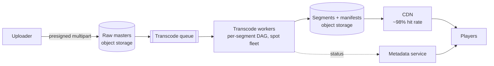

# Video Streaming

Design YouTube/Netflix sounds like the biggest question in the canon, and it hides the canon's biggest shortcut: **[segmented streaming makes video a static-file problem](../networking/cdn.md)**, which means the CDN does 95% of the serving work and your design is really three pipelines — upload, transcode, deliver — wrapped around [object storage](../data/object-storage.md). Say the shortcut early; it reframes the whole hour in your favor.

## Requirements & estimation

**Scope**: upload, transcode, play (adaptive quality, seek), metadata/discovery; live streaming parked with one honest sentence (different latency physics, same delivery bones); DRM acknowledged, not derived. Non-functional: playback start < 1–2 s, rebuffer-free at variable bandwidth, [durability of masters absolute](../data/object-storage.md); viewing is global — [physics demands edge delivery](../foundations/latency-throughput.md).

**Numbers** ([the photo-sharing example's](../foundations/estimation.md) big sibling): 100M DAU × 1 hr/day watched ≈ 10⁸ viewing-hours/day; at ~3 GB/hr average across qualities ≈ **300 PB/day egress** — the number that makes the CDN contract the company's most important vendor relationship, [not a checkbox](../devops/cost-capacity.md). Uploads: 500k/day × 10 min × ~1 GB raw ≈ 500 TB/day ingest; transcoding multiplies storage ~2× across the rendition ladder. **Verdict**: "egress economics and transcode throughput are the design; serving is the CDN's job — my job is keeping its hit rate near 100%."

## The delivery insight (lead with it)

Adaptive streaming (HLS/DASH): video is chopped into **2–6 s segment files** per quality level, described by a **manifest**; the player reads the manifest, fetches segments over plain HTTPS, and **switches quality per segment** based on measured bandwidth (that's the "adaptive" — client-side, no server smarts). Consequences, each worth a beat: every segment is an **immutable, hash-addressable static file** → [infinite-TTL CDN caching](../networking/cdn.md), request-collapsing on hot content, [range/seek for free](../data/object-storage.md) (seek = fetch a different segment — no server state, no special protocol); "streaming" infrastructure is *file serving with a smart client*; and popularity being [Zipfian](../caching/fundamentals.md), the hot 1% of content is nearly all traffic → hit rates in the high-90s, [origin shielded](../networking/cdn.md) to a whisper.

## Architecture

**Upload**: [presigned multipart to object storage](../data/object-storage.md) — parallel parts, resumable, your API never touches bytes; on completion, an event enqueues transcoding ([the outbox instinct](../data/distributed-transactions.md): the upload record and the job are one transaction's children).

**Transcode** — the batch-compute deep dive: split the master into chunks, transcode **chunks in parallel** across the rendition ladder (240p→4K, multiple codecs — H.264 universally, AV1/HEVC where clients allow: ~30–50% bandwidth savings, [real money at 300 PB/day](../devops/cost-capacity.md)), stitch, generate manifests. It's a [DAG of idempotent, checkpointed jobs](cicd-platform.md) — chunk-level retries, [spot instances with drain discipline](../devops/cost-capacity.md) (interruption-tolerant by construction — the textbook spot workload), [priority classes](../messaging/async-fundamentals.md) (new upload from a 10M-subscriber creator beats a backfill re-encode), and per-title/per-chunk quality tuning as the mention-level flourish. Publish is atomic-enough via the manifest: segments upload first, manifest last — [the hashed-assets-then-HTML ordering](../networking/cdn.md), same reasoning.

**Playback path**: player → metadata API (title, rights, manifest URL + [signed access](../data/object-storage.md)) → manifest → segments from CDN. Playback-start latency decomposes to: metadata call + manifest fetch + first-segment fetch — all cacheable, the last two at the edge; [the budget](../foundations/latency-throughput.md) closes comfortably *if* the CDN is warm, which is the SLO that matters.

**Resilience trimmings**: [multi-CDN](../networking/cdn.md) with client-side failover (the player retries a segment against CDN B — the *client* is your failover layer, a luxury request/response systems lack), [stale-if-error on manifests](../networking/cdn.md), and per-segment retries making mid-stream blips invisible (one 4 s segment failing ≠ rebuffer if the buffer holds 30 s).

## Deep dives worth steering toward

**The hot-new-release problem**: a premiere drops; 10M players fetch the same segments in the same minute. This is the CDN's finest hour — [request collapsing + origin shield](../networking/cdn.md) reduce origin load to ~one fetch per segment per shield — plus **pre-warming** (push the first N segments to edges before the premiere; the rest cache on first-fetch behind collapse). Contrast with the [cache-stampede page](../caching/failure-modes.md): same phenomenon, solved at planetary scale by machinery you configured, not code you wrote — and *knowing that boundary* is the operational literacy the prompt checks.

**View counts and watch telemetry**: players beacon progress events → [the ingest-shaped pipeline](log-pipeline.md) (batch, approximate, eventual — [nobody's rebuffer should ever wait on analytics](../foundations/thinking-in-systems.md)); counts are [sharded-and-batched](../caching/redis.md), uniques are [HLL](../caching/redis.md), and "1.2M views" is [honestly approximate by declaration](../foundations/scalability.md). Watch telemetry also feeds the *real* products: recommendations and per-title encoding decisions — one sentence connecting exhaust to value, very Staff.

!!! ops "DevOps lens"
    The operational surfaces: **CDN hit rate by content class** is the P&L dashboard ([1% of hit rate at this scale is seven figures a year](../networking/cdn.md) — cache-key hygiene and pre-warm discipline are revenue work); **transcode queue age by priority** (creator-facing SLO: "processing" time is product experience — [autoscale the worker fleet on it](../devops/kubernetes-autoscaling.md), spot-heavy with on-demand floor); **player-side QoE telemetry** (rebuffer ratio, startup time, bitrate distribution — [measured at the client](../observability/slos.md), because server-side "everything's fine" while a mid-tier ISP's peering melts is the [gray-failure genre](../distributed/failure-modes.md); QoE by ASN/geo is the dashboard that finds it); and **master durability posture** ([eleven-nines storage + versioning + the delete-protection story](../data/object-storage.md) — re-transcoding is possible *only* while masters exist; they're the crown jewels, tier them accordingly but never below archive).

!!! staff "Staff+ altitude"
    (1) **Egress economics shape the architecture** — codec investment (AV1's 30% savings vs. its encode-cost and device-reach), CDN contract structure, and [ISP-embedded caches / private interconnects](../networking/cdn.md) at the top end: at 300 PB/day these outweigh every service-level decision by an order of magnitude, and a Staff answer *ranks* them so. (2) **Per-title encoding as a worked cost-quality trade** — animated content compresses differently than sports; encoding ladders tuned per title cut bandwidth double-digit percent for compute spent once — [the precompute lever](../foundations/scalability.md) with a P&L attached. (3) **Live is a different product** — segment durations shrink, buffers shrink, pre-warm is impossible, origin load is structural — name the two or three deltas and *decline to merge the designs*; scope discipline at altitude. (4) **Rights and regional catalogs** are the quiet governor: geo-restricted content means [per-region catalog projections and signed, region-checked URLs](../devops/multi-region.md) — compliance shaping architecture, again.

!!! interview "In the interview"
    Lead with the reframe ("segmented streaming makes this a static-file problem — the design is upload, transcode, and CDN economics"), spend your depth on the transcode DAG and the hot-release story, and keep the [presigned-multipart and object-storage sentences](../data/object-storage.md) ready-made. Probes: *how does adaptive bitrate work?* (client measures, switches per segment — server is stateless about it); *how does seek work?* (manifest maps time→segment; fetch there — no server involvement); *premiere melts the origin?* (collapse + shield + pre-warm — with the "my code doesn't see this traffic" honesty); *why is startup slow in region X?* (QoE-by-geo telemetry → cold edge or bad peering — [differential observability](../distributed/failure-modes.md) applied); *storage math?* ([do it aloud](../foundations/estimation.md) — masters + 2× renditions, lifecycle to archive for the cold tail). The closing line that lands: "the service I'm designing is really the *control plane*; the data plane is the CDN, and my job is keeping it boring."
