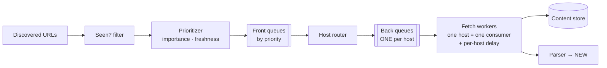

# Web Crawler

Design a crawler that fetches billions of pages — the prompt that looks like a `while` loop and unfolds into a [queue-theory](../messaging/async-fundamentals.md) problem with manners: the entire difficulty is that your infinite work queue must be drained *politely* (per-host rate limits you don't control), *efficiently* (dedup at billions), and *defensively* (the web actively lies to crawlers). It's also the rare prompt where the [DevOps instinct for external-dependency etiquette](../distributed/resilience.md) — budgets, backoff, per-host isolation — *is* the core algorithm.

## Requirements & estimation

**Scope**: seed URLs → fetch → parse → extract links → repeat; store page content for a downstream indexer (the indexer itself is [a different interview](typeahead.md)); freshness via re-crawl scheduling; robots.txt compliance non-negotiable. Ask the shaping question: *breadth (whole-web) or focused (one domain/vertical)?* — assume breadth, it's the harder shape.

**Numbers**: target 10B pages/month ≈ **~4,000 pages/s sustained**. Bandwidth: × ~500 KB average ≈ **2 GB/s ingest** — [a real network-capacity line](../devops/cloud-networking.md), not a rounding error. Storage: 10B × ~100 KB compressed ≈ **1 PB/month** → [object storage, content-addressed](../data/object-storage.md), lifecycle-tiered. URL frontier: billions of URLs × ~100 B ≈ hundreds of GB — *too big for RAM, fine on disk-backed queues*. **Verdict**: "throughput is easy to buy; the design problems are the frontier's politeness structure, dedup at this cardinality, and not being eaten by the web's pathologies."

## The frontier: a queue with manners

The naive design — one big URL queue, thousands of workers — DDoSes some unlucky host within the hour ([competing consumers](../messaging/async-fundamentals.md) with no per-key discipline). The frontier's real structure enforces **per-host politeness as topology**, not as willpower:

The two-tier queue (the classic Mercator shape, worth naming): **front queues** encode *priority* (importance, freshness debt); **back queues** encode *politeness* — one queue per host, each drained by exactly one worker honoring that host's crawl-delay ([per-key single ownership](../distributed/coordination.md): politeness by construction, no distributed rate-limiter needed — "route, don't lock" again). Each host's queue tracks its own courtesy: robots.txt rules (cached with TTL, refreshed on expiry), adaptive delay ([slow down when the host slows down](../distributed/resilience.md) — response-time-aware pacing is both polite and self-protective), and [per-host circuit breakers](../distributed/resilience.md) (a dying host gets silence, not retries).

**DNS at crawler scale** is its own subsystem ([the resolver becomes a hidden dependency](../networking/dns.md)): 4k pages/s of cold lookups will melt a stock resolver — run dedicated caching resolvers, prefetch resolution as URLs enter the frontier, and respect that *you* are now a measurable load on other people's DNS too.

## Dedup at billions: the two-layer answer

**URL-seen filter** (before enqueue): a [Bloom filter](../data/storage-engines.md) in front of a persistent seen-set — the Bloom absorbs the read storm at ~10 bits/URL (billions of URLs ≈ tens of GB of RAM across the fleet, [do the math aloud](../foundations/estimation.md)); false positives mean *skipping* a genuinely-new URL occasionally — for a crawler, an acceptable lie (say this trade explicitly: Bloom false-positive semantics must match the domain — fine here, [fatal in a payments dedup](payments.md)). Behind it, the authoritative store ([sharded KV](../data/partitioning.md), URL-hash keyed) for the write path and Bloom rebuilds.

**Content dedup** (after fetch): 25–30% of the web is duplicate content under different URLs (mirrors, tracking params, print views). Exact dupes: content-hash check ([content-addressing](../data/object-storage.md) gives it free). Near-dupes: **SimHash/shingling** — fingerprints where similar documents land near each other; one sentence of name-dropping with the *why* (skip re-storing and re-indexing near-identical pages) is the right interview depth.

**Re-crawl scheduling** turns the crawler into a permanent system: per-page revisit cadence from observed change frequency (news hourly, docs monthly — estimate change rate per URL from crawl history, [exponential-decay flavored](typeahead.md)), budgeted per site, folded into the front queues' priority math. Freshness is a [budget allocation problem](../devops/cost-capacity.md) — crawl capacity is finite; spending it is policy.

## The web fights back

The section that separates readers from operators — the pathologies and their armor: **spider traps** (calendar pages generating infinite URLs, session-ID labyrinths) → per-host page budgets and URL-depth/pattern heuristics; **crawler traps of scale** (a single host with 50M real pages) → per-host budgets *again* (the answer to most things); **malformed everything** (HTML that crashes parsers, 2 GB "pages", gzip bombs) → [hard resource caps per fetch](../distributed/resilience.md): size limits, parse timeouts, [sandboxed parsing](../devops/containers.md) — the parser is code executing on adversarial input, treat it like one ([the CI-runner trust posture](cicd-platform.md), same instinct); **cloaking and bot-blocking** → identify honestly via user-agent, respect blocks (and note the legal/ethical line exists — one sentence, then move); **redirect loops and URL canonicalization** (params, fragments, case) → canonicalize *before* dedup or the seen-set fragments into uselessness.

!!! ops "DevOps lens"
    The crawler is a fleet of [outbound-heavy workers](../devops/cloud-networking.md) with unusual ops: **egress architecture matters** (NAT/conntrack limits at 4k conn/s, [ephemeral-port exhaustion](../networking/fundamentals.md) — the classic crawler incident; dedicated egress IPs with published reverse-DNS, because sites *will* check who you are), **per-host health dashboards** (fetch success by host-bucket, breaker states, politeness-delay distributions — your "am I being rude" telemetry), **frontier health** ([age of oldest URL per priority class](../messaging/async-fundamentals.md) — a starving back queue means one slow host is hoarding a worker; queue-depth alone lies, as always), **trap detection as anomaly alerting** (pages-per-host velocity spikes = a trap eating budget — auto-quarantine the host, alert, move on), and **the parser fleet's blast radius** (crashes correlated to a specific site's content = [poison input](../messaging/async-fundamentals.md); DLQ the URL pattern, don't retry-loop it). Politeness is also *reputation ops*: one bad deploy that hammers hosts gets your IP ranges blocklisted industry-wide — [canary crawler behavior changes](../devops/deployments.md) like the production changes they are.

!!! staff "Staff+ altitude"
    (1) **Crawl budget is the strategic resource** — the Staff conversation isn't "can we fetch 10B pages" (yes, buy machines) but *which* 10B: importance scoring, freshness debt, and vertical priorities are [a portfolio allocation](../devops/cost-capacity.md) that product and legal co-own; the frontier's prioritizer is where company strategy compiles to code. (2) **Own the etiquette posture in writing** — robots.txt interpretation edge cases, rate ceilings, identification, and takedown response are policy with legal exposure; "we crawl politely" needs the same documentation rigor as [a security posture](../security/defense-in-depth.md). (3) **The architecture generalizes** — frontier + politeness + dedup + adversarial-input hardening is the same skeleton as [webhook delivery fleets](../networking/apis.md), feed fetchers, and link-preview services; teams build this shape repeatedly without noticing, and the platform play is extracting it once. (4) **Freshness SLOs per content class** ("news re-crawled within 1 h, tail within 30 d") turn the crawler from a batch job into [an SLO-governed service](../observability/slos.md) — the maturity reframe.

!!! interview "In the interview"
    The spine: throughput/bandwidth math → two-tier frontier with *politeness as topology* (the sentence that wins the prompt: "one queue per host, one consumer per queue — politeness by construction") → Bloom-fronted dedup with the false-positive trade stated → the pathology armor. Probes to expect: *how do you not DDoS a site?* (per-host queue ownership + adaptive delay + robots.txt — structure, not politeness promises); *how do you avoid re-crawling the same URL?* (canonicalize → Bloom → authoritative seen-set; false positives skip pages, acceptable here); *what about infinite calendars?* (per-host budgets + pattern heuristics — "the answer to most crawler pathologies is a budget"); *how fresh is the index?* (change-rate-driven re-crawl scheduling as budget allocation); *distributed how?* ([partition the frontier by host-hash](../data/partitioning.md) — host affinity keeps politeness local; workers scale statelessly under it). Close with the reputational-ops sentence — crawlers are the rare system whose failure mode is *other people's* outages, and saying so lands.
