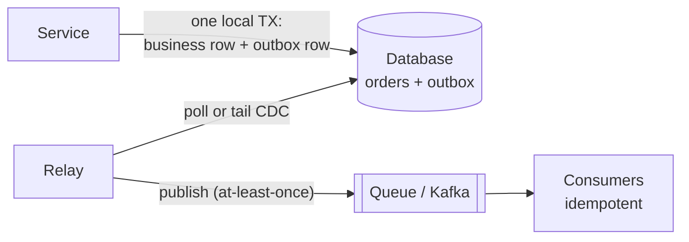

# Distributed Transactions

The single-node transaction is a miracle you don't appreciate until it's gone — and it's gone the moment your operation spans two shards, two services, or (the everyday case nobody names) **a database and a message queue**. Now "all or nothing" requires machines that can fail independently to agree, and the entire topic is the industry's forty-year negotiation with that requirement: first a protocol that technically works (2PC), then a long retreat from it, then the patterns that actually run the world's order flows (sagas, outbox, reconciliation).

## Two-phase commit: the protocol and the flaw

The obvious design, formalized: a **coordinator** asks every participant to **prepare** (do the work, hold the locks, vote — a *yes* is a binding promise to commit if told); unanimous yes → **commit** everywhere; any no → abort everywhere.

The flaw is in the gap between phases: a participant that voted yes is **in doubt** — it cannot commit (maybe another voted no) and cannot abort (it promised) — until the coordinator speaks. If the coordinator dies post-prepare, participants sit *holding locks*, blocking every other transaction that touches those rows, potentially until a human intervenes. 2PC converts a coordinator failure into **everyone's** unavailability: precisely the correlated-failure shape that [reliability engineering](../foundations/reliability-availability.md) exists to avoid. Add the steady-state bill (two round trips + multiple fsyncs per transaction, locks held across all of it) and you have why XA-style distributed transactions faded from web-scale practice.

The modern footnote that rescues the idea: **2PC over replicated participants**. Spanner runs 2PC where each "participant" is a Paxos *group*, not a node — participants that can't die (well, that survive minority failure) remove the blocking scenario. 2PC didn't die; it moved inside systems built by people who could afford consensus everywhere ([consensus](../distributed/consensus.md)).

## Move one: don't have the problem

The highest-leverage "solution" is boundary design: **put things that must change together inside one transactional home.** Order and its line items in one shard (same partition key — [sharding](partitioning.md)); account and its ledger entries in one service; the invariant materialized into one row ([transactions](transactions.md)). This is what domain-driven design's *aggregate* actually is operationally: **the aggregate is the transaction boundary.** In interviews, redrawing the boundary so the distributed transaction disappears is a stronger move than any protocol — "I'd co-locate reservation and payment-hold in the booking service precisely so this is one local transaction" is Staff-grade judgment in one sentence.

But some flows genuinely span domains — order, payment, inventory, shipping live in different services for good reasons. Enter sagas.

## Sagas: atomicity traded for compensation

A **saga** replaces one distributed transaction with a *sequence of local transactions*, each atomic in its own service, plus **compensating actions** to semantically undo completed steps if a later one fails:

> Reserve inventory → charge payment → create shipment.
> Shipment fails? → refund payment → release inventory.

The honest fine print, which is where interviews are won:

- **Compensation is not rollback.** The world *saw* the intermediate states; the email was sent; the charge hit the customer's bank app. So: design intermediate states as **legitimate business states** ("payment authorized, order pending"), not embarrassing secrets — and **sequence irrevocable steps last** (authorize early, *capture* money late; notify after commit, not before). The saga's step order is a risk-ordering exercise.
- **No isolation.** Two sagas interleave freely; the anomaly zoo returns at the business level. Defenses: *semantic locks* (the `reserving` state on inventory is a lock wearing a status column) and idempotent, commutative operations where possible.
- **Two shapes.** *Choreography*: each service reacts to events (order-created → inventory reserves → emits inventory-reserved → payment charges...) — decoupled, and by step five nobody in the company can tell you where an order actually is. *Orchestration*: a saga coordinator (state machine — Temporal, Step Functions, or a table + worker you own) drives calls and records progress — one place to look, retry, alert, and audit. The romance is with choreography; **production usually wants orchestration** for anything money-shaped, because "where is order 84712 stuck?" is a question you *will* be asked at 3 a.m.

## The outbox pattern: the workhorse nobody teaches

The most common distributed transaction in the wild is mundane: *commit to the database AND publish to Kafka*. The naive **dual write** is a bug factory — write DB then publish (crash between: DB updated, event never sent, downstream forever ignorant) or publish then write (worse: the world reacts to a transaction that then rolls back).

The fix is beautiful because it *reduces* the problem to the single-node transaction we still have:

Write the business change **and** an event row into an `outbox` table *in the same local transaction* — atomicity by construction. A **relay** (poller, or better, [CDC tailing the WAL](analytics.md)) publishes outbox rows to the queue and marks them sent. Crash anywhere: the event is either not yet published (relay will retry) or published twice (consumers are idempotent). Result: **at-least-once handoff with transactional truth**, no 2PC, no in-doubt locks — "effectively exactly-once" once consumers dedupe ([delivery semantics](../messaging/delivery-semantics.md)). This pattern, plus sagas riding on it, is how order pipelines at essentially every serious commerce company actually work.

## Idempotency and reconciliation: the load-bearing hygiene

Everything above leans on two disciplines:

**Idempotency everywhere.** Every saga step and consumer processes duplicates harmlessly: idempotency keys stored with results ([the Stripe pattern](../networking/apis.md)), natural idempotency (`UPSERT`, `SET status='paid'`), or dedup tables keyed by event ID. At-least-once delivery isn't a defect to apologize for — it's the contract; idempotency is how you sign it.

**Reconciliation as the safety net.** Sagas bug out, compensations fail, operators fat-finger. Mature systems run **reconciliation jobs**: nightly (or continuous) diffs between systems — orders vs. charges, reservations vs. inventory, internal ledger vs. payment processor — with alerts on drift and runbooks for repair. Unsexy, and it's the difference between "we think it's consistent" and "we *measure* consistency and it drifted 0.001% last month, here are the 3 cases." Payment companies are, to first approximation, reconciliation engines with APIs attached.

!!! ops "DevOps lens"
    Sagas and outboxes are *operational* systems — they fail visibly if you built them right, silently if not. Instrument: **stuck-saga dashboards** (count by state × age; "12 orders in `payment_authorized` > 30 min" is an alert, and *every* state needs a max-age), **DLQs for failed compensations** (a refund that keeps failing is a human's problem *now* — page, don't retry forever), **outbox depth and relay lag** (the outbox is a queue living in your database: monitor its backlog, and mind table bloat from delivered rows — trim aggressively, [vacuum](sql-at-scale.md) remembers), and **the reconciliation report as an SLO** ("unreconciled items > N or age > X pages the owning team"). The incident genres: the *poison event* (one malformed message wedging a choreography — DLQ + skip-with-alarm), the *compensation storm* (downstream outage → mass saga failure → thundering refunds; rate-limit compensations too), and the *relay gap* (outbox filling while the relay's dead — the one component everyone forgets to monitor because it's "just a poller").

!!! staff "Staff+ altitude"
    Markers: (1) **Boundaries before protocols** — the first review question is never "saga or 2PC?" but "why do these two things live apart?"; moving the line so atomicity is local beats any coordination machinery, and *knowing when it can't move* (genuine domain seams, org ownership, third parties) is the judgment. (2) **Orchestration for auditable flows, stated unapologetically** — decoupling romance loses to "we can answer where any order is, replay it, and prove what happened" for money paths; buy the workflow engine (Temporal-class) rather than growing a bespoke state machine past ~3 flows — durable execution is undifferentiated heavy lifting. (3) **The ledger mindset** — for anything financial: append-only entries, derived balances, explicit state machines, and reconciliation *designed in*, because the question isn't whether drift happens but whether you detect it before your auditor does. (4) **Idempotency as paved road** — keys, dedup storage, and retry-with-backoff live in the platform's client libraries once, not in every team's sprint; it's the cheapest fleet-wide correctness you can buy.

!!! interview "In the interview"
    The canonical prompt — *"order service, payment service, inventory service: how do you keep them consistent?"* — deserves a rehearsed 60 seconds: *"No 2PC — coordinator failure leaves participants in-doubt holding locks. Saga, orchestrated: reserve inventory (semantic lock via `reserving` state), authorize payment, confirm; compensations release and refund, irrevocable capture happens last. Every hop is outbox-published — business row and event in one local transaction, CDC relay to Kafka, consumers idempotent by event ID — and a nightly reconciliation diffs orders against charges as the backstop."* That paragraph contains six named patterns and answers the next four follow-ups pre-emptively. Probes to expect: *"why not 2PC?"* (in-doubt blocking + correlated unavailability; note Spanner's consensus-participant exception to show range); *"what if the refund fails?"* (DLQ → human escalation — compensations get operations, not infinite retries); *"exactly-once?"* (doesn't exist end-to-end; at-least-once + idempotency is the honest contract — [full story here](../messaging/delivery-semantics.md)).

**Next:** [Object, block & file storage](object-storage.md) — the storage that isn't a database, where the internet actually keeps its bytes.
