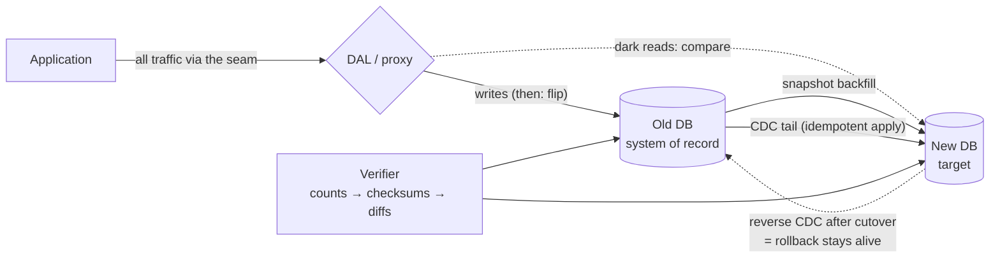

# Database Migrations

Migrations come in three sizes. Small: a schema change inside one engine — the [expand–contract discipline](sql-at-scale.md), choreographed with [deploys](../devops/deployments.md). Medium: moving data *within* a fleet — [the resharding dance](partitioning.md). Large — this page: **replacing the system of record itself while it serves production traffic**. New engine (Oracle → Postgres), major version too big to upgrade in place, self-hosted → managed, datacenter → cloud, [SQL → NoSQL or back](nosql.md). Everyone budgets for copying the data, and the copy is the *easy* part. What you're actually building is a **temporary distributed system in which two databases both claim to be the truth** — and every hard problem on this site ([replication lag](replication.md), [ordering](../distributed/time-ordering.md), [idempotency](../messaging/delivery-semantics.md), [atomicity across stores](distributed-transactions.md)) reappears inside the machinery you built to escape it. The reasons to attempt it anyway are few and honest: a licensing exodus, a scale ceiling the [ladder](sql-at-scale.md) can't fix, deleting ops toil by going managed, or a platform consolidation. Write the reason down — the migration will run longer than promised, and the written *why* is what keeps it funded past month six.

## The shape of every safe migration

Every zero-downtime migration that works converges on the same skeleton — a ladder of individually reversible steps:

1. **Stand up the target, and cut a seam in the application** — a data-access layer or proxy through which *all* traffic flows. No seam, no migration: you can't switch what you can't intercept.
2. **Backfill + tail.** A consistent **snapshot** copies history in throttled batches; **CDC** (change data capture — tailing the [WAL](storage-engines.md), Debezium-style, same machinery as [analytics ingestion](analytics.md)) streams every write that happens during and after. Start CDC *before* the snapshot and make apply **idempotent** (primary-key upserts): the overlap between the two streams then converges instead of corrupting — [at-least-once delivery plus idempotent apply equals effectively-once](../messaging/delivery-semantics.md), applied to your own data.
3. **Verify continuously, not once.** Escalating rigor: row counts → chunked checksums → row-level diffs → **dark reads** (read both stores, serve the old, compare and count mismatches). Drift is not an *if*; reconciliation is a component of the system, not a safety net for it.
4. **Cut reads gradually** — behind a [flag](../devops/deployments.md), by percentage, or by tenant wave. Reads are the rehearsal: every mismatch found here is a write-cutover incident refunded.
5. **Cut writes — the moment of truth.** The clean version is **freeze-and-flip**: pause writes at the seam, wait for CDC lag to reach zero, flip, resume. *Your write freeze equals your replication lag* — seconds if you've throttled backfill and rehearsed, an outage if you haven't. Proxy-tier flips ([Vitess, ProxySQL — the gateway pattern](../networking/proxies-gateways.md)) and [per-tenant homing](../devops/multi-region.md) shrink the blast radius to one shard or tenant at a time.
6. **Reverse the replication immediately** — CDC now flows new → old, so "roll back" means *flip back*, not *lose an hour of acknowledged writes*. This is what keeps the point of no return where you scheduled it instead of where the incident finds it.
7. **Soak, then contract.** The migration is not done when the new database serves traffic; it is done when the old one is **off**. Until then you run two systems, double ops load, and drift accrues interest.

## Dual-write vs. CDC — the debate you must win

**Dual-write from the application** looks simple and is a trap: writing two databases from app code with no atomic commit across them is [a distributed transaction you volunteered for](distributed-transactions.md). Partial failures leave silent divergence; two app instances interleave A-then-B and B-then-A into *different orders* on the two stores; [triggers and side effects fire twice](transactions.md); and you've coupled the migration to every code path that writes. **CDC** reads the source's own commit log: ordering and transactional boundaries preserved for free, zero app changes on the write path, and lag you can [measure in seconds and bytes](replication.md). The Staff verdict: **CDC is the spine**; app-level dual-write only where CDC can't express the transform (deep cross-engine semantic changes), and then with reconciliation running from day one. Either way the reconciler is mandatory — the debate is only about how much drift it has to catch.

## What actually bites

The mechanical risks are managed by the ladder. The ones that page you are **semantic**:

- **Engines disagree about meaning.** Timezone handling, collation and case-sensitivity, decimal precision, Oracle's `NULL`-equals-empty-string, [isolation-level defaults](transactions.md) your app silently depended on. Each is a correctness bug that no checksum catches until real queries run — which is what dark reads and tenant waves are *for*.
- **The planner regression.** A query that ran in 3 ms runs in 3 s on the new engine because its optimizer chose differently — discovered at cutover, at peak, unless you **replayed production query logs** against the target and diffed per-query p99 first. Same data, same SQL, different [engine internals](storage-engines.md): this genre is why "the data copied fine" and "the migration is safe" are different sentences.
- **Sequence collisions.** Auto-increment counters on the target that lag the source hand out IDs that already exist. Bump sequences past the source's high-water mark (plus slack) before cutover, or move to [Snowflake-style IDs](partitioning.md) and delete the problem class.
- **The readers you didn't know about.** The analyst's direct connection, the cron job from 2019, the other team [integrated-by-database](../devops/iac-gitops.md). Audit connections from the database's own logs for weeks, and rotate credentials as a forcing function — whoever pages you *was* a dependency.
- **The backfill attacks its own source.** Bulk reads hammer the primary (read from a replica), flood the WAL, and [lag every other replica](replication.md) — your migration becomes someone else's incident. Throttle it like the batch job it is, and watch the [cache layer](../caching/failure-modes.md): a backfill that churns hot pages changes production latency while you're busy watching row counts.
- **Rollback after writes landed on the new side** — the scariest branch. Without reverse CDC, rolling back abandons every write since the flip. With it, rollback is a flip. The **point of no return** is the first *semantically irreversible* divergence — new features writing shapes the old engine can't hold. Schedule it deliberately, late, and in writing.

!!! ops "DevOps lens"
    Rehearse the entire ladder against a production-sized copy — the throttle rates, the freeze, the *rollback* — before touching production; an unrehearsed cutover runbook is [a hypothesis](replication.md). The migration dashboard, live for the whole program: **CDC lag in seconds and bytes** (your freeze-window forecast), **mismatch count from the verifier** (nonzero = stop the line), **error rate and p99 split by backend** (old vs. new — the planner regression shows up here first), **backfill progress vs. source load**. The cutover itself is run like [an incident in reverse](../observability/incidents.md): a decision tree with named decision-maker, abort thresholds decided *in advance* (mismatches > X, lag > Y, p99 > Z ⇒ revert, no meeting), and a comms plan — the [multi-region failover discipline](../devops/multi-region.md), pointed at your own change. Cut over in the traffic trough; freezes are cheapest at 4 a.m. on purpose.

!!! staff "Staff+ altitude"
    Markers: (1) **A written reversibility budget** — every step names its undo, up to an explicitly scheduled point of no return; "how do we get back from here?" answered per rung *before* the program starts is what separates a migration from a bet. (2) **The risk register is semantic, not mechanical** — copying bytes is solved; collation, isolation, planner behavior, and sequence math each get a named owner and a verification method, because those are the outages. (3) **Buy the abstraction while you're paying anyway** — the seam you cut (DAL, proxy) and the integration-by-database you banned are the durable assets; migration N is when you make migration N+1 cheap. (4) **Finishing is the deliverable.** The 90%-migrated steady state — two systems, double ops, drift forever — is *worse than not starting*; define done as "the old system is off," track **% of traffic on the new store** (not % of code merged), and celebrate the deletion, because the org remembers what gets celebrated.

!!! interview "In the interview"
    The rehearsable paragraph: *"Cut a seam so all access flows through one layer. Snapshot-backfill plus CDC into the target — CDC started first, apply idempotent, so the overlap converges. Verify continuously: counts, checksums, then dark reads comparing both stores on live traffic. Cut reads by tenant wave behind a flag; cut writes with a freeze-and-flip whose length equals my measured CDC lag — seconds, because it's rehearsed. The moment writes land on the new side, reverse replication flows new-to-old, so rollback stays a flip until the deliberately scheduled point of no return. Decommission is the finish line, not an afterthought."* Probes to expect: *"how do you know the copies match?"* (continuous escalating verification — and dark reads catch the *semantic* gaps checksums can't); *"why not dual-write from the app?"* (no atomicity across stores — it's a volunteer distributed transaction; CDC preserves order and transaction boundaries from the log); *"the new DB misbehaves a week after cutover?"* (reverse CDC has kept the old side current — flip back, diagnose in daylight); *"how long is the write freeze?"* (a number, not an adjective: it equals replication lag, which I throttle and rehearse to seconds); *"when do you delete the old system?"* (written exit criteria: soak duration, error budget intact, the last unknown reader found — then a date, kept).

**Section complete.** Data at rest — and data in motion between homes — is handled. The same choreography reappears at platform scale in [migrating Kubernetes across clouds](../devops/cluster-migration.md). Next section: [Caching](../caching/index.md) — the art of lying about where data lives, fast.
