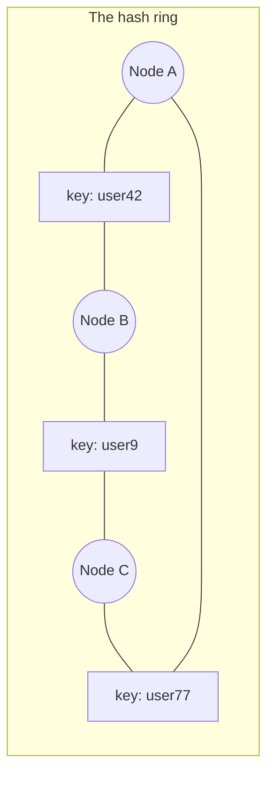

# Partitioning & Sharding

When data or write load outgrows one node, you split it — and the split is unlike every other decision in your design: caches can be added later, replicas can be added later, but the **shard key** is welded into every row's address, every query's routing, and every client's assumptions. Migrating it means touching all data and all code while both serve traffic. Choose it like you'll live with it for a decade, because you will.

(Orthogonality first, since interviews blur it: **replication** copies the same data to many nodes; **partitioning** puts *different* data on different nodes. Real systems do both — every partition is itself a replicated group. [Replication](replication.md) answers "who leads?"; this page answers "who owns which keys?")

## The three ways to split

**Range partitioning** — each shard owns a contiguous key range (`[A–F]`, `[G–M]`...). Buys: *range scans stay local* (time slices, alphabetical walks), easy splitting of a busy range. The famous failure: **sequential keys create a permanently hot last shard** — timestamps or auto-increment IDs mean every insert lands on the newest range while older shards cool into museums (the classic HBase/Bigtable lesson). Range wants naturally-scattered or explicitly-bucketed keys.

**Hash partitioning** — `shard = hash(key)`; uniform by construction, hotspot-resistant for *distinct* keys. Kills range queries (adjacent keys scatter across the fleet). And never ship the naive form: `hash(key) mod N` means changing N reshuffles nearly *everything* — the mod-N trap that consistent hashing exists to fix.

**Directory/lookup partitioning** — an explicit map (`tenant 4812 → shard 7`) in a config store. Maximum flexibility (move any tenant anywhere: whale isolation, compliance pinning, gradual drains) at the price of an extra hop and a new critical dependency — the directory itself is now [coordination infrastructure](../distributed/coordination.md) to cache, version, and keep alive.

## Consistent hashing, taught properly

The elegant fix for the mod-N trap, and a legitimate "explain it in 60 seconds" interview set piece:

Hash both **nodes and keys** onto a circle (0 to 2³²−1). Each key belongs to the first node clockwise from it. Add a node: it claims only the arc between itself and its predecessor — **~K/N keys move, instead of nearly all of them**. Remove a node: its arc slides to its successor, nobody else notices.

Two refinements make it production-grade: **virtual nodes** — each physical node appears at 100–1000 ring positions, smoothing the variance of random placement (without vnodes, some node always owns a triple-sized arc), letting heterogeneous hardware take proportional load, and spreading a dead node's arc across *many* successors instead of dumping it on one; and **bounded loads** — cap any node at (1+ε)× average, spilling overflow clockwise, so affinity never becomes a hotspot guarantee. Habitat: Cassandra/Dynamo rings, memcached client libraries, Envoy's ring-hash LB, chat/WebSocket session routing — anywhere keys must stick to nodes *while the node set churns*.

## Choosing the shard key: the actual craft

Four properties, in tension, and the tension is the interview:

1. **High cardinality** — millions of distinct values (you can't balance 8 values of `region` across 64 shards).
2. **Even load** — not just even *counts*: even *traffic*. One `tenant_id` can be 10,000× another (the whale problem).
3. **Present in your hot queries** — every query lacking the shard key becomes scatter-gather to all shards; the key must be the thing your access patterns already hold ([queries-first modeling](nosql.md), again).
4. **Aligned with isolation boundaries** — tenancy, residency, deletion: if compliance says "EU tenant data stays in EU," the key had better make that expressible.

Worked judgments: `user_id` for a consumer app — high cardinality, queries are user-scoped, celebrities are the manageable exception → good default. `tenant_id` for B2B — right isolation boundary, but whales exist → **hybrid: hash small tenants across shared shards, pin whales to dedicated shards via directory entries** (the pattern behind most mature SaaS). Raw `timestamp` — write hotspot by construction → compound it (`(sensor_id, timestamp)`) or salt it (`hash(id) % 16` prefix buckets), accepting a 16-way fan-in on time-range reads — say the cost out loud, because bucketing trades read fan-out for write balance, and knowing you made that trade is the point.

## Hot partitions and what breaks when you shard

**Hot partitions** happen anyway — a celebrity, a viral post, one whale's Black Friday. Detection first: **per-partition metrics**, because *the fleet average is a lie* ("cluster at 20% CPU" and shard 14 on fire coexist happily). Mitigation ladder: cache the hot key in front → split/salt that key (`post123#1..8` sub-keys, merge on read) → dedicated shard via directory override → and note that managed stores do some of this invisibly (DynamoDB adaptive capacity), which helps until it doesn't.

Sharding also quietly repeals features you were using, and listing them unprompted is a strong signal:

- **Cross-shard queries** → scatter-gather: latency becomes the *slowest* shard's ([tail amplification](../foundations/latency-throughput.md)); aggregation logic moves into your app or a query layer.
- **Secondary indexes** → choose *local* (each shard indexes its own data; every index query fans out) or *global* (the index is itself sharded by the indexed value; single-shard lookups, but the index updates asynchronously and can lag — DynamoDB GSIs). There is no third option without paying coordination.
- **Transactions** → single-shard only; cross-shard atomicity means [2PC or sagas](distributed-transactions.md).
- **Unique constraints & auto-increment** → global uniqueness now needs a service: Snowflake-style IDs (timestamp + node + sequence — sortable, coordination-free) or ticket ranges. "Where do IDs come from?" is a real design box post-sharding.
- **Joins** → denormalize at write time; the relational luxury ended at the shard boundary.

## Resharding: pay now or pay much more later

The dreaded operation, and the reason pre-planning is the whole game:

**Pre-split logical shards (do this).** Create far more *logical* shards than physical nodes on day one — 4,096 logical shards mapped onto 8 physical nodes. Scaling out = **remapping logical shards to new nodes and copying them** — no rehash, no key movement logic, just data motion behind a versioned map. This one decision converts "terrifying rewrite" into "routine rebalance," and it costs nearly nothing at design time. (Vitess, Citus, and every mature sharded MySQL install work this way; consistent-hashing systems get an equivalent via vnodes.)

**The live migration dance** (when you must move without pre-splits): dual-write old + new → backfill history in throttled batches → verify (checksums, shadow reads) → cut reads over behind a flag → drain and drop. Weeks of careful choreography — the [expand–contract migration](sql-at-scale.md) at cluster scale — and every step needs a rollback story.

**Routing** ties it together: smart clients or a proxy tier (Vitess vtgate, Envoy) consult a **versioned shard map** in a config store (etcd/ZooKeeper — [coordination](../distributed/coordination.md)); during migrations the map says "shard 302: reads old, writes both," and map rollout is itself a canaried deploy. Where's the map's truth? Who can edit it? Those are the questions that find the weak spot in most sharded designs — ask them of your own before the interviewer does.

!!! ops "DevOps lens"
    Sharded fleets change what "operate the database" means: **dashboards go per-shard or you're blind** (p99 by shard, QPS by shard, size by shard — the imbalance ratio max/median is your early-warning metric); **every maintenance op multiplies by N** (schema change = N rolling migrations with per-shard failure handling; backup/restore = N × [PITR](sql-at-scale.md) stories; an upgrade is a *campaign*); and **new incident genres arrive**: the hot-shard-behind-a-green-average, the shard-map cache gone stale after a botched rollout (some clients still writing to the old home — reconciliation time), the rebalance that saturated inter-node bandwidth and became its own outage (throttle data motion like the backfill it is). Automation isn't optional at N shards; it's the difference between a platform and a pager rotation.

!!! staff "Staff+ altitude"
    Markers: (1) **Name the one-way door** — in reviews, the shard key gets the scrutiny of a public API, because it *is* one: "walk me through the queries that don't include this key" is the single highest-yield review question in data design. (2) **Buy the cheap insurance** — pre-split logical shards and Snowflake IDs cost ~nothing at design time and delete the two most expensive migrations in the company's future; mandating them in the paved road is pure Staff leverage. (3) **Sharding is tenancy policy** — noisy-neighbor isolation, per-tenant SLOs, residency, and "delete this customer completely" are shard-map features, not afterthoughts; sometimes compliance, not scale, is the real reason to shard, and recognizing which force is driving changes the design. (4) **Defer honestly** — the [SQL-at-scale ladder](sql-at-scale.md) exists because sharding's complexity bill (this entire page) is permanent; the Staff position is a written trigger ("we shard when write QPS crosses X or table Y exceeds Z after partitioning"), not a vibe.

!!! interview "In the interview"
    The shard-key justification is a rehearsable paragraph: *"Shard by `user_id`, hashed, 4,096 logical shards pre-split over 16 nodes: high cardinality, every hot query is user-scoped so no scatter-gather, celebrities get cache-plus-salting, IDs come from a Snowflake service since auto-increment died with the single writer, and scaling out is remapping logical shards — no rehash."* Five decisions, one breath. Keep the **consistent-hashing 60-seconder** loaded (ring → clockwise ownership → K/N movement → vnodes for variance), and answer "what gets harder once you shard?" with the repealed-features list (cross-shard queries, indexes, transactions, uniqueness, joins) *before* enumerating fixes. Classic probes: *"one shard is hot — walk me through it"* (detect per-partition → cache → salt/split → dedicated shard); *"how do you add capacity?"* (logical-shard remap or ring rebalance — never mod-N; say why); *"how would you reshard with zero downtime?"* (the dual-write dance, with verification and rollback named).

**Next:** [Transactions & isolation](transactions.md) — what the database actually promises inside one node, and the anomaly zoo between the isolation levels.
