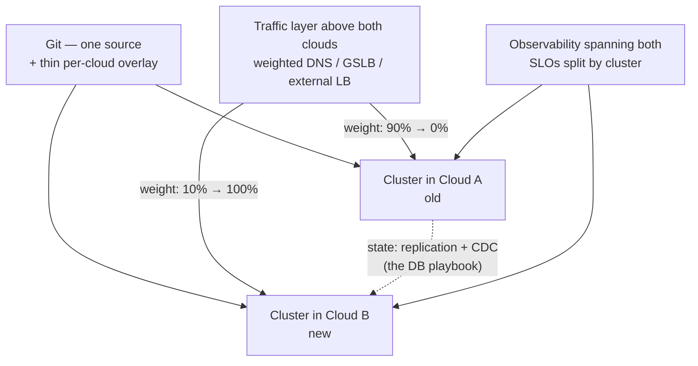

# Migrating Kubernetes Across Clouds

Kubernetes' portability promise is why this migration is *plausible* — and why it's chronically underestimated. The workload API travels beautifully: your Deployments, Services, and HPAs will apply to the new cluster unchanged, which is [the promise kept](kubernetes-architecture.md). Everything the workloads *touch* does not travel: disks, identity, load balancers, DNS, registries, quotas, the [hundred provider-specific annotations](kubernetes-workloads.md) you forgot you wrote. EKS → GKE is roughly 20% Kubernetes and 80% the cloud around it. Rule zero: **you never migrate a cluster — you build a new one and move traffic.** Clusters are cattle; upgrading one *in place across providers* isn't a thing. This is [blue-green](deployments.md) at cluster scale, with [the database-migration choreography](../data/migrations.md) riding underneath for everything stateful — and the honest reasons to do it are strategic, not technical: a pricing cliff or expiring discount, an acquisition consolidating platforms, GPU availability, [residency](multi-region.md), or provider risk. Price it honestly — egress fees plus engineer-months against the negotiated discount — and notice that a *credible, rehearsed* exit plan pays a dividend even if never executed: it's leverage at the renewal table.

## The portability audit — what's actually coupled

Before any plan, hunt everything with a cloud's fingerprints on it:

- **State — the hard core.** PersistentVolumes are cloud disks; **snapshots do not cross clouds**. CSI drivers, StorageClasses, and IOPS/latency profiles all differ — the same database on a different disk has a different p99, discovered under load. Velero-style backup moves the Kubernetes *objects*; the gigabytes underneath migrate like what they are — databases — via [replication, CDC, and verified cutover](../data/migrations.md). The strongest move is made *before* the migration: get state out of the cluster entirely ([managed databases, object storage](../data/object-storage.md)) so the cluster migration migrates only cattle. This project is an audit of whether your "cloud-native" architecture actually is.
- **Identity.** IRSA and GKE Workload Identity are entirely different wiring for the same idea — every pod that touches a cloud API needs rework, and every secret in the provider's [KMS or secret manager](secrets-identity.md) needs re-provisioning. Inventory the blast radius from cloud audit logs or an egress proxy: you cannot rewire calls you haven't found.
- **Traffic and networking.** LoadBalancer/Ingress annotations are 100% provider-specific; health-check defaults and timeouts differ between LB implementations — the *502s-at-cutover* genre is almost always the new LB's health-check or idle-timeout defaults meeting your old assumptions. The CNI model may change (pod-per-VPC-IP vs. overlay), which changes [IP-exhaustion math and NetworkPolicy behavior](cloud-networking.md). And the sneaky critical path: **partners who allowlisted your egress IPs** — external humans with change windows now gate your cutover; start that clock weeks early.
- **The ecosystem ring.** Image registry (mirror images, retarget [CI pushes](cicd.md), rotate pull secrets), DNS zones, [CDN origins](../networking/cdn.md), log and metric sinks (the CloudWatch-shaped hole in your [observability](../observability/fundamentals.md)), node images and their hardening, GPU device plugins, [autoscaler behavior](kubernetes-autoscaling.md) (Karpenter vs. NAP bin-pack differently on different instance shapes), and spot semantics — a 2-minute versus 30-second preemption warning [changes your graceful-shutdown budget](kubernetes-workloads.md).
- **Behavioral drift.** Same YAML, different behavior: default StorageClass reclaim policies, kernel versions, conntrack limits, instance-shape granularity redoing your bin-packing — and the fresh account's **default quotas**, which you will hit at the worst possible moment (the 30-LB limit, mid-cutover) unless quota raises are a pre-flight item.

## The sequence

[GitOps is the migration engine](iac-gitops.md): if the cluster is rebuildable from git, "migrate" means *point the reconciler at a new cluster and let it converge* — and if it isn't, step zero of the migration is making that true, which is the hidden hygiene dividend of the whole project. Then:

1. **Inventory and decouple.** Run the audit above; move state out of the cluster where possible; concentrate every provider difference into **one thin, explicit seam** — a per-cloud Kustomize overlay or Helm values layer. Cloud-specific annotations scattered through a hundred manifests is the migration's real cost; one directory of overrides is its solved form.
2. **Build the target from the same git.** Conformance-check it, then load-test with production-shaped traffic — this is where the LB defaults, quota walls, and noisy CNI surprises surface while they're cheap.
3. **Move in service units along the dependency graph, leaf-first — data and its apps together.** The anti-pattern is all-apps-then-all-data: a request hairpinning between clouds pays internet RTT *plus egress, per hop, per request*. Migrating a service *with* its state ([per the playbook](../data/migrations.md)) bounds the split to the seams you chose.
4. **Shadow and soak.** Mirror or replay read traffic against the target; dashboards split by cluster label from day one, [SLOs compared side by side](../observability/slos.md) — "it's up" is not the bar; *same p99, same error rate* is.
5. **Cut over above both clouds.** The traffic layer that moves users must sit outside either provider: [weighted DNS/GSLB with TTL honesty](../networking/dns.md), or an external LB/CDN tier. Canary weights per service, tenant waves where you have them, and instant revert = weights back — [the deployment discipline](deployments.md), aimed at infrastructure.
6. **The funeral, on a date.** Decommission with the same rigor as [the database contract phase](../data/migrations.md): the old cluster kept "just in case" is 2× bill plus config drift, forever.

## The interregnum

The weeks you run in both clouds are the riskiest steady state of the project: observability must span both or you're blind during exactly the wrong window; the on-call surface doubles; egress bleeds during replication *and* during split operation; every incident starts with "which cloud?"; and [correlated assumptions](../distributed/failure-modes.md) hide in the seams (the cert that auto-renews only in cloud A, the runbook referencing dashboards that live in the old account). Bound it deliberately — written exit criteria per service wave, aggressive batching, and the same warning as [the database page](../data/migrations.md): 90%-migrated is the worst place to live. Do not let the interregnum become the architecture.

!!! ops "DevOps lens"
    The pre-flight checklist that saves the cutover: **quotas raised** on the target account (LBs, IPs, vCPUs per family, GPU); **partner allowlists** updated and confirmed; **DNS TTLs lowered days ahead** ([and tested, because resolvers lie](../networking/dns.md)); **image mirror verified** by deploying from it exclusively; **rollback rehearsed** — weights back, before the first real cutover, as a drill with a stopwatch. Capacity honesty: the target runs full-size while the source stays full-size until soak completes — 2× is the temporary price of a safe migration ([budgeted, not discovered](cost-capacity.md)) — and sign committed-use discounts *after* the new provider's real usage shape is measured, not before. Watch the boring killers: clock/timezone differences in batch jobs, the cron that runs twice because both clusters think they own it (fence singleton jobs during the interregnum — [a lease, not a hope](../distributed/coordination.md)).

!!! staff "Staff+ altitude"
    Markers: (1) **Portability is priced, not worshiped.** The Kubernetes API layer is free portability — keep it. Full cloud-agnosticism — lowest-common-denominator services, no managed anything — is paying daily for an option you exercise once a decade; the Staff position is a *thin seam* (one overlay directory) and managed services behind interfaces, not abstinence. (2) **The rehearsed exit is leverage** — an audit, a costed plan, and one internal service actually moved converts "we could leave" from bluff to negotiating position; sometimes the migration's highest-EV outcome is the discount that makes it unnecessary. (3) **Sequencing is the design** — the dependency graph decides wave order (leaf-first, data-with-apps), the metric is % of traffic served from the new cloud, and the program has an owner, exit criteria, and a funeral date; a migration without a decommission date is an adoption, not a migration. (4) **Migrate less** — the inventory is your once-a-decade license to retire: every service is a three-way choice (move it, replace it with managed, or delete it), and the third option is criminally underused.

!!! interview "In the interview"
    The rehearsable narrative: *"I don't migrate the cluster — I build a new one from the same git, with provider differences isolated in one thin overlay. Audit first: state, identity, LB annotations, registries, quotas, partner allowlists. State moves like a database — replication and verified cutover, because PV snapshots don't cross clouds — ideally into managed services before the migration starts. Then service-by-service waves, leaf-first with their data, shadowed and soaked, cut over by a weighted traffic layer that sits above both clouds, with rollback being weights-back. Bounded interregnum, written exit criteria, and the old cluster gets a funeral date."* Probes to expect: *"what breaks first?"* (identity wiring and LB annotation/health-check defaults — the 502s-at-cutover genre); *"how do the volumes move?"* (they don't — that's [the database-migration problem](../data/migrations.md) wearing a CSI costume); *"how does traffic actually cut?"* (a layer above both clouds, TTL honesty, per-service weights); *"how long do you run both?"* (as short as the dependency graph allows — bounded by exit criteria, because the interregnum is the riskiest state); and the trap question, *"so should we stay multi-cloud permanently?"* — distinguish **migration** (transient, bounded) from **multi-cloud operation** (permanent): active-active across providers is [the multi-region problem](multi-region.md) squared with none of the shared primitives, and the honest answer for a single workload is almost always no — keep the portability, skip the permanent split.

**Next:** [Cost & capacity](cost-capacity.md) — the bill as an architecture diagram, and the unit economics that make cost an engineering discipline.
