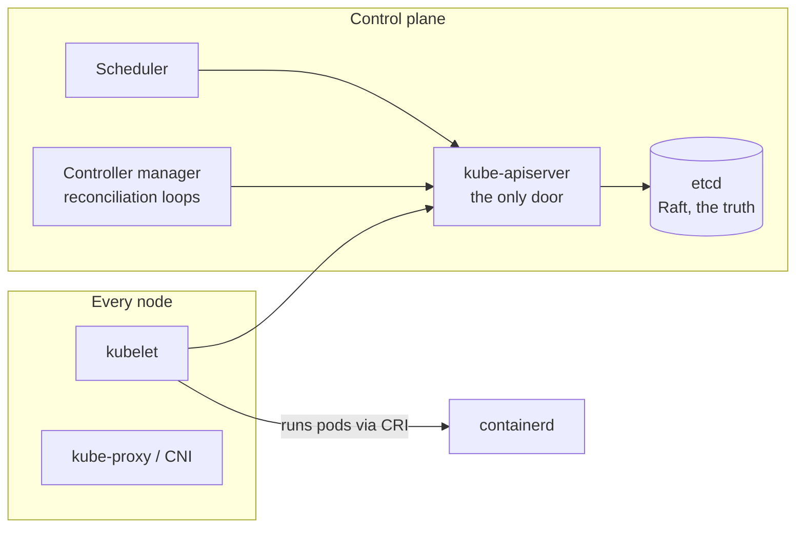

# Kubernetes Architecture

Kubernetes is the best-documented distributed system you will ever run, which makes it the perfect capstone for everything in the [distributed systems section](../distributed/index.md): a [consensus core](../distributed/consensus.md) (etcd), an API layer with [optimistic concurrency](../data/transactions.md), a fleet of [reconciliation loops](../distributed/coordination.md) with [leader election](../distributed/coordination.md), and a scheduler doing continuous bin-packing. Study it as architecture — not as YAML — and you get two payoffs: you operate it better, and you can *reuse its design moves* in interviews, because they're among the best design moves in the industry.

## The shape: a small strong core and a reconciling edge

**etcd** is [the small strong core](../distributed/consensus.md) in the flesh: 3–5 nodes, Raft, holding *desired and observed state* — and nothing else in the system talks to it directly. **The API server** is the single door: authn/authz, validation, admission webhooks, and the **watch** mechanism (clients subscribe to changes rather than polling — [the config-watch pattern](../distributed/coordination.md) at scale). Every other component — scheduler, controllers, kubelets — is *just an API client*, which is the first reusable design move: one authoritative interface, everything else stateless-ish clients of it.

## Reconciliation: the design pattern worth stealing

Kubernetes does not execute commands; it **converges on declarations**. You write desired state (`replicas: 5`); controllers run a loop: *observe actual → diff against desired → act to close the gap → repeat forever*. Nothing is a one-shot operation; everything is a thermostat.

Why this is the most important idea on the page: **level-triggered beats edge-triggered under failure.** A command ("start 2 more pods") can be lost, duplicated, or arrive after the world changed; a *declaration* ("there should be 5") is re-checked continuously, so missed events heal themselves on the next loop — crash a controller mid-action and the restart just re-observes and re-diffs ([crash-recovery](../distributed/failure-modes.md) handled by design, not by exception paths). Every controller action is [idempotent by construction](../messaging/delivery-semantics.md) because "make reality match this" twice equals once. This is *the* architectural answer to unreliable networks and processes, and it generalizes far beyond Kubernetes: [GitOps](iac-gitops.md) is reconciliation applied to deployment; your [saga orchestrator](../data/distributed-transactions.md) and [reconciliation jobs](../data/distributed-transactions.md) are the same shape.

The machinery details that make it work at scale: controllers use **watches + local caches** (informers) so loops read locally and only *writes* hit the API; **resourceVersion** gives [optimistic concurrency](../data/transactions.md) (conflicting updates fail and retry — no locks); controllers run active-passive with [lease-based leader election](../distributed/coordination.md); and **owner references** cascade cleanup (delete the Deployment, the ReplicaSet and pods follow — declarative garbage collection).

## The scheduler: bin-packing as a service

The scheduler watches for unbound pods and picks nodes in two phases — **filter** (hard constraints: [resource requests](kubernetes-autoscaling.md), node selectors, taints/tolerations, affinity rules) then **score** (soft preferences: spread, packing, image locality). Two design notes with reach: scheduling is by **requests, not actual usage** ([the whole capacity conversation](kubernetes-autoscaling.md) hangs on this), and topology-spread constraints are how [failure-domain thinking](../foundations/reliability-availability.md) becomes YAML — "spread these replicas across zones" as a declared invariant, enforced continuously.

## The property that saves your weekends: fail-static

The crown jewel of the architecture, and the line to quote in reviews: **the data plane survives the control plane.** Kubelet runs pods; if the API server or etcd goes down, *running pods keep running*, Services keep routing (kube-proxy's rules are already programmed), traffic keeps flowing. You lose *change* — no new deploys, no rescheduling, no autoscaling — but you don't lose *service*. [Blast-radius design](../distributed/consensus.md) as a first-class property: the brain can nap without the body collapsing. When you design *any* control-plane/data-plane split (a [feature-flag service](../case-studies/feature-flags.md), a [service mesh](service-mesh.md), a config system), this is the property to copy — data planes cache their marching orders and **fail static**, never fail closed on the control plane's availability.

## Extension as architecture

Kubernetes' deepest trick: the machinery above is *generic*. **CRDs** add new resource types to the API (with storage, watch, RBAC for free); **operators** are your own controllers reconciling them — "PostgresCluster" as a declared object with a control loop that handles provisioning, [failover](../data/replication.md), backups. The design lesson: Kubernetes won not by solving workloads but by shipping a *universal declarative control plane* others could build on — platform-as-substrate, the [paved-road](../caching/failure-modes.md) idea at its most structural. (With the matching warning: every CRD+operator you adopt is someone's distributed system running in your cluster, with its own bugs, upgrade treadmill, and 3 a.m. personality.)

!!! ops "DevOps lens"
    Operating the control plane is operating [a consensus system](../distributed/consensus.md), with all the etcd care that implies (fast dedicated disks — [fsync sensitivity](../distributed/consensus.md); snapshot/restore drills; watch DB size and compaction). The K8s-specific additions: **API server overload** is the cluster-wide gray failure — a misbehaving client (crash-looping operator, chatty CI) hammering LIST on large collections can starve everyone (API priority & fairness helps; per-client rate limits and audit-log archaeology find the culprit); **watch/informer storms** after control-plane restarts (every client relists at once — [thundering herd](../caching/failure-modes.md), control-plane edition); **certificate expiry** as the classic self-inflicted total outage (kubelet certs, webhook certs — automate rotation, alert on expiry windows); and **admission webhooks as availability liabilities** (a down webhook with `failurePolicy: Fail` blocks all matching writes cluster-wide — every webhook is a [serial dependency](../foundations/reliability-availability.md) you added to the API path). And rehearse the fail-static story: kill the control plane in staging and *watch* workloads survive — then you'll believe it, and know its limits, during the real one.

!!! staff "Staff+ altitude"
    Markers: (1) **Steal the patterns, not just the platform** — reconciliation loops, declarative APIs with optimistic concurrency, level-triggered convergence, and fail-static data planes are *the* modern control-plane design kit; a Staff engineer designs internal systems (deploy tooling, [DNS automation](../networking/dns.md), fleet config) in this shape and can say why. (2) **Cluster topology is blast-radius policy** — one big cluster (bin-packing efficiency, one upgrade, one blast radius) vs. many small ones (isolation, [cell-architecture](../foundations/reliability-availability.md) properties, multiplied toil): the mature answer is cells-by-criticality/tenancy with fleet management ([Cluster API, GitOps-of-clusters](iac-gitops.md)), stated as policy, not accident. (3) **Upgrade discipline is availability engineering** — control-plane and node upgrades as [staged rollouts](deployments.md) with soak time, because "the platform" is the most [correlated failure domain](../foundations/reliability-availability.md) you own. (4) **Operator adoption is a build-vs-buy review** — each one is a distributed system with root-ish powers; require the same scrutiny as a new database.

!!! interview "In the interview"
    Two deployments of this page: as **direct answer** ("how does Kubernetes work?" → the shape: etcd truth via Raft, API server as the single watched door, controllers reconciling desired vs. actual, scheduler filter/score, kubelet executing, *and* the fail-static property — ninety seconds, architecture-first, zero YAML) and as **pattern source** for *any* control-plane design question ("design a fleet config system / deploy system / flag service" → declare desired state in a strongly-consistent store; agents watch, cache, converge, and fail static; changes are versioned declarations, not commands; [leader-elected](../distributed/coordination.md) controllers reconcile — you are describing Kubernetes' bones, and it's the correct answer shape almost every time). High-yield probes: *"what happens if etcd/the control plane dies?"* (fail-static — running workloads unaffected; change frozen; [quorum-loss](../distributed/consensus.md) recovery for etcd itself); *"why declarative instead of imperative?"* (lost/duplicated commands vs. self-healing convergence — level-triggered wins under failure); *"how do two controllers not fight?"* (optimistic concurrency on resourceVersion + leader election per controller).

**Next:** [Kubernetes workloads & traffic](kubernetes-workloads.md) — Deployments, Services, probes, and the pod-lifecycle choreography that decides whether your deploys drop requests.
