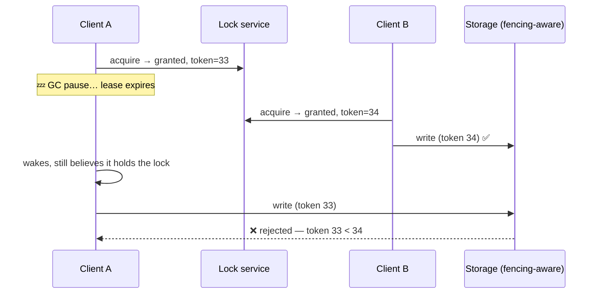

# Coordination, Locks & Leases

"Only one worker may process this job at a time." It sounds like a `if` statement. It is, in fact, the hardest easy-sounding requirement in distributed systems — because *at a time* invokes [clocks that lie](time-ordering.md), *one worker* invokes [failure detection that guesses](failure-modes.md), and enforcing any of it invokes [consensus that costs](consensus.md). This page is the honest toolkit: the patterns that make exclusivity actually true, the famous hole in naive distributed locks, and — most valuable — the ladder of designs that avoid needing locks at all.

## Leader election as a service

The most common coordination need isn't exotic: N replicas of a controller/scheduler/cron-runner, exactly one active. The standard machinery rents it from the [small strong core](consensus.md): each candidate tries to create an **ephemeral key** (etcd lease-bound key, ZooKeeper ephemeral node) — creation succeeds for exactly one (consensus guarantees it); the winner leads, *continuously renewing its lease*; if it dies or partitions, the lease expires, the key vanishes, and the next candidate's watch fires. This is precisely how Kubernetes controllers do active-passive HA (`leader-elect=true`), how [database failover managers](../data/sql-at-scale.md) pick primaries, and how every "singleton service, but highly available" is built. The subtleties are the lease's: renewal period ≪ TTL (miss-one-tolerance), and the deposed leader's obligation to *stop acting* the moment it can't renew — which is exactly where the trouble starts.

## The naive lock, and the hole in it

The lock everyone writes first: `SET lock:job42 me NX EX 10` — atomic acquire with a 10-second TTL (auto-release if the holder dies; that TTL is what makes it a **lease**, and leases are the only sane distributed lock — a lock without expiry + a dead holder = deadlock forever).

Now the [story you already know](time-ordering.md): the holder pauses — GC, VM freeze, swap storm — for 15 seconds. The lease expires. Client B legitimately acquires. Client A wakes, *believes it holds the lock* (its next instruction executes under that belief — no check can help, because any check races the next pause), and writes. **Two writers.** No component misbehaved: the lock service was correct, both clients were correct, physics happened. The conclusion is structural, not fixable-by-tuning: **a lock that only the clients believe in is a suggestion.**

## Fencing tokens: the fix

Make the *resource* a participant. The lock service issues, with each grant, a **monotonically increasing token** (etcd's revision, ZooKeeper's zxid — consensus systems produce these for free). Every write to the protected resource carries the token; **the resource rejects any token older than the newest it has seen.**

The pause becomes harmless: stale holders *can't* corrupt, no matter what they believe. The cost is the honest part: the storage/resource must check tokens — a conditional-write capability ([compare-and-swap](../data/transactions.md), version columns, etcd transactions, S3 conditional PUTs). When the resource *can't* participate (a third-party API, an email send), fencing is impossible — which forces the distinction that organizes this whole topic:

**Locks for efficiency vs. locks for correctness** (Kleppmann's framing, and the most practical sentence in distributed locking): an *efficiency* lock prevents duplicate work — if it fails open occasionally, you compute something twice and shrug (fine on a single Redis `SETNX`; this is also the [cache stampede single-flight](../caching/failure-modes.md)). A *correctness* lock prevents corruption — if it fails open once, you have two writers on one invariant, and it **must** be a consensus-backed lease *plus fencing at the resource*. (This is also the verdict on the Redlock controversy in one line: multi-node Redis locking rests on timing assumptions the pause story breaks — fine for efficiency, not for correctness; for correctness, etcd/ZooKeeper + fencing.) Asking "is this lock for efficiency or correctness?" of every lock in a design is a genuinely elite review habit.

## The rest of the coordination toolbox

The consensus core's primitives compose into more than locks:

- **Membership & service registry** — ephemeral keys per instance = a live roster that *cannot* go stale past a lease TTL (dead instances vanish by construction); watches push changes to interested parties. This is [service discovery's](../devops/service-mesh.md) truth layer, Consul/etcd/ZooKeeper's day job.
- **Config watch** — write config to the core; every node watches; changes push in milliseconds. (With the [config-push blast radius](../networking/proxies-gateways.md) that implies — canary your config.)
- **CAS / conditional transactions** — etcd's compare-mod-revision-then-write, DynamoDB conditional puts: *don't lock, detect conflicts* — [optimistic concurrency](../data/transactions.md) at the coordination layer, and very often the better answer than a lock (no hold time, no orphan cleanup, losers just retry).
- **Work claiming without a lock service** — the humble, superior pattern for job queues: claim atomically in the datastore itself (`UPDATE jobs SET owner=me WHERE id=? AND owner IS NULL`, [`SKIP LOCKED`](../data/transactions.md), or a conditional write) — the claim, the work record, and the fencing live in *one* system with real transactions. Most "we need distributed locks" requirements are this pattern wearing a costume.

## The real answer: coordinate less

The ladder to climb *before* reaching for any lock, in order of preference:

1. **Partition ownership — route, don't lock.** Give every key exactly one owner ([per-key single writers](time-ordering.md): a Kafka partition's consumer, a shard's leader) and exclusivity is *structural* — no acquisition, no expiry, no pauses to fear. "Only one worker processes job 42" becomes "job 42 hashes to partition 7, which one consumer owns." This is how the big systems actually do it.
2. **Idempotency — make duplicates harmless** so exclusivity stops mattering ([the whole previous section](../messaging/delivery-semantics.md)); two workers processing the same job once each is a non-event if the effect dedupes.
3. **CAS / atomic claims** — conflict *detection* over conflict *prevention*.
4. **Lease + fencing** — when genuine cross-system mutual exclusion is unavoidable.
5. **A bare distributed lock** — the bottom rung, reserved for efficiency cases where failure is shrug-able.

The [USL told you why](../foundations/scalability.md): coordination is the quadratic cost. Every rung climbed down this ladder is throughput bought back.

!!! ops "DevOps lens"
    The lock service is **tier-0 by definition** — its outage is every dependent's outage simultaneously ([the CP core's blast radius](consensus.md), made concrete), so it gets the full treatment: dedicated fast disks, isolation from bulk traffic, rehearsed quorum-loss runbooks. Operationally watch: **lock hold times** (a p99 hold climbing toward the lease TTL is the pause story loading its gun), **wait queues** (contention = someone's using a hot lock as a job scheduler — redesign incoming), **orphaned locks / stuck leases** (holder crashed mid-critical-section; your TTL is the MTTR), and **session churn** (JVM apps with 5-second leases + 6-second GC pauses = flap city — lease TTLs must exceed your *real* pause distribution, which means you need to *know* your pause distribution). And the incident to pre-plan: mass lease expiry after a core hiccup — every leader deposed at once, every candidate electing simultaneously; jitter the re-elections or enjoy the [thundering herd](../caching/failure-modes.md), coordination edition.

!!! staff "Staff+ altitude"
    Markers: (1) **Run the coordination inventory** — list everything in the architecture that claims to need agreement (locks, elections, "exactly one," uniqueness), and interrogate each against the ladder: most entries dissolve into partition ownership or idempotency, and every dissolution is permanent throughput + availability bought back. (2) **Standardize the lock discipline** — one blessed lock service, client libraries with fencing built in, and the efficiency-vs-correctness question *required* in design docs; forty teams inventing locking is how the pause story becomes a quarterly incident. (3) **Fencing-capable storage as a platform requirement** — conditional writes/version checks in the paved-road data stores make correctness locks *possible*; without them teams ship suggestion-locks and call them mutexes. (4) The architectural instinct to model: when a design review says "we'll take a lock," the Staff response is *"who owns this key?"* — reframing exclusion as ownership is usually the whole fix, and it's the [agreeing-less](consensus.md) lesson applied one system at a time.

!!! interview "In the interview"
    The **fencing-token story is the star** — GC pause, expired lease, confident zombie writer, then the fix with the monotonic token and the resource rejecting stale writers. Ninety seconds, one diagram, and it's the single most reliable "this candidate actually understands distributed systems" signal in the interview canon. Pair it with the **efficiency-vs-correctness** distinction ("single-Redis SETNX is fine for dedupe; for correctness I want etcd + fencing — and if the resource can't check tokens, I redesign toward ownership instead"). For any "ensure only one X" prompt, walk the ladder *out loud, in order*: partition ownership → idempotency → atomic claim → lease+fencing → lock — interviewers score the ordering itself, because it's the ordering of someone who's been burned. Probes to expect: *"what TTL for the lock?"* (longer than your real pause distribution, shorter than your tolerable orphan-MTTR — and admit it's a trade); *"what if the lock service goes down?"* (tier-0: dependents' postures — fail-static holding current roles vs. fail-stop — chosen per system in advance); *"Redlock?"* (the one-line verdict, delivered without theology).

**Next:** [Resilience patterns](resilience.md) — the complete anti-cascade toolkit: timeouts, retries, breakers, bulkheads, and the art of failing on purpose.
