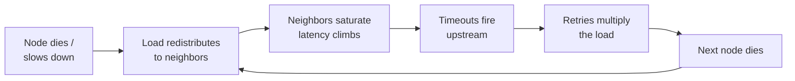

# Failure Modes & Fallacies

On a single machine, things mostly either work or crash. Distribute the same logic across a network and you inherit ten thousand shades of *half-working* — the defining property of distributed systems, and the reason this whole field exists. The classic "fallacies of distributed computing" (the network is reliable, latency is zero, bandwidth is infinite, the topology doesn't change, transport cost is zero...) compress into one operational sentence: **the network is a component with its own failure modes, latency distribution, and bill — and every arrow in your diagram is made of it.**

This page is the taxonomy of trouble. Naming failure modes precisely is half of designing against them, and it's a vocabulary interviewers notice immediately.

## Partial failure: the defining condition

When a monolith fails, you have one fact to learn. When 3 of 400 pods can't reach one of 12 shards through one of 3 NAT gateways, "is the system up?" stops having a yes/no answer. Design implications that fall straight out:

- Every remote call needs an answer to "[what if it's slow? dead? wrong? full?](../foundations/thinking-in-systems.md)" — the four questions are partial failure's catechism.
- **You cannot distinguish slow from dead** — a timeout tells you "no answer in time," never *why*. (This is the operational face of a famous impossibility result; the practical upshot: failure detection is always a *bet* with a false-positive rate, tuned via heartbeat intervals and thresholds — declare death fast and you'll kill healthy-but-slow nodes; declare slowly and you'll burn [MTTR](../foundations/reliability-availability.md).)
- Failure taxonomy worth knowing: **crash-stop** (dies, stays dead), **crash-recovery** (dies, returns with amnesia about in-flight work — the normal case, and why [WALs](../data/storage-engines.md) and [idempotency](../messaging/delivery-semantics.md) exist), **omission** (some messages silently lost), **timing** (right answer, too late), and **Byzantine** (lies — mostly the concern of consortium/blockchain systems; inside your own datacenter you assume non-Byzantine and spend the savings).

## Gray failure: the killer with a health check

The most dangerous node in any fleet is not the dead one — it's the one that **passes its health checks while failing real work**: the NIC dropping 2% of packets, the disk serving reads at 100× latency, the zombie process that answers `/healthz` from memory while every real query hits the sick disk. Dead nodes get ejected in seconds; gray nodes poison traffic for *hours*, because every layer of automation believes them.

The signature is **differential observability** — the system looks healthy from one vantage point (its own probes) and broken from another (its callers' latency). Which dictates the defenses: measure health *from the caller's side* ([outlier detection](../networking/load-balancing.md) — eject on observed error/latency deviation, not self-reported fitness), compare vantage points (server-side metrics vs. client-side metrics for the same calls should agree; divergence *is* the alert), and prefer eviction cheapness (if replacing a suspect node costs nothing, your detection threshold can be paranoid). "The health check lies" is one of the most senior sentences you can say in a design review.

## Partitions in the wild: never a clean split

The textbook partition is a tidy cut: {A,B} | {C,D}. Real partitions are uglier — **asymmetric** (A can reach B; B's replies vanish — hello, half-open connections), **partial** (A reaches C, B can't, D flaps), **flapping** (up-down-up at 30-second intervals, triggering election storms and [failover](../data/replication.md) whiplash — hysteresis and flap-damping exist for this), and **self-inflicted** (a security-group change, an MTU mismatch, an overflowing [conntrack table](../networking/fundamentals.md) — the "partition" that ships in a config deploy). Design consequence: quorum systems handle clean splits *by construction*; the flapping and asymmetric cases are where you find the bugs — which is why serious systems test with *packet loss and delay injection*, not just node kills.

## Cascading failures: the anatomy

The distributed systems horror genre has one recurring plot:

Each arrow is individually reasonable — that's what makes cascades vicious. Load balancers *should* redistribute; clients *should* retry; timeouts *should* fire. The system's safety mechanisms become the propagation medium. Note the amplifiers: **retry multiplication** ([3 layers × 3 attempts = 27×](../foundations/thinking-in-systems.md)), **connection-pool exhaustion transmitting slowness upstream** ([Little's law collecting](../networking/fundamentals.md)), and **recovery herds** (everything reconnecting/refilling at once — [the cold-cache stampede](../caching/failure-modes.md) as an encore after the outage). The complete anti-cascade toolkit gets its own page: [resilience patterns](resilience.md).

## Metastable failures: stuck after the storm

The advanced concept that's become essential vocabulary: a **metastable failure** is a system that remains broken *after the trigger clears*. The spike ends, the deploy rolls back, the sick node is gone — and the system stays pinned at 100% doing no useful work. The mechanism is always a **sustaining feedback loop**:

- Retry storms: overload → timeouts → retries → more overload → more timeouts. The original spike is long gone; the retries *are* the load now.
- Cold-cache loops: cache died → DB overloaded → requests too slow to *fill* the cache → cache stays cold → DB stays overloaded.
- Connection churn: overloaded server drops connections → clients reconnect (TLS handshakes are expensive!) → the handshake load *is* the overload.

The defining test: **"fix the trigger" doesn't fix the system.** Recovery requires *breaking the loop* — shed load hard (reject 80% at the door so 20% completes and starts filling caches), pause retries fleet-wide, restart into a quiet state, ramp traffic gradually. Teams without this concept flail during these incidents ("but we fixed the problem an hour ago!"); teams with it go straight for the loop. Asking "what sustains overload here after a spike passes?" in a design review is a genuinely elite move — it finds the retry policies and refill behaviors that turn blips into afternoons.

(The correlated-failure family — shared deploys, certs, config, and the other ways "independent" redundancy isn't — was covered in [reliability](../foundations/reliability-availability.md); it composes with everything here: correlated triggers, cascading propagation, metastable persistence. That's the anatomy of every famous multi-hour outage.)

!!! ops "DevOps lens"
    Incident-shape recognition is the operator's edge, and it maps straight onto this taxonomy: **gray failure** smells like "one AZ's p99 is 8× but everything is green" — go compare client-side vs. server-side views; **cascade in progress** smells like errors *marching through* the dependency graph in order — stop it at the current front with shedding/breakers, don't chase the origin while it spreads; **metastable state** smells like "trigger resolved 40 minutes ago, load still pinned" — stop diagnosing, start breaking the loop (drain retries, shed, warm caches deliberately). Build the *differential dashboards* before you need them: caller-vs-callee latency for every critical edge, retry-rate per client, connection-churn rate. And practice the ugly-partition cases in chaos drills — packet loss and 500 ms delay injections find bugs that clean node-kills never will, because your timeouts and hedges have never met *slow* in staging.

!!! staff "Staff+ altitude"
    At Staff level, this page becomes a review lens: every design review is secretly a failure review. The questions that earn the level: *"Which failures here are correlated?"* (shared fate hiding under redundancy), *"What's the blast radius of each component, and what shrinks it?"* ([cells, shuffle sharding](../foundations/reliability-availability.md)), *"What sustains overload after the trigger clears?"* (metastability hunting — check every retry policy, cache-refill path, and reconnect storm), and *"How does this system behave at 120% load?"* — because "we never tested overload" means the overload behavior is *whatever the bugs decide*. The meta-marker: Staff engineers design the *degraded modes as product features* (what works during a partition? what's sacrificed first?) rather than treating failure as an exception path — at scale, failure is a steady-state operating regime with its own UX.

!!! interview "In the interview"
    Vocabulary deployed at the right moment is the signal here: when the interviewer kills a node in your design, distinguish **crash vs. gray** ("if it's dead, outlier ejection removes it in seconds; the nastier case is gray — passing health checks, failing work — which is why I balance on observed latency, not self-reported health"). When they push load up, narrate the **cascade anatomy and cut it** ("the risk isn't the first node — it's redistribution + retries amplifying; my breakers and retry budgets cap the multiplication"). And for genuine differentiation, volunteer **metastability** once: *"I'd also cap retry queues, because the failure I actually fear is metastable — the spike ends but retries sustain the overload; the design needs a load-shedding mode that breaks that loop."* Most interviewers have *lived* that incident; hearing it named by a candidate is memorable. That's this page's whole job: turning your 3 a.m. pattern-recognition into precise, portable language.

**Next:** [Time & ordering](time-ordering.md) — why "what time is it?" is a trick question, and what to use instead.
