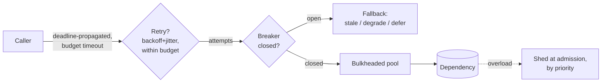

# Resilience Patterns

Every pattern on this page exists because of one diagram — [the cascade](failure-modes.md): a slow dependency, timeouts stacking, retries multiplying, neighbors falling like dominoes. The resilience toolkit is the set of circuit-breaks in that chain, and it's the most *directly deployable* page in this section: these patterns go verbatim into interview designs, production configs, and code review comments. They compose into one philosophy — **fail fast, fail partially, fail on purpose** — because at scale the alternative to designed failure isn't success; it's undesigned failure.

## Timeouts: the foundational discipline

Every remote call gets a deadline. No exceptions — an unbounded wait is a resource leak with a fuse ([Little's law](../foundations/latency-throughput.md): latency × rate = concurrency, and concurrency is finite; the slow dependency that consumes your thread/connection pool takes *you* down, not just itself).

The craft: **set timeouts from the caller's budget, not the callee's history.** "p99 is 200 ms so timeout at 2 s" is backwards when your own SLA is 500 ms — budget-derived timeouts ([the latency budget](../foundations/latency-throughput.md), enforced) mean timeouts *decrease* inward along the call chain ([the laddering rule](../networking/proxies-gateways.md): outer > inner, so the inner call gives up before the outer one abandons it — invert the ladder and you get completed work the client never saw, [the duplicate-order genre](../networking/proxies-gateways.md)). **Deadline propagation** does this automatically — the remaining budget rides the request ([gRPC's built-in](../networking/apis.md)); each hop knows how much time is actually left and gives up early instead of doing doomed work. And distinguish connect timeouts (short — a SYN that got no answer is cheap to abandon) from request timeouts (budget-derived).

## Retries: the pattern that causes the outages it prevents

Retries repair transient blips and *amplify sustained failures* — [3 layers × 3 attempts = 27× load on the struggling service](failure-modes.md), which is how retries sustain [metastable failures](failure-modes.md) long after triggers clear. The complete discipline, every clause load-bearing:

1. **Retry only what's safe** — idempotent operations ([or operations made idempotent](../messaging/delivery-semantics.md)), and only on errors that *mean* "try again" (connect failure, 503, reset — never 4xx, and never blind-retry a timeout on a non-idempotent write: the request may have succeeded).
2. **Exponential backoff** — 100 ms, 200, 400, 800... capped. Give the struggling service *widening* gaps, not a metronome.
3. **Full jitter** — randomize each delay (`random(0, base × 2ⁿ)`). Without it, every client that failed together retries together — synchronized waves ([the thundering herd](../caching/failure-modes.md), self-inflicted). Jitter is one line of code and it has prevented more outages than most architecture reviews.
4. **Cap attempts, then fail** — 2–3 tries; after that you're not retrying, you're DDoSing a colleague. Hand off to [the DLQ](../messaging/async-fundamentals.md) or degrade.
5. **Retry budgets** — the fleet-level guard: retries may be at most ~10–20% of total traffic; beyond that, stop retrying *globally* (the load balancer/mesh enforces it). Budgets are what stop individually-reasonable retry policies from composing into an amplification attack — and *retry at one layer only* (the edge, usually), because per-layer retries are where the 27× comes from.

## Circuit breakers: stop calling the dead

When a dependency's failure rate crosses a threshold, the breaker **opens**: calls fail *immediately* — no timeout wait, no load added to the struggling service — and the fallback path takes over. After a cooldown, **half-open** trials probe recovery; success closes the breaker. Three gifts: your latency stops stacking timeout-lengths (fail in 1 ms, not 2 s), your threads stop pooling behind a corpse, and the dependency gets what it actually needs — *silence* to recover in (breakers are how the [metastable retry loop](failure-modes.md) gets broken by design).

The craft details: breakers are **per-dependency, per-endpoint** (payment-service-down shouldn't trip the breaker for search); thresholds want error *rate* + minimum volume (3 failures out of 5 calls at 2 a.m. is noise, not an outage); and the half-open probe count must be small (a fleet's worth of "probes" is a stampede wearing a safety label). And every breaker implies the next question — *what do we serve while it's open?* — which is the degradation section's job.

## Bulkheads: compartmentalize the ship

One shared thread pool and every dependency can drown all the others — the slow recommendation call eats the pool, and suddenly checkout can't get a thread ([pool exhaustion transmitting failure](../networking/fundamentals.md), the cascade's favorite vector). **Bulkheads** partition resources by dependency or by request class: separate pools/connection quotas per downstream (recommendations get 20 connections, max; when they're gone, that *feature* degrades, not the service), separate worker fleets for [priority classes](../messaging/async-fundamentals.md), separate node pools for noisy tenants ([the isolation instinct everywhere](../data/partitioning.md): cells, shuffle shards, per-tenant pools — same idea, different scales). Bulkheads convert "the slow thing takes everyone down" into "the slow thing is slow, alone."

## Load shedding: reject some to save all

The [hockey stick](../foundations/latency-throughput.md) taught that a saturated system serves *nobody* well — queues grow, everything times out, throughput collapses. **Load shedding** is the deliberate alternative: past a threshold (queue depth, concurrency limit, p99), reject excess *early and cheaply* (fast 429/503 at admission — the [LB or gateway](../networking/load-balancing.md), where rejection costs microseconds) so accepted requests complete within their deadlines. Serving 80% of traffic well beats serving 100% at uselessness — the requests you'd have "served" past their timeout were wasted work anyway ([goodput vs. throughput](../foundations/latency-throughput.md), the distinction that matters).

Priority makes shedding *strategy*: tag requests (checkout > browse > crawler; [paid > free](rate-limiting.md); interactive > batch) and shed lowest-first — the system browns out in a *chosen* order, which is the entire difference between an incident and a business decision. Pair with **backpressure** upstream ([bounded queues, pull-based consumption](../messaging/async-fundamentals.md)) so slowness propagates visibly instead of pooling; shedding is what the *edge* does with the pressure that arrives.

## Graceful degradation: the menu, rehearsed

The last pattern is a product decision wearing an infrastructure costume — when a component fails, what do users get instead of an error page? The menu, [from the foundations](../foundations/thinking-in-systems.md), now with its operational requirement: **serve stale** ([cache beats error](../networking/cdn.md) — `stale-if-error` as an availability nine), **drop the feature** (feed without recommendations, search without personalization — behind [flags](../devops/deployments.md) so it's a toggle, not a deploy), **queue and defer** ("order received, confirmation coming" — [the async boundary](../messaging/async-fundamentals.md) flexing), **simplify** (the static fallback page, the default recommendations). The operational requirement: degraded modes **must be rehearsed** — a fallback path that hasn't run in six months is [untested failover](../data/replication.md) by another name, and it will fail exactly when the primary does. Chaos drills exist to keep the fallback muscles alive.

## The composition (what "resilient" actually means)

One request path, every pattern in its place. The patterns are individually simple; resilience is the *composition* — each one covering another's failure mode (retries need budgets need breakers need fallbacks need rehearsal).

!!! ops "DevOps lens"
    Resilience machinery is config, and config drifts — so **audit the actual values**: the service with a 30 s timeout inside a 10 s caller, the retry policy someone set to 10 attempts "temporarily" in 2024, the breaker whose threshold means it has never once opened (grep for breakers with zero open-events in a year: they're decorative). **Dashboards per pattern**: retry rate as a fraction of traffic (the budget metric — a climbing ratio is a cascade's leading indicator), breaker state-changes (an opening breaker is often your *fastest* dependency-failure alert — faster than the dependency's own monitoring), shed-request count by priority (the brownout meter), pool saturation per bulkhead. And the [mesh/platform](../devops/service-mesh.md) angle that makes this tractable: timeouts, retries, budgets, and breakers enforced *in the sidecar/library layer* mean the discipline exists fleet-wide by default instead of forty times by folklore — resilience is a [paved road](../caching/failure-modes.md) deliverable, arguably *the* paved road deliverable.

!!! staff "Staff+ altitude"
    Markers: (1) **Resilience budgets are system-wide invariants** — timeout ladders, retry budgets, and shed priorities only work if they're *coherent across teams*, which makes them platform policy with an owner, not per-service craftsmanship; the Staff artifact is the one-page "resilience contract" every service inherits (and the linter/mesh-config that enforces it). (2) **Priority taxonomies are business decisions** — deciding checkout outranks browse outranks analytics is product strategy encoded in shed order; get it signed off *before* the incident, because during one it gets decided by whoever's on call. (3) **Interrogate fallbacks like primaries** — "serve stale from cache" is an availability claim about the cache now ([is it tier-0?](../caching/failure-modes.md)); "degrade to defaults" is a claim someone tests quarterly; a fallback nobody rehearses is a wish. (4) **Overload behavior is a designed feature** — the Staff question in every review: *"what does this system do at 120% load — chosen by us, or discovered by it?"* Systems with an answer have load tests and shed policies; systems without have future postmortems.

!!! interview "In the interview"
    This page is directly quotable in any design: *"Every call has a budget-derived timeout with deadline propagation; retries are edge-only, 3 attempts, exponential backoff with full jitter, under a 10% fleet retry budget; per-dependency circuit breakers with stale-cache fallbacks; bulkheaded pools so recommendations can't starve checkout; admission-level load shedding by priority — checkout last."* One breath, six patterns, each with its craft detail attached. The probes: *"dependency gets slow, not down — walk me through it"* (the money question: slow is worse than dead — budget timeout fires → breaker accumulates failures → opens → fallback serves stale → dependency gets silence to recover; narrate the *pool math* that makes slow dangerous); *"why jitter?"* (synchronized retry waves — the one-liner: "everyone who failed together retries together"); *"why would you reject requests you could queue?"* (queued past deadline = wasted work; goodput over throughput; shed early where rejection is cheap). Signature move: mention **retry budgets** unprompted — per-call retry policies are common knowledge; fleet-level budgets are operator knowledge.

**Next:** [Rate limiting](rate-limiting.md) — the same protection philosophy, applied at the front door, with algorithms attached.
