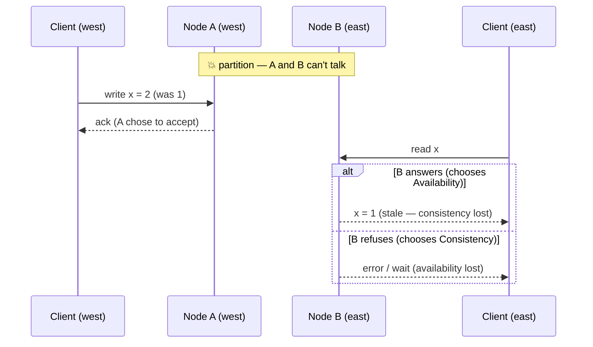

# CAP & PACELC

CAP is simultaneously the most cited and most misquoted idea in distributed systems. The pop version — "pick two of three: Consistency, Availability, Partition tolerance" — draws a tidy triangle and is wrong in a way that interviewers *specifically probe for*. The real theorem is narrower, stranger, and more useful. And its grown-up successor, PACELC, explains the trade-off you're paying right now, on a perfectly healthy network, with every replicated system you run.

## What CAP actually says

Setup: your data lives on multiple nodes (it must — one node is a single point of failure and a scaling ceiling). One day the network **partitions**: nodes are alive but can't reach each other. A client writes to the side you can reach. Now a client on the *other* side reads.

The theorem, precisely: during a partition, a distributed system cannot provide both

- **Consistency** — meaning **linearizability**: every read reflects the latest completed write, as if there were one copy of the data;
- **Availability** — every request to any non-failed node gets a (non-error) response.

Because: the isolated node either answers with what it has (available, but possibly stale → not linearizable) or refuses/blocks until it can verify (consistent, but not available). That's the entire theorem. Three consequences kill the triangle myth:

1. **P is not a choice.** Partitions are a fact of physics and BGP; "choosing P" is like choosing gravity. The only choice is C-or-A *when* a partition happens. A "CA distributed system" is a sunny-day story, not a design.
2. **The choice only exists during partitions.** On a healthy network you can have both C and A. CAP says nothing about normal operation — that's PACELC's territory.
3. **It's per-operation, not per-database.** The same system can serve linearizable writes and stale-tolerant reads; you choose C or A *per request path*, and mature systems do.

## CP and AP in the wild

- **CP (refuse rather than lie):** ZooKeeper, etcd, Consul — coordination stores whose entire job is truth. During partition, the minority side stops serving. This is why *etcd quorum loss halts your Kubernetes control plane*: the cluster would rather be silent than wrong about who owns what. Also CP in spirit: anything quorum-writing with R + W > N configured strictly.
- **AP (answer rather than refuse):** Dynamo-style stores (Cassandra, Riak, DynamoDB in its eventually-consistent modes), DNS, gossip protocols. Amazon's founding example: the shopping cart must **never refuse an add-to-cart** — accept writes on both sides of a partition, merge later, tolerate the occasional resurrected item. Read the [Dynamo lineage](../data/nosql.md) as a chain of consequences from that one business commitment: sloppy quorums, hinted handoff, vector clocks, read repair — every exotic mechanism is just the bill for choosing A.
- **The trick answers interviewers fish for:** a single-node Postgres is not "CA" — it's not a distributed system; CAP doesn't apply (it's simply unavailable when its one node dies). And Google Spanner marketing itself as "effectively CA" means: it's CP, but Google's private network makes partitions so rare that the A sacrifice almost never gets invoked. The theorem isn't violated; the probability of paying is engineered down.

## PACELC: the trade-off with no partition required

CAP's blind spot: it's silent about the 99.99% of time when the network is fine. PACELC completes it:

> **if Partition: trade Availability vs. Consistency; Else: trade Latency vs. Consistency.**

The **ELC** half is the daily tax. Strong consistency means coordination *on every write* (and for linearizable reads, often on reads too): a quorum round-trip, a leader hop, possibly cross-region confirmation. Physics prices that at milliseconds-to-hundreds-of-milliseconds of latency, always, partition or no partition:

| | During partition | Normal operation | Examples |
|---|---|---|---|
| **PA/EL** | stay up, serve stale | fast, relaxed reads | Cassandra (ONE/LOCAL_QUORUM), DynamoDB default, DNS, caches |
| **PC/EC** | refuse minority side | pay coordination latency for truth | etcd, ZooKeeper, Spanner, quorum SQL clusters |
| **PA/EC** and **PC/EL** | mixed postures | | rarer; tunable stores per-query land here |

Concretely: a cross-region *linearizable* write must confirm on a majority spanning regions → one inter-region round trip minimum, say 60–150 ms, per write, forever. An eventually-consistent write acks locally in 2 ms and replicates behind your back. That 30–75× latency ratio — not partition philosophy — is the actual reason most systems relax consistency for most data. **You pay for consistency in milliseconds every day, and only occasionally in availability.**

## Choosing, per data class

The Staff move is refusing to answer "is our system CP or AP?" — the unit of choice is the *data class and operation*:

| Data | Choice | Why |
|---|---|---|
| Payment, inventory decrement, account balance | PC/EC — linearizable | Wrong is worse than slow or down |
| Session/auth tokens | CP-ish reads (or short-TTL cached) | Security-sensitive staleness window |
| Social graph, profiles, product catalog | PA/EL | Seconds of staleness are invisible |
| Likes, view counters, presence dots | PA/EL, aggressively | Approximate by nature |
| Coordination (locks, leader election, service discovery truth) | PC/EC always | A stale answer here corrupts everything downstream |

Same application, all five rows, different postures — served by different stores or different consistency levels of one store. "Which parts of this design need linearizability, and what does everything else tolerate?" is the sentence that shows you've escaped the triangle.

!!! ops "DevOps lens"
    You operate CAP choices whether you made them or not. **CP systems fail loudly and completely**: etcd loses quorum → control plane frozen, leader elections stall, deploys stop — your incident is "everything is refusing service." **AP systems fail quietly and weirdly**: the cluster stayed "up" through the partition, and now you're triaging ghost items, divergent counters, and read-repair storms hours later — your incident is "everything worked and the data is subtly wrong." Know which incident *shape* each dependency produces, and monitor accordingly: quorum health and election churn on CP systems; replication lag, hinted-handoff depth, and conflict rates on AP systems. And the classic self-inflicted partition: a firewall rule or security-group change that splits a cluster is indistinguishable from a network failure — half the "CAP events" you'll ever see shipped in a config deploy.

!!! staff "Staff+ altitude"
    Three altitude markers. **(1) Price the ELC tax explicitly:** "strong consistency on this path costs a cross-region round trip on every write — 80 ms — so the real question is which writes deserve it," is a budget conversation, not a theology one. **(2) Blast-radius the CP cores:** every architecture has a small set of PC/EC components (etcd, the lock service, the payment ledger) that everything else leans on; Staff design keeps that set *small, boring, and over-provisioned*, and keeps bulk data paths off it. **(3) Design the merge, not just the split:** if you choose AP anywhere, the real work is conflict resolution — last-write-wins (and whose clock?), CRDTs, or business-rule merges like Dynamo's cart union. Choosing A without designing the merge is choosing silent data corruption with extra steps.

!!! interview "In the interview"
    Never lead with letters — lead with the user: *"If a partition hits, should this operation fail or serve stale? For the cart: stale. For the payment: fail."* Then, if useful, name it CAP. Expect these probes: *"Is MongoDB CP or AP?"* — resist the bait; answer that it depends on write concern and read preference, i.e., it's tunable per operation, which is the sophisticated truth for most modern stores. *"Why not make everything strongly consistent to be safe?"* — PACELC: you'd pay coordination latency on every operation forever to protect data that tolerates staleness; cite the cross-region write math. *"What actually happens in your design during a partition?"* — walk one write and one read on each side of the split, exactly like the sequence diagram above; being able to *narrate the partition* is the difference between knowing the acronym and knowing the theorem.

**Next:** [Consistency models](consistency-models.md) — the full ladder from linearizable to eventual, and the client-side guarantees users actually notice.
