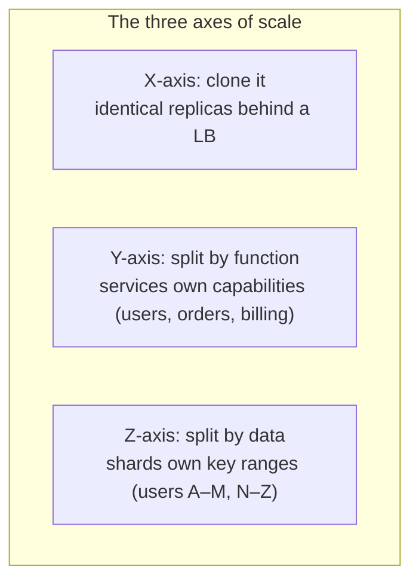

# Scalability

"Will it scale?" is the most asked and worst phrased question in system design. Nothing "scales" in the absolute; the real question is **where does it break first, what does it cost to move that point, and how many times can you repeat the trick?** Scalability is not a property you add — it's a *sequence of bottlenecks you've planned for* rather than discovered at 2 a.m.

This page gives you the honest version: what one machine can actually do (more than most candidates think), why horizontal scaling won anyway, why writes are so much harder than reads, and the two laws that explain why adding servers eventually makes things *worse*.

## Vertical first: one box goes further than the slideware admits

Scaling up — a bigger machine — is unfashionable and underrated. A serious 2025-era server is a monster: 128+ cores, terabytes of RAM, NVMe storage doing millions of IOPS at gigabytes per second, 25–100 Gbps networking. Single-node PostgreSQL on such hardware comfortably serves tens of thousands of transactions per second; Stack Overflow famously ran one of the busiest sites on the internet on a handful of machines for years.

Vertical scaling's genuine virtues: **zero added complexity** (no sharding, no distributed anything, no consistency puzzles), and complexity is the tax you pay forever. Its genuine limits: the price curve bends brutally upward at the top end; there's a hard ceiling; and — the reason your ops instincts distrust it — **one box is one failure domain**. The biggest machine in the world still reboots, and its maintenance window is your outage.

The grown-up position, and the one to voice in interviews: *scale up until the complexity of scaling out is cheaper than the hardware, but make the software horizontal-ready long before that day.* Databases especially: a primary on big hardware with replicas buys years at most companies before sharding earns its complexity.

## Horizontal: the photocopier and its prerequisites

Scaling out — more machines — is how the ceiling is removed: capacity grows roughly linearly (for a while; see below), failure domains shrink to one node out of N, and you buy commodity hardware instead of exotic hardware.

But the photocopier only copies **stateless** things. A service is horizontally scalable when any instance can serve any request, which requires: sessions externalized (Redis, or signed tokens on the client), no local disk as a source of truth, no in-memory counters that matter, and handlers safe to run concurrently with themselves. This is why "make it stateless" is the first commandment of scale — the whole trick of load-balanced horizontal scaling rests on it. (State doesn't disappear, of course; it concentrates in the data tier, where the *rest* of this site deals with it. That's the real shape of scalable architecture: a wide stateless middle and a carefully managed stateful core.)

## Scaling reads vs. scaling writes: not the same sport

**Reads scale by copying data.** Every read-scaling tool is a copy with a freshness trade-off: read replicas (copies with replication lag), caches (copies with TTLs), CDNs (copies at the edge), materialized views and denormalization (copies in a friendlier shape). Copies are cheap and parallel beautifully; the price is always the same — the copy can be **stale**, and you must decide where staleness is acceptable. Read-heavy systems (most consumer products) are therefore "easy" to scale: layer the copies, route reads to them, keep the small write stream on the primary.

**Writes scale by splitting responsibility.** You cannot cache a write. The write-scaling toolbox: **partition** the data so different nodes own different keys ([sharding](../data/partitioning.md) — the big gun, with the big costs); **batch and buffer** so a thousand logical writes become one physical one (group commit, write coalescing — how metrics and logging systems survive); **absorb asynchronously** — put a queue in front so bursts fill the queue instead of killing the database, and workers drain at a sustainable rate (the queue as shock absorber); and **relax durability or consistency** where the business truly permits (fire-and-forget analytics vs. never-lose payments). When an interviewer says "now make it write-heavy," they are asking you to reach into exactly this toolbox, in roughly this order of preference.

## The scale cube

A tidy vocabulary for "which way are we scaling?", worth one diagram in almost any interview:

X is cheap and first (stateless clones). Y buys independent scaling, deployment, and *team ownership* — its deepest benefit is organizational. Z is the most powerful and most expensive: true data partitioning, with resharding, hot keys, and cross-shard queries as the ongoing bill. Most mature systems use all three at once: cloned instances (X) of decomposed services (Y) over sharded data (Z).

## The two laws of diminishing servers

**Amdahl's law**: if a fraction *s* of the work is serial (can't be parallelized), maximum speedup is 1/*s* no matter how many machines you add.

| Parallelizable | Max speedup — ever |
|---|---|
| 90% | 10× |
| 95% | 20× |
| 99% | 100× |

That "serial fraction" hides everywhere: the single primary taking writes, the lock around the hot row, the one queue partition preserving order, the leader doing coordination. Find it and you've found the true ceiling of the architecture.

**The Universal Scalability Law** goes darker: beyond contention (Amdahl), real systems pay a **coherency** cost — nodes must agree with each other (cache invalidations, lock chatter, gossip, consensus rounds), and that cost grows with the *square* of node count. So throughput doesn't just plateau as you add machines; it **peaks and then declines**. Every operator has seen this curve without knowing its name: the cluster that got *slower* when you doubled it, drowning in its own coordination. The design lesson is permanent: **scalability is bought by removing the need to agree** — partition so nodes don't share, replicate so they don't wait, relax consistency so they don't coordinate. Every famous technique in this site is, underneath, a scheme for agreeing less.

## Autoscaling: the operator's truth

Autoscaling is where "just add servers" meets reality, and interviewers with scars love probing it:

- **Choose the metric carefully.** CPU is the default and often wrong — I/O-bound services sit at 30% CPU while drowning. Requests-per-instance, queue depth, or p99 latency track real saturation better. Best of all is scaling on *leading* indicators (queue depth rises before latency does).
- **Scaling has lag.** Instance boot, image pull, JVM warmup, cache fill: minutes. A traffic spike steeper than your scale-up lag *will* eat you; the defenses are headroom (run at 40–60% so you can absorb 2× while scaling), warm pools, and predictive/scheduled scaling for known cycles.
- **Scale-in is the dangerous direction.** Killing instances mid-request, draining long-lived connections, evicting local caches that then stampede the database on the next scale-out — scale-in bugs cause outages during *low* traffic, which is embarrassing.
- **Autoscaling protects the stateless tier only.** The database does not autoscale by photocopy. Every autoscaled front end is a magnifying glass pointed at the fixed-size stateful core behind it — scale-out amplifies the load you deliver to the layer that can't scale out. (You've seen this: the web tier scaled to 400 pods and knocked the primary over. The autoscaler worked *perfectly*.)

!!! ops "DevOps lens"
    The purest scaling instrument in your toolbox is the **connection pool + queue-depth graph**. Saturation announces itself there long before CPU: pool exhaustion, rising queue depth, p99 bending upward while p50 sits still. When you narrate scaling in an interview, narrate it from those graphs — "I'd watch queue depth per instance; when it trends up at steady traffic, that tier is saturating" — and you sound like what you are: someone who has actually watched a system approach its limit, not someone reciting that servers can be added.

## Scale by subtraction

The cheapest request is the one you never serve. Before adding machines, remove work — this list, in this order, is worth more than any cluster:

1. **Cache it** — the answer already computed ([caching](../caching/index.md)).
2. **Precompute it** — move work from read time to write time (feeds, materialized views).
3. **Approximate it** — HyperLogLog for counts, sampling for analytics; "about 1.2M views" costs 1000× less than exactness and nobody can tell.
4. **Defer it** — async everything outside the spinner (queues).
5. **Batch it** — amortize per-operation overhead (writes, network calls, commits).
6. **Expire it** — TTLs and retention policies; data you delete is data you never scale.
7. **Refuse it** — rate limits and load shedding; some traffic isn't worth serving, and saying so is a design decision, not a failure.

!!! staff "Staff+ altitude"
    Staff-level scaling answers are **staged and costed**. Not "we shard" but: "Phase 1: replicas + cache carries us to ~50k QPS on one writer — six months of runway, near-zero complexity. Phase 2: partition by tenant when write volume demands it — that's the expensive door, so we pick the partition key *now* (tenant ID on every table) to keep it openable cheaply later." Two more altitude markers: **know when NOT to scale** — engineering a 100× headroom for a product that needs 2× is a misallocation a Principal is paid to veto; and **scale the organization with the system** — the Y-axis split that looks clean on the whiteboard is also an on-call rotation, a deploy pipeline, and a team boundary. The USL applies to humans too: coordination cost grows quadratically with the teams that must agree.

!!! interview "In the interview"
    The scaling portion of any interview is the bottleneck sequence from [Thinking in systems](thinking-in-systems.md), performed: "At 1× this is two app nodes and Postgres. At 10×, reads swamp us first — cache plus two replicas, accepting seconds of staleness on profile pages. At 100×, writes are the wall — shard by user ID, and here's why user ID: every query in our API includes it." Follow-ups to expect: *"Why not just use a bigger database?"* (give the honest vertical-first answer — it buys real time, but it's one failure domain and the price curve bends); *"What's the hardest thing to scale here?"* (always: the stateful, coordinated thing — name it specifically); *"When would you NOT shard?"* (when replicas + cache + retention policy still fit on one writer — sharding is a one-way door that doubles operational surface).

**Next:** [Reliability & availability](reliability-availability.md) — the math of nines, and why "independent" failures never are.
