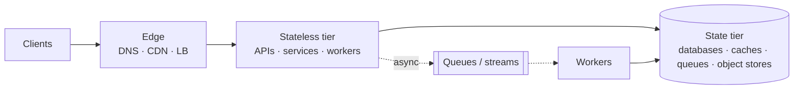

# Thinking in Systems

A blank whiteboard and the words "design Twitter" induce the same physiological response as a paging alert: elevated heart rate, tunnel vision, the urge to *do something*. Incident response has a cure for that — you don't improvise, you run a process. System design is the same. The engineers who look brilliant in design discussions are not improvising either; they're running a small set of mental models, the same ones, every time, on every problem.

Here are the ten. You already know most of them from production — you just haven't named them yet. Naming them is what makes them usable under pressure.

## 1. Every system is stores and flows

Strip away the logos and every system ever designed is the same picture: **data at rest** (stores), **data in motion** (flows), and **transformations** between them. Requests flow in, get transformed, touch state, flow out.

This is the generic anatomy. "Design X" is always: *what are the stores, what are the flows, and where do the transformations happen?* Start every design by drawing this skeleton and the panic evaporates — the rest of the interview is just filling in the organs.

## 2. Separate the read path from the write path

The single highest-leverage question about any system: **what is the read/write ratio, and how different are the two paths?**

| System | Ratio | Consequence |
|---|---|---|
| News feed, search, product pages | ~100:1 reads | Cache aggressively, precompute, denormalize — optimize the read |
| Chat, collaborative editing | near 1:1 | Both paths hot; think fan-out and ordering |
| Metrics, logging, IoT ingest | 1000:1 **writes** | Append-only ingestion, batch, compress — the read path is queries over aggregates |

Reads and writes want different data shapes: writes want normalized, append-friendly structures; reads want precomputed, denormalized answers. Most real architectures are machinery for maintaining a read-optimized copy of write-optimized truth — that's what caches, replicas, materialized views, search indexes, and feed fan-outs all are. Say the ratio out loud in the first five minutes of any interview; it steers everything after.

## 3. Hunt the bottleneck (it moves)

A system's capacity is the capacity of its narrowest hop, and *fixing the bottleneck relocates it*. Scale the web tier and the database becomes the wall; add a cache and the database recovers but the cache's backing store chokes on misses; shard the database and the hot shard appears. This is why "how does this scale?" is never answered once — it's answered as a *sequence*: at 10× traffic, X breaks first, here's the fix; at 100×, Y breaks, here's that fix. Interviewers adore this framing because it's how real systems actually grow, and operations people narrate it naturally because they've watched it happen in Grafana.

## 4. State is where the pain lives

Stateless things scale by photocopying: add replicas behind a load balancer, done. Every genuinely hard problem in this site is hard because of **state** — who owns it, how it's copied, what happens when copies disagree.

State wears disguises. Sessions ("just a little user context in memory"), counters, rate-limit buckets, locks, local caches, cursors mid-pagination, files on local disk, long-lived WebSocket connections — each one quietly pins work to a specific machine and breaks the photocopier. The standard playbook: **push state out** — down into purpose-built stores (Redis, databases), or out to the client (signed tokens, resumable upload offsets). What remains stateless scales for free; what remains stateful gets your design attention, because that's where it's earned.

## 5. Ask the four questions of every box

For any component in any design — a cache, a queue, a replica, a third-party API — ask:

1. **What if it's slow?** (the most neglected — slow is worse than dead, because timeouts stack and threads pool up)
2. **What if it's dead?**
3. **What if it's wrong?** (stale cache, lagging replica, duplicated message)
4. **What if it's full?** (disk, queue depth, connection pool, file descriptors)

| | Cache | Queue | Read replica |
|---|---|---|---|
| **Slow** | Latency budget blown; need cache-read timeout + fallthrough | Consumers lag; producers unaffected (that's the point) | Queries pile up; pool exhaustion upstream |
| **Dead** | Stampede onto the database ([cache failure modes](../caching/failure-modes.md)) | Producers block or shed; is there a DLQ? | Fail over reads to primary — can it take the load? |
| **Wrong** | Stale reads; is that acceptable *here*? | Duplicate delivery; consumers must be idempotent | Replication lag; read-your-writes broken |
| **Full** | Eviction pressure, hit rate collapses | Backpressure or data loss — choose explicitly | Disk full stops replication silently |

This table *is* the DevOps superpower in portable form. Run the four questions on your own design before the interviewer does, out loud, and you're demonstrating exactly the instinct they're rubric-hunting for.

## 6. Place the sync/async boundary deliberately

One question splits every workflow: **what must be true before the user's spinner stops?** That work is synchronous and lives inside your latency budget. Everything else — emails, thumbnails, feed fan-out, fraud scoring, analytics — belongs behind a queue, done eventually, retried safely.

Checkout is the classic: reserve inventory and authorize payment synchronously (the user must know it worked); send confirmation email, update recommendations, notify the warehouse asynchronously. Drawing that line explicitly ("the API returns after the write to the orders table and the payment auth; these four things happen async") is a one-sentence move that instantly structures your whole design — and it's where queues *earn* their place in the diagram instead of appearing by fashion.

## 7. Push or pull — someone has to do the work

Every data movement is either **push** (producer sends when data exists) or **pull** (consumer asks when it wants). Push is fresh but can overwhelm slow consumers; pull is self-pacing but wastes work polling and adds staleness. The choice recurs everywhere: news feeds (push to followers' inboxes vs. pull-and-merge at read time — and the hybrid for celebrities), notifications (push), dashboards (pull), and — the DevOps classic — Prometheus *scraping* targets rather than accepting pushes, precisely so the monitoring system controls its own load and a misbehaving service can't flood it. When you see the pattern once, you'll notice every system is choosing sides, and "who does the work, and who sets the pace?" becomes a design question you ask reflexively. Pull gives the consumer backpressure for free; push needs it bolted on.

## 8. Respect amplification

Systems multiply. One user action can become thousands of operations (a celebrity tweet fanned out to 100M timelines); one request can touch a hundred services (and at 100-way fan-out, if each dependency is fast 99% of the time, *every* dependency is fast on only 0.99¹⁰⁰ ≈ 37% of requests — the tail rules you; see [latency & throughput](latency-throughput.md)); one failure can become a storm (a 3-layer retry policy of 3 attempts each is 27 requests hammering the struggling service — retry amplification is how blips become outages). Before finalizing any design, trace one user action through and count what it becomes at each hop. Amplification is where "works at demo scale" quietly diverges from "works."

## 9. Name the axis you're trading on

There are only about five axes: **latency, consistency, availability, cost, and complexity** (durability makes six when storage is involved). Every architecture decision buys on one axis by paying on another; junior engineers make the trade silently, senior engineers make it out loud, Staff engineers also say *why the price is acceptable for this business*. The sentence template that does it:

> "I'm trading **X** for **Y** because **Z**, and that's acceptable here because **W**."

"I'm trading consistency for availability on the like-counter because nobody is harmed by a count that's seconds stale, and that lets us serve it from replicas everywhere." Practice the template until it's automatic; it upgrades nearly every statement you make in a design discussion.

## 10. Design the failure story first

At sufficient scale, partial failure isn't an event — it's the steady state. Something in a large system is *always* broken; the design's job is to make that unobservable. So treat the failure story as a first-class deliverable, not an appendix: for each component, what's the **blast radius** when it fails, and what's the **degraded mode**? The degradation menu is short and worth memorizing: serve stale (cache beats error), shed load (reject some to save all — see [resilience patterns](../distributed/resilience.md)), queue and defer, disable the feature (flags), fail over. Systems that degrade by *choice* have good ops stories; systems that degrade by *surprise* have incident reports.

## The 60-second checklist

All ten models compress into the loop you run when the whiteboard is blank:

1. **Ratio** — read-heavy, write-heavy, or balanced? (model 2)
2. **Skeleton** — stores, flows, transformations. (1)
3. **State** — what's stateful? Push the rest stateless. (4)
4. **Boundary** — what's inside the spinner? Queue the rest. (6)
5. **Trace & multiply** — one action end to end; count the amplification. (8)
6. **Interrogate** — four questions per box. (5)
7. **Bottleneck sequence** — what breaks at 10×, at 100×? (3)
8. **Failure story** — blast radius and degraded mode per component. (10)
9. **Say the trades** — name the axis, every time. (9)

!!! staff "Staff+ altitude"
    These models are not just for producing designs — they are how you **review** them, and Staff+ work is mostly review: reading a design doc from another team and finding, in thirty minutes, the question nobody asked. The four questions and the amplification trace are ruthless review instruments. In interviews at that level you may be handed a flawed design to critique instead of a blank board; this checklist *is* the critique, run in the same order. And one more altitude marker: Staff engineers apply model 9 to the *organization* — complexity is a cost paid in on-call rotations and onboarding time, so the design that five teams can operate beats the elegant one that only its author understands.

!!! interview "In the interview"
    You don't recite models; you *perform* them. The performance version: open with the ratio and the skeleton (models 2 and 1) while restating requirements; narrate the sync/async boundary as you draw (6); when the interviewer says "what if the cache dies?", smile — you ran the four questions two minutes ago and the answer is already on the board. The models' real gift is composure: there is no question in the canon — "how does it scale?", "what breaks first?", "why a queue here?" — that isn't one of these ten wearing a costume.

**Next:** [Scalability](scalability.md) — what actually happens when you turn the traffic dial, and why the ceiling is always contention.
