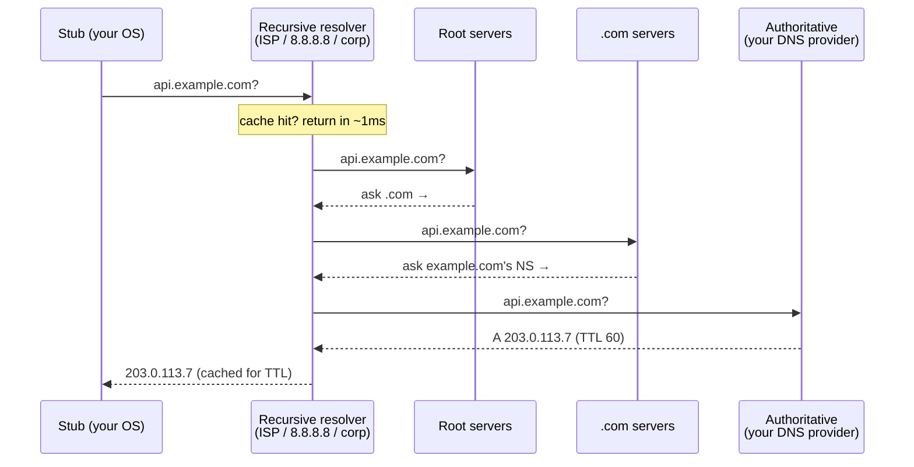

# DNS

DNS is the internet's phone book, its oldest hyperscale distributed system, and a masterclass in eventual consistency that predates the term — a 1983 design still serving trillions of queries a day on hierarchical delegation and unapologetic caching. It is also, per the oldest joke in operations, always the culprit. Both facts belong in your head at once: DNS is *beautiful* (this is what a planetary eventually-consistent read-optimized database looks like) and DNS is *in the blast radius of half of all major outages* (because it's the one dependency in front of everything, including your failovers).

## How resolution actually works

The full walk costs ~20–120 ms; caching at every layer (browser, OS, resolver) makes the *typical* cost near zero. Two structural facts do all the work: **delegation** (each level only knows who to ask next — this is how one namespace scales across millions of independent operators) and **TTL-governed caching** (every answer carries its own expiry). There is no push, no invalidation protocol, no coordination: just copies expiring on schedule. Keep that in mind for the failover section — it's the whole plot.

**Records you'll actually use:** `A`/`AAAA` (name → IPv4/IPv6), `CNAME` (name → name; illegal at a zone apex, which is why providers invented ALIAS/ANAME flattening — a classic trivia probe), `NS` (delegation), `MX`, `TXT` (verification, SPF/DKIM), `SRV` (host+port service discovery, mostly in internal systems), `CAA` (who may issue your certs). Negative answers (NXDOMAIN) are cached too — a fact that has ruined many launch days: query the name *before* creating it, and resolvers remember it doesn't exist for the negative TTL.

## DNS as a traffic-steering tool

Because DNS answers can vary per query, per client, and per health state, the phone book doubles as a *global load balancer* — with caveats that interviews love:

- **Round-robin / weighted answers** — crude distribution; caching means one popular resolver's cached answer serves thousands of clients, so real balance is coarse. Weighted records are the classic **canary-by-DNS** (1% to the new stack).
- **Latency- / geo-based routing** — answer with the nearest healthy region (Route 53, NS1, etc.). This is the standard entry point of [multi-region architecture](../devops/multi-region.md).
- **Health-checked failover** — provider probes your endpoints; when primary fails checks, answers flip to secondary. Sounds crisp; the fine print is the next section.
- **GSLB / anycast alternative** — serious global platforms increasingly steer with **anycast** instead: one IP announced via BGP from many sites, the internet's routing itself delivers users to the nearest one, and "failover" is a routing withdrawal that takes effect in seconds *without any cache obeying anything*. This is how root servers, 8.8.8.8, 1.1.1.1, and every major CDN edge work. Rule of thumb worth quoting: **DNS steering for coarse, slow decisions; anycast for fast, fine ones.**
- **Internal service discovery** — inside platforms, DNS is the discovery API: Consul, and above all Kubernetes, where every Service gets a name (`svc.namespace.svc.cluster.local`) served by CoreDNS, and headless Services return pod IPs directly. Ops corollary: at scale, *your own* DNS becomes a high-QPS dependency with its own capacity planning (the infamous ndots-and-search-domains query amplification in K8s is a rite of passage).

## The TTL honesty problem

Every DNS failover design collides with the same truth: **the TTL is a request, not a command.**

You set TTL 60 to fail over fast. Reality: some ISP resolvers enforce minimums and hold answers for hours; OSes and browsers layer their own caches; Java applications famously cached forever by default; corporate middleboxes do whatever they want; and *connected* clients don't re-resolve at all — an established connection or pool keeps using the old IP until it breaks. So the honest model of a DNS failover is: **most traffic moves within a few TTLs, and a long tail keeps arriving at the dead address for hours or days.** Hence the standard production posture: keep something answering at the old IP (a redirecting proxy, a drained-but-alive LB), or better, put the volatility *behind* a stable anycast/LB address so DNS never has to change in an emergency at all. Short TTLs also have a bill: TTL 30 on a big property means orders of magnitude more resolver traffic hitting your authoritative servers — and a hard dependency on their availability every 30 seconds. The standard playbook: run TTL 300 in peacetime, drop to 60 ahead of planned migrations, raise it back after.

## Failure modes with famous names

- **"Propagation delay" is a myth** — nothing propagates; caches expire. If your change "hasn't propagated," you're waiting out the *old* TTL (which is why you lower TTLs *before* the change, one full old-TTL in advance).
- **Provider outage = total outage** — the 2016 Dyn DDoS took down Twitter, Spotify, GitHub, and dozens more *simultaneously*, not because their systems failed but because nobody could look up their names. The lesson institutionalized since: multi-provider NS records (two independent DNS providers serving the same zone) — cheap insurance almost nobody buys until after their first DNS incident.
- **Expired domain / botched DNSSEC / fat-fingered zone push** — configuration is the leading cause of DNS incidents, and DNS config has planetary blast radius with cache-delayed rollback. Treat zone changes with deploy-grade ceremony: review, canary records, staged TTLs.
- **Resolver as hidden dependency** — your service's outbound calls (webhooks, third-party APIs, even DB hostnames) all do DNS; a flaky resolver manifests as *mysterious cross-cutting timeouts*. Cache client-side sanely, and monitor resolution latency as a first-class metric.

!!! ops "DevOps lens"
    Operate DNS like a deploy system, because it is one: **TTL choreography** around every migration (lower a full TTL ahead, verify from *multiple vantage points* — your laptop's cache is not the internet; use external probes across regions/ISPs), **monitor** resolution success and latency from outside, **alarm on approaching expiry** (domains and DNSSEC signatures), and rehearse the failover: many teams discover during the incident that their "60-second DNS failover" takes 45 minutes of tail traffic. And the self-inflicted classic to check today: what's the TTL on the record in front of your primary database or API, and who last tested lowering it?

!!! staff "Staff+ altitude"
    Staff-level DNS thinking is about **what you let DNS decide**. Three markers: (1) *Keep emergencies out of the resolution path* — architectures that require a DNS change to survive a regional failure have built cache-expiry into their RTO; put stability (anycast IPs, global LBs) in DNS and volatility behind it. (2) *Treat the DNS provider as a tier-0 dependency* — it's in front of everything including your status page (host that on a different domain and provider; yes, really), so multi-provider NS and an out-of-band runbook are portfolio decisions, not paranoia. (3) *Own the internal discovery contract* — at platform scale, "how do services find each other" (DNS names? mesh? config push?) is an org-wide API with migration costs measured in years; changing it is a Staff project, and choosing it casually is how you get one of those projects.

!!! interview "In the interview"
    DNS earns you points in two places: the resolution walk (60 seconds, like the sequence diagram — delegation, caching, TTLs) and — the richer vein — **failover skepticism**. When a design says "and DNS fails over to region B," the Staff-grade response is: *"With TTL 60 and honest resolvers, most traffic moves in minutes — but disobedient caches and already-connected clients mean a tail of traffic hits the dead region for hours, so I'd steer with anycast/global LB and keep DNS static, or at minimum keep the old endpoint answering."* Expected probes: *"why is DNS round-robin bad load balancing?"* (resolver caching makes distribution coarse and sticky; no capacity awareness — it balances *resolvers*, not load); *"CNAME at apex?"* (illegal per spec; ALIAS/flattening); *"how would you canary with DNS?"* (weighted records, 1%, with the honesty caveat about cache granularity).

**Next:** [HTTP: 1.1 → 2 → 3](http.md) — three generations of one protocol, each murdering its predecessor's head-of-line blocking.
